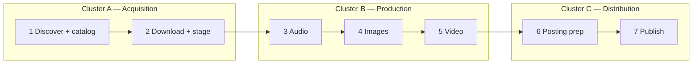
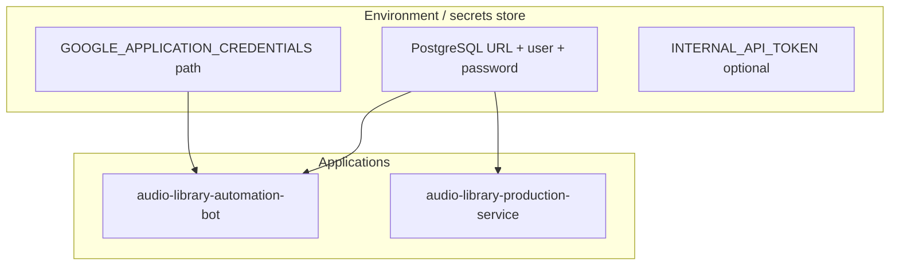
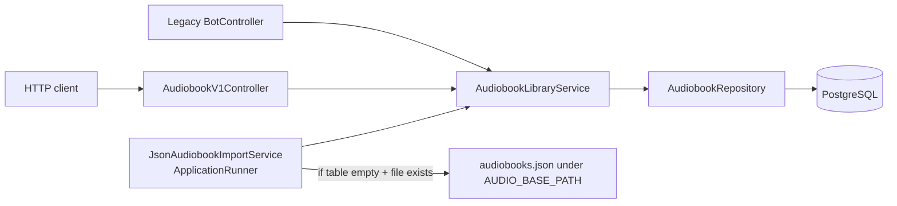

# Audio Library Platform — Overview

High-level components, relationships, and data flow. For implementation details, see each service’s README.

## Detailed Data Documentation

- Database relationships and rationale: `architecture/database-and-relations.md`
- DTO catalog and mapping: `features/dto-catalog-and-mapping.md`
- Open gaps and priorities: `reports/database-dto-gap-report.md`

## Three clusters and seven pipeline steps (target architecture)

### Internal cluster APIs (target)

When services run as separate processes, cluster-to-cluster calls use **`/internal/**`** endpoints only on trusted networks. Normative details (token, correlation ID, `schemaVersion`, idempotency) are documented in [`docs/superpowers/plans/2026-04-01-cluster-services-split-and-hardening.md`](../superpowers/plans/2026-04-01-cluster-services-split-and-hardening.md).

- **`/internal/**`** must not be exposed on a public ingress without authentication (e.g. shared secret `X-Internal-Token`, optional mTLS).
- **`X-Correlation-Id`** (or W3C `traceparent`) on every internal request for log correlation.
- JSON request bodies carry **`schemaVersion`** when contracts evolve.
- **Idempotency** via `Idempotency-Key` (or equivalent) on production and posting handoffs.

| # | Responsibility | Cluster | Notes |
|---|------------------|---------|--------|
| 1 | Discover sources, resolve URLs/paths, persist catalog | **A — Acquisition** | Search, parsers, `parsed_book`, library rows |
| 2 | Download and stage files for downstream use | **A — Acquisition** | Torrents, `AUDIO_BASE_PATH`, staging paths in DB |
| 3 | Audio: chunk, silence removal, concat, processing logs | **B — Production** | FFmpeg APIs, `audio-silence-service`, `ai_integration_log` |
| 4 | Images from descriptions; link to catalog; feed video | **B — Production** | Book cover, AI image, poster assets |
| 5 | Video from audio (3) + images (4) | **B — Production** | `/api/video`, final renders |
| 6 | Posting prep: segments, chapters, timeline in descriptions | **C — Distribution** | Platform-agnostic package from durations + edits |
| 7 | Publish: YouTube, Boosty, Twitch, Patreon | **C — Distribution** | Platform APIs where applicable; **Boosty posting uses Playwright browser automation** (not a public Boosty REST API in this repo — see `audio-library-automation-bot/.../poster/boosty/service/Poster.java`); idempotent posts |

### Java package map (tentative)

Under `kg.automation.rest.automatation`: **A** — `search`, `torrent`, `library` (ingest/catalog **writes**), `telegram`, `file`; **B** — `audio`, `ffmpeg`, `image`, `video`, `ai`, `gateway`, `text`, and most of `poster` except Boosty/YouTube; **C** — `poster.boosty`, `poster.youtube`; **shared** — `config`, `firebase`, and **`library` persistence** (entities/repos) consumed by all clusters; **ingest writes** remain Acquisition-facing.

### Data ownership (target)

## Database and Firebase credentials

**PostgreSQL** is the authoritative store for relational data. **Firestore** (via Firebase Admin) is an optional projection when sync is enabled. Secrets **must not** be committed. Use environment variables (or a local `application-local.properties` / `.env` that is gitignored). A commented template lives at `audio-library-automation-bot/env.example`. Step-by-step setup and verification\

| Concern | Variables / files | Notes |
|--------|-------------------|--------|
| PostgreSQL (monolith) | `DATABASE_URL`, `DATABASE_USER`, `DATABASE_PASSWORD` | Matches `docker compose` defaults in `audio-library-automation-bot` when using local Postgres. |
| PostgreSQL (cluster JAR) | `DATABASE_URL`, `DATABASE_USERNAME` (or `DATABASE_USER`), `DATABASE_PASSWORD` | `audio-library-service` prefers `DATABASE_USERNAME` and accepts `DATABASE_USER` as fallback — same DB credentials as the monolith if both point at one instance. |
| Firebase Admin | `GOOGLE_APPLICATION_CREDENTIALS`, `FIREBASE_PROJECT_ID`, optional `FIREBASE_ENABLED` | Path to a **downloaded service account JSON**; add filename patterns to `.gitignore` (see repo root and `audio-library-automation-bot/.gitignore`). |
| Internal cluster APIs | `INTERNAL_API_TOKEN` | For manual multi-process testing; see cluster hardening plan. |

**CI / Railway:** Configure the same variables as **encrypted** secrets in the deployment environment; never paste keys into the repo or public logs.

### Cluster boundary: Acquisition (A)

- **Owned data (relational):** `audiobook` rows created or updated during ingest; `parsed_book`; `media_group` / `media_item` when sourced from Telegram; `audio_description` fields that describe **staging** (paths, workspace, torrent-related fields).
- **Outbound to B:** after staging, a **production job** should reference the same payload as in the plan (`audiobookId`, `stagedAudioPaths`, `workspaceDirectory`, `idempotencyKey`). The idempotency key should be derived from **staging version** (e.g. hash of paths + sizes or a monotonic job id per workspace) so retries do not duplicate work.
- **Anti-patterns:** Acquisition code must **not** depend on `..video..`, image generators for final posters tied to render, or Boosty/YouTube uploaders.

## SQL persistence (audiobooks)

- **Local without Docker:** `spring.profiles.active=dev` (or `h2`) uses in-memory H2 with Hibernate `ddl-auto=update` and Flyway off — for quick runs only; parity with production schema is validated by PostgreSQL tests when Docker is available (`AudiobookRepositoryPostgresIT`).
- **Media groups** (Telegram album flow), **audio descriptions** (per workspace), **parsed books** (scraper metadata), and **AI trace payloads** (Ollama / image request/response) are stored in PostgreSQL (Flyway `V2`–`V5`). Legacy `media_groups.json` / `description.json` can be imported when enabled via `application.properties` migration flags.
- **Firebase** (optional): set `FIREBASE_ENABLED=true` and `GOOGLE_APPLICATION_CREDENTIALS` to a service account JSON (see `env.example`). For **Firestore** read models, set `FIREBASE_FIRESTORE_SYNC=true` (and optionally `FIREBASE_FIRESTORE_COLLECTION`); `AudiobookLibraryService` upserts/deletes documents `audiobooks/{id}` after SQL commit (async), with PostgreSQL as the source of truth.

## Phase 2 (optional, out of current scope)

- Normalize pipeline `description.json` blobs into tables such as `processing_job` / `book_metadata`.
- HTTP callbacks from **audio-silence-service** into the core API for job completion.

## Integration note

Today the **frontend** talks to **both** core (8088) and silence (8090) mainly for **health checks**. The Java core does not yet call the Python silence service over HTTP in-repo; silence processing is a **separate deployable** for specialized audio work and future orchestration.

## Placeholder packages (cluster alignment)

Empty packages (`acquisition`, `production`, `distribution`) exist under `kg.automation.rest.automatation` for future moves; see `package-info.java` in each.
