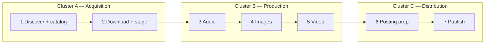

# Audio Library Platform — Overview

High-level components, relationships, and data flow. For implementation details, see each service’s README.

## Detailed Data Documentation

- Database relationships and rationale: [Database and Relations](./database-and-relations.md)
- DTO catalog and mapping: [DTO Catalog and Mapping](../features/dto-catalog-and-mapping.md)
- Open gaps and priorities: [Database DTO Gap Report](../reports/database-dto-gap-report.md)

## Three clusters and seven pipeline steps (target architecture)

### Internal cluster APIs (target)

When services run as separate processes, cluster-to-cluster calls use **`/internal/**`** endpoints only on trusted networks. Normative details (token, correlation ID, `schemaVersion`, idempotency) are documented in [Database DTO Documentation Implementation Plan](../superpowers/plans/2026-04-20-database-dto-documentation-implementation-plan.md) and [Database DTO Documentation Design Spec](../superpowers/specs/2026-04-20-database-dto-documentation-design.md).

- **`/internal/**`** must not be exposed on a public ingress without authentication (e.g. shared secret `X-Internal-Token`, optional mTLS).
- **`X-Correlation-Id`** (or W3C `traceparent`) on every internal request for log correlation.
- JSON request bodies carry **`schemaVersion`** when contracts evolve.
- **Idempotency** via `Idempotency-Key` (or equivalent) on production and posting handoffs.

| # | Responsibility | Cluster | Notes |
|---|------------------|---------|--------|
| 1 | Discover sources, resolve URLs/paths, persist catalog | **A — Acquisition** | Search, parsers, `parsed_book`, library rows |
| 2 | Download and stage files for downstream use | **A — Acquisition** | Torrents, `AUDIO_BASE_PATH`, staging paths in DB |
| 3 | Audio: chunk, silence removal, concat, processing logs | **B — Production** | FFmpeg APIs, `audio-silence-service`, `ai_integration_log` |
| 4 | Images from descriptions; link to catalog; feed video | **B — Production** | Book cover, AI image, poster assets |
| 5 | Video from audio (3) + images (4) | **B — Production** | `/api/video`, final renders |
| 6 | Posting prep: segments, chapters, timeline in descriptions | **C — Distribution** | Platform-agnostic package from durations + edits |
| 7 | Publish: YouTube, Boosty, Twitch, Patreon | **C — Distribution** | Platform APIs where applicable; **Boosty posting uses Playwright browser automation** (not a public Boosty REST API in this repo — see `audio-library-automation-bot/.../poster/boosty/service/Poster.java`); idempotent posts |

### Java package map (tentative)

Under `kg.automation.rest.automatation`: **A** — `search`, `torrent`, `library` (ingest/catalog **writes**), `telegram`, `file`; **B** — `audio`, `ffmpeg`, `image`, `video`, `ai`, `gateway`, `text`, and most of `poster` except Boosty/YouTube; **C** — `poster.boosty`, `poster.youtube`; **shared** — `config`, `firebase`, and **`library` persistence** (entities/repos) consumed by all clusters; **ingest writes** remain Acquisition-facing.

### Data ownership (target)

## Data and persistence at a glance

- PostgreSQL is the source of truth for relational entities used across acquisition, production, and distribution.
- Firebase/Firestore is an optional projection layer used by selected read paths when sync is enabled.
- Credentials, environment variable matrices, and low-level persistence mechanics are intentionally documented in detailed docs, not in this overview.
- For schema detail and rationale, see [Database and Relations](./database-and-relations.md), [DTO Catalog and Mapping](../features/dto-catalog-and-mapping.md), and [Database DTO Gap Report](../reports/database-dto-gap-report.md).

## Phase 2 (optional, out of current scope)

- Normalize pipeline `description.json` blobs into tables such as `processing_job` / `book_metadata`.
- HTTP callbacks from **audio-silence-service** into the core API for job completion.

## Integration note

Today the **frontend** talks to **both** core (8088) and silence (8090) mainly for **health checks**. The Java core does not yet call the Python silence service over HTTP in-repo; silence processing is a **separate deployable** for specialized audio work and future orchestration.

## Placeholder packages (cluster alignment)

Empty packages (`acquisition`, `production`, `distribution`) exist under `kg.automation.rest.automatation` for future moves; see `package-info.java` in each.
