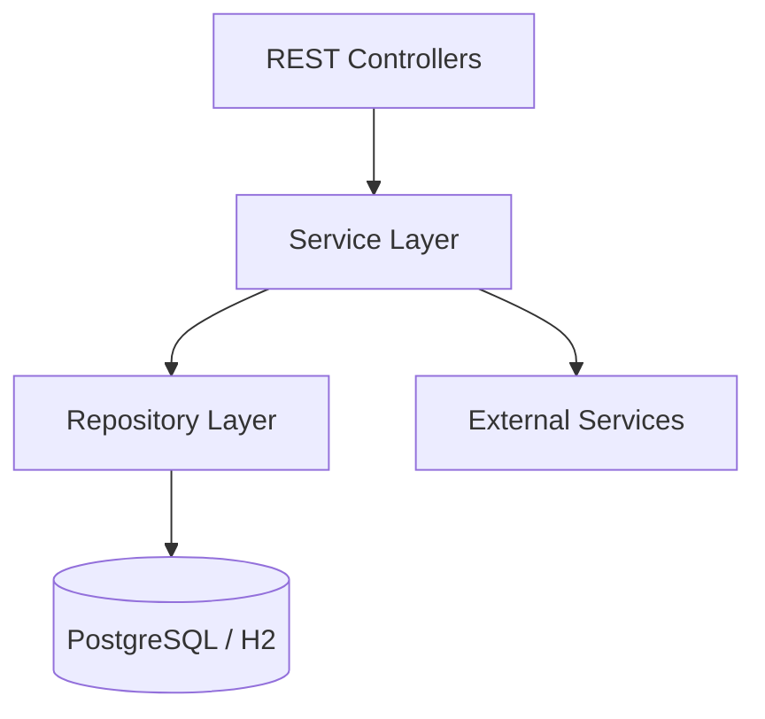

# Backend Architecture

Deep dive into the Java backend (`audio-library-automation-bot`) — the central orchestrator of the Audio Library System.

## Tech Stack

| Technology | Version | Purpose |
|-----------|---------|---------|
| Java | 17 | Language runtime |
| Spring Boot | 3.4 | Application framework |
| Spring Data JPA | — | Database access (Hibernate ORM) |
| Flyway | — | Database schema migrations |
| Jasypt | — | Encrypted secrets in configuration |
| Playwright | — | Browser automation (Boosty posting, catalog scraping) |
| Firebase Admin SDK | — | Optional Firestore sync |

## Domain Package Map

All packages live under `kg.automation.rest.automatation`:

```
kg.automation.rest.automatation/
├── audio/        Audio processing (compress, trim, concat, duration)
├── video/        Video composition (image + audio + particle overlay)
├── image/        Book cover generation (Java AWT text rendering)
├── ai/           AI integrations (OpenAI DALL-E 3/GPT-4o, Ollama Gemma)
├── ffmpeg/       FFmpeg CLI abstraction (ProcessBuilder wrapper)
├── torrent/      Torrent lifecycle (qBittorrent Web API)
├── telegram/     Telegram bot (webhook handler + commands)
├── poster/       Platform publishing (Boosty via Playwright)
├── search/       Catalog search (LLM-powered proxy + URL extraction)
├── library/      Audiobook catalog (JPA CRUD, v1 REST API, Firestore sync)
├── firebase/     Firebase config (Admin SDK initialization, sync service)
├── gateway/      Inter-service REST orchestration
├── file/         Path configuration and directory management
├── text/         Text extraction and AI description enhancement
├── Data/         DTOs: Book, AudioDescription, BookCover, TorrentInfo, SearchInformation
└── config/       Spring config: CORS, async, scheduling, Telegram bot
```

## Layered Architecture

The backend follows a standard Spring Boot layered architecture:



### Controllers

REST controllers handle HTTP requests and delegate to services. Each domain has its own controller:

| Controller | Base Path | Responsibility |
|-----------|-----------|---------------|
| `AudioController` | `/api/audio` | Audio compress, trim, concatenate, duration |
| `AudiobookV1Controller` | `/api/v1/library/audiobooks` | Audiobook CRUD operations |
| `BookCoverController` | `/api/book-cover` | Cover image generation |
| `TorrentController` | `/api/torrent` | qBittorrent management |
| `SearchController` | `/api/search` | LLM-powered catalog search |
| `BoostyController` | `/api/boosty` | Boosty.ru publishing |
| `YouTubeController` | `/api/youtube` | YouTube publishing |
| `OpenAiController` | `/api/ai/openai` | DALL-E 3 image generation |
| `OllamaController` | `/api/ai` | Local Gemma model inference |
| `TextController` | `/api/text` | GPT-4o text enhancement |
| `VideoController` | `/api/video` | Video composition |

### Services

Services contain business logic and orchestrate calls to repositories and external services:

| Service | What It Does |
|---------|-------------|
| `AudiobookLibraryService` | Full CRUD for audiobook records with optional Firestore sync |
| `AudioConcatenatorService` | FFmpeg-based MP3 concatenation with metadata JSON generation |
| `QBittorrentService` | qBittorrent Web API client — login, upload torrents, poll status, delete |
| `TorrentMonitorScheduler` | Scheduled polling of torrent completion states |
| `BookParserService` | Playwright-based baza-knig.ru scraper with pagination |
| `AudioDescriptionPersistenceService` | Processing workspace metadata persistence |
| `FirestoreSyncService` | Async Firestore upsert/delete after SQL commits |
| `RestCallService` | Inter-service HTTP call coordination |
| `AiTraceService` | In-memory cache for AI-generated image references |
| `ExecutionService` | Generic FFmpeg ProcessBuilder wrapper |
| `JsonMediaGroupImportService` | One-shot JSON import of media groups |

### Repositories

Spring Data JPA repositories backed by PostgreSQL (or H2 in dev):

| Repository | Entity | Table |
|-----------|--------|-------|
| `AudiobookRepository` | `Audiobook` | `audiobook` |
| `ParsedBookRepository` | `ParsedBookEntity` | `parsed_book` |
| `MediaGroupRepository` | `MediaGroup` | `media_group` |

## Feature Flag System

Spring's `@ConditionalOnProperty` gates entire subsystems, allowing the backend to run in different modes:

### Minimal Mode (`app.core.enabled=true`, default)

Only **Audio processing** and **Library CRUD** are active. No external services required:
- Audio compress, trim, concatenate, duration
- Audiobook CRUD (`/api/v1/library/audiobooks`)
- Health check (`/actuator/health`)

Use this when:
- Running audio processing only
- No external services available (no Telegram token, no qBittorrent, no Playwright)
- Development / testing without full infrastructure

### Full Mode (`app.core.enabled=false`)

All domains are active:
- Everything in minimal mode, plus:
- Telegram bot (webhook + commands)
- Boosty posting (Playwright)
- AI integrations (OpenAI + Ollama)
- Torrent management (qBittorrent)
- Catalog search and parsing
- Video composition
- Text extraction

Requires: Telegram bot token, Playwright/Chromium, qBittorrent, OpenAI API key.

### Additional Flags

| Flag | Default | Effect |
|------|---------|--------|
| `firebase.enabled` | `false` | Initializes Firebase Admin SDK |
| `firebase.firestore.sync` | `false` | Enables async Firestore sync after SQL writes |
| `app.migration.import-json` | `true` | One-shot JSON import on startup |
| `app.migration.import-media-groups` | `false` | One-shot media group import |

## Design Patterns

| Pattern | How It's Applied |
|---------|-----------------|
| **Layered architecture** | Controllers → Services → Repositories — clean separation of concerns |
| **Feature flags** | `@ConditionalOnProperty` enables minimal or full mode without code changes |
| **Async processing** | `@EnableAsync` for non-blocking FFmpeg operations and external API calls |
| **Encrypted secrets** | Jasypt `ENC(...)` notation in `application.properties` |
| **Browser automation** | Playwright for sites without public APIs (Boosty.ru, baza-knig.ru) |
| **Optional projection** | PostgreSQL as source-of-truth → async Firestore projection for real-time reads |
| **Database migrations** | Flyway configured at `classpath:db/migration/` for versioned SQL migrations |
| **Scheduled tasks** | `@Scheduled` for torrent monitoring polling loop |

## CORS Configuration

Configured in `config/CorsConfig.java`:

- **Allowed origins**: `http://localhost:5173` (Vite dev), `http://localhost:4173` (Vite preview)
- **Allowed methods**: GET, POST, PUT, DELETE, PATCH, OPTIONS
- **Allowed headers**: all

## Related Documentation

- [System Overview](system-overview.md) — high-level architecture
- [Database Design](database-design.md) — entities and persistence
- [Schema sources of truth](schema-sources-of-truth.md) — Flyway ↔ API ↔ DTO mapping index
- [REST API Reference](../api/rest-api-reference.md) — endpoint inventory
- [Configuration](../guides/configuration.md) — environment variables and dependencies
