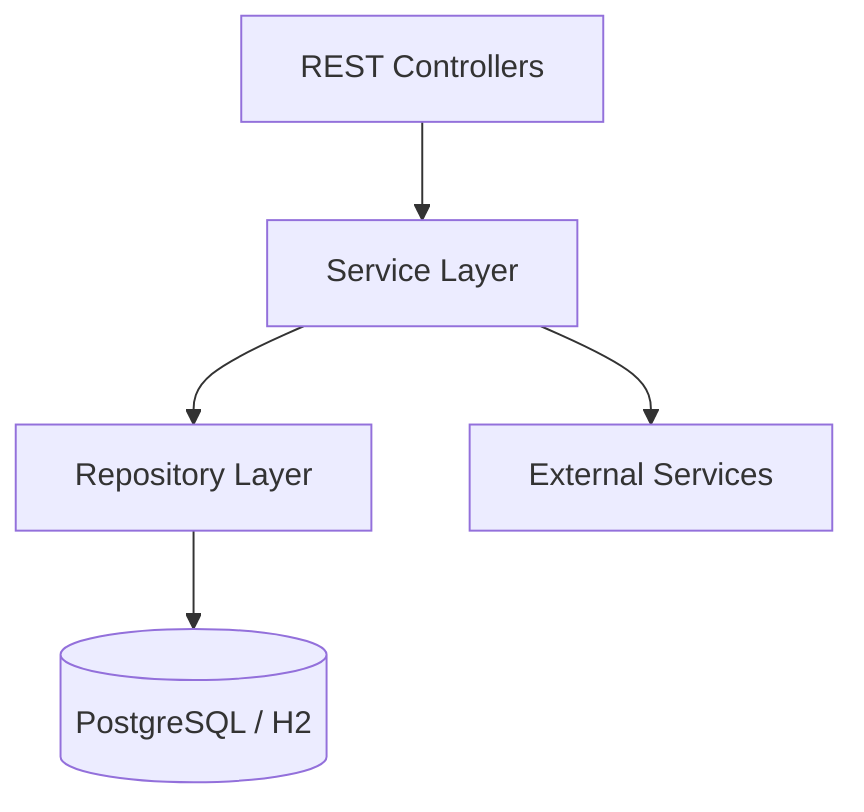

# Backend Architecture

Deep dive into the Java backend (`audio-library-automation-bot`) — the central orchestrator of the Audio Library System.

## Tech Stack

| Technology | Version | Purpose |
|-----------|---------|---------|
| Java | 17 | Language runtime |
| Spring Boot | 3.4 | Application framework |
| Spring Data JPA | — | Database access (Hibernate ORM) |

## Layered Architecture

The backend follows a standard Spring Boot layered architecture:

## Design Patterns

| Pattern | How It's Applied |
|---------|-----------------|
| **Layered architecture** | Controllers → Services → Repositories — clean separation of concerns |
| **Feature flags** | `@ConditionalOnProperty` enables minimal or full mode without code changes |
| **Async processing** | `@EnableAsync` for non-blocking FFmpeg operations and external API calls |
| **Encrypted secrets** | Jasypt `ENC(...)` notation in `application.properties` |
| **Browser automation** | Playwright for sites without public APIs (Boosty.ru, baza-knig.ru) |
| **Optional projection** | PostgreSQL as source-of-truth → async Firestore projection for real-time reads |
| **Database migrations** | Flyway configured at `classpath:db/migration/` for versioned SQL migrations |
| **Scheduled tasks** | `@Scheduled` for torrent monitoring polling loop |

