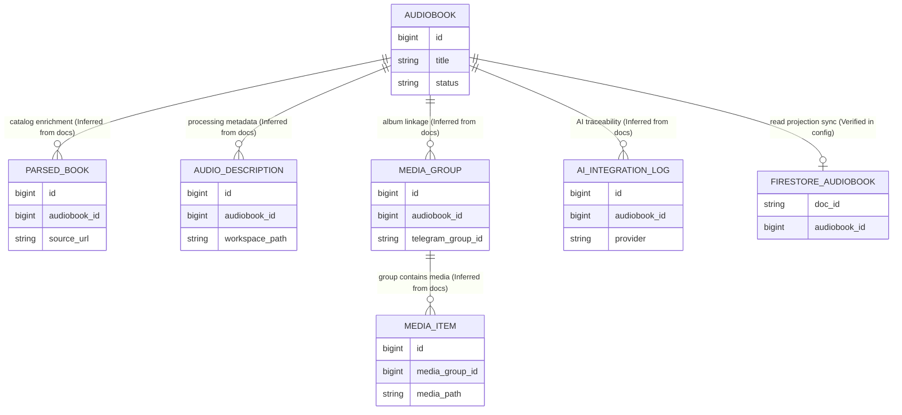
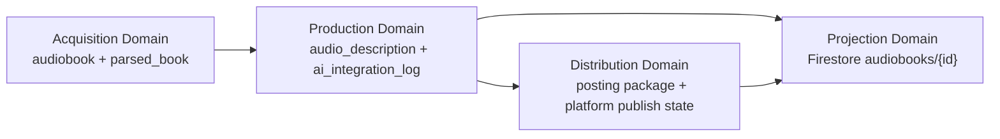

# Database and Relations

This document is the evidence-driven architecture reference for core relational entities and their cross-domain handoffs.
It is aligned with the approved design in `superpowers/specs/2026-04-20-database-dto-documentation-design.md` and the high-level architecture in `architecture/audio-platform-overview.md`.

## Evidence Labels

- `Verified in code`: Relationship, table, or behavior is directly confirmed in repository source snippets surfaced in current documentation.
- `Verified in config`: Relationship, table, or behavior is directly confirmed in configuration references surfaced in current documentation.
- `Inferred from docs`: Relationship is stated in architecture or planning docs, but direct schema or source-level enforcement is not shown in this docs workspace.
- `Missing in current workspace`: Required physical proof (for example FK/UNIQUE/index DDL in current workspace) is not present here.

## Domain Map

The platform is organized into four data domains to match lifecycle ownership and pipeline flow.

| Domain | Primary responsibility | Core entities (doc-visible) | Evidence |
|---|---|---|---|
| Catalog (Acquisition) | Ingest and maintain canonical audiobook metadata | `audiobook`, `parsed_book` | `Inferred from docs` |
| Processing (Production) | Maintain staging/processing metadata for audio and AI operations | `audio_description`, `ai_integration_log` | `Inferred from docs` |
| Distribution (Publication) | Build publish-ready artifacts and post state | publish package data, platform posting state | `Inferred from docs` |
| Projection (Firebase/Read model) | Optional external read projection from SQL source of truth | Firestore `audiobooks/{id}` projection | `Verified in config` |

## Relationship Matrix

| Relationship | Logical purpose | Physical enforcement state | Evidence | Notes |
|---|---|---|---|---|
| `audiobook -> parsed_book` | Preserve discovered metadata for each title | `Missing in current workspace` | `Inferred from docs` | Mentioned in overview as stored relational metadata. |
| `audiobook -> audio_description` | Persist workspace/audio processing context per title | `Missing in current workspace` | `Inferred from docs` | Used to connect staging and processing lifecycle. |
| `audiobook -> media_group` | Associate Telegram/media album-level entities to title | `Missing in current workspace` | `Inferred from docs` | Doc references media groups in PostgreSQL. |
| `media_group -> media_item` | Represent one-to-many items inside a media group | `Missing in current workspace` | `Inferred from docs` | Relationship implied by naming and ingestion flow. |
| `audiobook -> ai_integration_log` | Link AI requests/responses to audiobook trace context | `Missing in current workspace` | `Inferred from docs` | Flyway mention exists in overview, DDL not available here. |
| `audiobook -> Firestore projection` | Project SQL source-of-truth rows to read model | Not a DB FK; async application-level sync | `Verified in config` | Overview explicitly states SQL commit followed by async projection update. |

## Relationship Rationale

- `audiobook` as aggregate anchor (`Inferred from docs`): the overview consistently treats audiobook rows as the source record that downstream processing and publishing depend on.
- `parsed_book` linkage (`Inferred from docs`): parser/source metadata must stay attached to an audiobook so ingestion decisions remain reproducible.
- `audio_description` linkage (`Inferred from docs`): workspace paths and stage metadata must be associated with the same audiobook to preserve idempotent retries and production handoff continuity.
- `media_group` and `media_item` linkage (`Inferred from docs`): Telegram/media album handling requires group-to-item containment and audiobook association to avoid orphaned assets.
- `ai_integration_log` linkage (`Inferred from docs`): AI image/audio/text request traces need stable content ownership for debugging and reprocessing.
- Firestore projection from SQL (`Verified in config`): keeping PostgreSQL authoritative with async projection avoids dual-write authority conflicts while supporting read-oriented consumers.

## Constraint and Index Backlog

The following backlog focuses on physical enforcement gaps that are logical requirements in current architecture docs.

| Backlog item | Why needed | Priority | Current evidence |
|---|---|---|---|
| Add explicit FK from child tables to `audiobook.id` where expected | Prevent orphan processing/catalog records and improve join correctness | P0 | `Missing in current workspace` |
| Add explicit FK from `media_item.media_group_id` to `media_group.id` | Enforce album integrity and cascade behavior strategy | P0 | `Missing in current workspace` |
| Define uniqueness/idempotency keys for processing job linkage by audiobook/workspace | Prevent duplicate processing artifacts on retries | P1 | `Inferred from docs` |
| Add lookup indexes for high-frequency joins (`audiobook_id`, `media_group_id`) | Improve query performance across acquisition and production joins | P1 | `Missing in current workspace` |
| Document projection consistency contract (SQL commit -> async Firestore sync) with retry semantics | Make eventual consistency behavior explicit and testable | P2 | `Verified in config` |

Backlog execution should be coordinated with migration ownership in the reporting document to avoid drift between logical architecture and physical schema.
