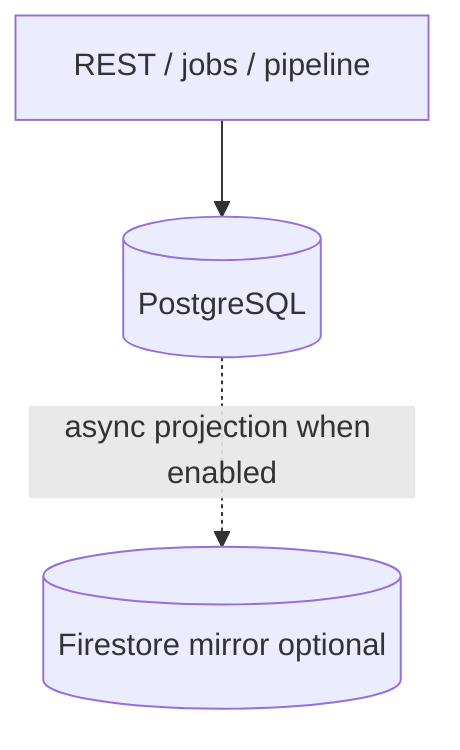
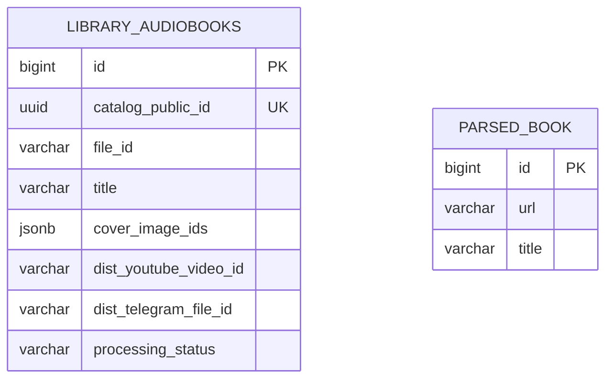

# Database Design

Data model, entity relationships, and persistence strategy for the Audio Library System.

## Persistence backend (PostgreSQL first, Firestore second)

**Order of precedence:**

1. **PostgreSQL** — system of record for catalog, pipeline state, Flyway migrations, and REST APIs that target SQL (`app.persistence.backend=postgresql`, default). All new features should read/write Postgres first.
2. **Firestore** — optional **secondary** projection only (`firebase.enabled=true`, `firebase.firestore.sync=true`). Server-side mirror after SQL commits; not a competing write authority. **`GET /api/v1/library/audiobooks`** reads **`library_audiobooks`** via **`LibraryAudiobookService`**, not Firestore.

| Setting | Behavior |
|---------|----------|
| `app.persistence.backend=postgresql` (default) | Postgres is authoritative. Firebase is **not** forced off — you may enable it explicitly for mirroring only. |
| `app.persistence.backend=firebase` / `firestore` | Rejected at startup (Firestore-primary mode is unsupported). |

Firebase Admin beans (`Firestore`, `FirestoreAudiobookService`, etc.) register only when `firebase.enabled=true`. With defaults (`firebase.enabled=false`), optional Firestore job-log calls in audio/cover services are skipped.

## Database Setup

| Aspect | Production | Local Development |
|--------|-----------|-------------------|
| **Engine** | PostgreSQL 15+ | H2 in-memory |
| **Profile** | `default` | `-Dspring.profiles.active=h2` |
| **Migrations** | Flyway (`classpath:db/migration/`) | Hibernate DDL auto |
| **Connection** | `DATABASE_URL`, `DATABASE_USER`, `DATABASE_PASSWORD` | Auto-configured by Spring |

## Entity Relationship Diagram

High-level slice only. **Cycle / pipeline tables** (`cycles`, `audio_parts`, …) are defined in Flyway and [`2026-05-05-milestone-a-normalized-schema-design.md`](../superpowers/specs/2026-05-05-milestone-a-normalized-schema-design.md).

## Entities

### `library_audiobooks` — Operational catalog (REST)

Flat catalog for **`AudiobookDto`** / Telegram workflows. **DDL:** `audio-library-automation-bot/src/main/resources/db/migration/V202605052210__library_audiobooks.sql`.

| Column | Type | Description |
|--------|------|-------------|
| `id` | bigint (PK, identity) | Internal surrogate key |
| `catalog_public_id` | UUID (unique) | Exposed as **`AudiobookDto.id`** |
| `file_id` | varchar | Telegram file id (when used) |
| `title` … `description` | various | Metadata (see Flyway) |
| `cover_image_ids` | jsonb | Cover id list |
| `dist_youtube_video_id` | varchar | **`distributedTo.youtubeVideoId`** |
| `dist_telegram_file_id` | varchar | **`distributedTo.telegramFileId`** |
| `processing_status` | varchar | e.g. IDLE, DISTRIBUTED |

**Managed by**: `LibraryAudiobookService`, `AudiobookV1Controller`  
**API**: `/api/v1/library/audiobooks`

### `parsed_book` — Scraped acquisition metadata

Baseline scrape rows (no FK to `library_audiobooks`). See Flyway **`V202605051200__baseline_parsed_book.sql`**.

| Field | Type | Description |
|-------|------|-------------|
| `id` | bigint (PK) | Surrogate key |
| `url`, `title`, … | varchar / text | Scraped fields per migration |

**Created by**: parser / search pipeline  
**Used by**: description enhancement and cycle backfill migrations

## Firestore Projection (Optional)

When `firebase.firestore.sync=true`, the backend may mirror **`library_audiobooks`** rows to Firestore after SQL commits (`FirestoreAudiobookService`). Failures do not roll back SQL.

The **admin dashboard** does **not** rely on Firestore for catalog or jobs: it polls **`GET /api/v1/library/audiobooks`** and **`GET /api/v1/job-logs`** (PostgreSQL-backed).

## Spring Data JPA Repositories (selected)

| Repository | Entity | Key Operations |
|-----------|--------|---------------|
| `LibraryAudiobookRepository` | `LibraryAudiobookEntity` | Catalog CRUD |
| `ParsedBookRepository` | `ParsedBookEntity` | Parsed book persistence |

## Related Documentation

- [Schema sources of truth](schema-sources-of-truth.md) — Flyway ↔ entity ↔ service ↔ REST ↔ DTO map (start here when changing catalog or pipeline tables)
- [Backend Architecture](backend-architecture.md) — service and repository layer details
- [DTO Catalog](../data/dto-catalog.md) — data transfer objects and mapping
- [REST API Reference](../api/rest-api-reference.md) — CRUD endpoints for audiobooks
