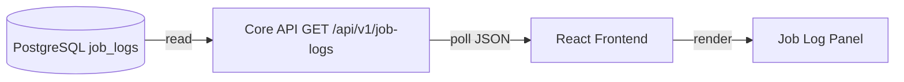
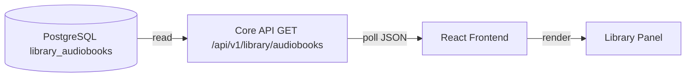
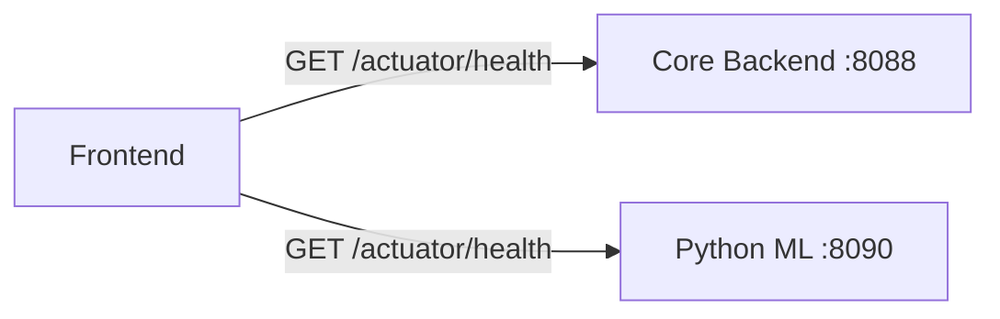

# Frontend Architecture

Documentation for the operational dashboard (`audio-frontend`) — a React-based web interface for monitoring and managing the Audio Library System.

## Tech Stack

| Technology | Version | Purpose |
|-----------|---------|---------|
| React | 19 | UI framework |
| TypeScript | — | Type-safe development |
| Vite | — | Build tool and dev server |
| Tailwind CSS | — | Utility-first CSS styling |

## Project Structure

```
audio-frontend/src/
├── App.tsx          ← Main application component with navigation and page routing
├── main.ts          ← Vite entry point, renders App into DOM
├── assets/          ← Static assets
└── index.css        ← Global styles (Tailwind imports)
```

## Pages

The dashboard is a single-page application with multiple views controlled by internal state:

| Page | What It Shows |
|------|--------------|
| **Dashboard** | Landing page — overview of the automation platform |
| **Jobs** | Job log panel loaded from the core API (`GET /api/v1/job-logs`, PostgreSQL `job_logs`), polled every few seconds |
| **Library** | Audiobook catalog from **`GET /api/v1/library/audiobooks`** (PostgreSQL `library_audiobooks`), polled every few seconds |
| **Service Health** | Live health check results for Core and Silence services |
| **Logs** | Validation results and error trace inspection |

### Jobs Panel

The Jobs page loads job rows through the core backend only (no direct browser access to the database or Firestore):



Each job log entry displays:
- **Job type** (e.g., audio processing, video creation)
- **Status** with color coding: `RUNNING` (yellow), `COMPLETED` (green), `FAILED` (red)
- **Timestamps** — start time and optional completion time
- **Summary** — brief description of the job
- **Error message** — displayed in red if the job failed

The subscription is limited to the 50 most recent entries, ordered by `startedAt` descending.

### Library Panel



Rows show **`id`** (`catalog_public_id` UUID), **`title`**, **`processingStatus`**, **`fileId`**, optional author/narrator, and badges when **`distributedTo.youtubeVideoId`** / **`distributedTo.telegramFileId`** are set. This path does **not** use the Firebase Web SDK or Firestore listeners.

### Health Checks

The health page checks both backend services in parallel:



Each check has an 8-second timeout and returns one of four statuses:
- `ok` — service responded with 2xx
- `error (status)` — service responded with non-2xx
- `timeout` — no response within 8 seconds
- `offline-or-cors` — connection failed (service down or CORS blocked)

## API Client Module (`api/client.ts`)

The client module provides:

| Function | Purpose |
|----------|---------|
| `getCoreHealth()` | Health check for `VITE_CORE_API_URL` (default `:8088`) |
| `getSilenceHealth()` | Health check for `VITE_SILENCE_API_URL` (default `:8090`) |
| `subscribeToJobLogs(callback, maxCount)` | Polls `GET /api/v1/job-logs` on the core API (returns recent PostgreSQL `job_logs` rows) |
| `subscribeToAudiobooks(callback)` | Polls `GET /api/v1/library/audiobooks` (PostgreSQL catalog) |

### JobLog Interface

```typescript
interface JobLog {
  jobId: string;       // PostgreSQL job_logs.id (serialized as string in JSON)
  jobType: string;     // Type of job (audio, video, etc.)
  status: string;      // RUNNING, COMPLETED, FAILED
  startedAt: string;   // ISO timestamp
  completedAt?: string; // ISO timestamp (optional)
  summary?: string;    // Brief description
  errorMessage?: string; // Error details if failed
}
```

## Backend-only data access

The dashboard does not use the Firebase client SDK or connect to Firestore from the browser. **PostgreSQL is the primary source** for operational data exposed to the UI (job logs via **`GET ${VITE_CORE_API_URL}/api/v1/job-logs`**, library catalog via **`GET ${VITE_CORE_API_URL}/api/v1/library/audiobooks`** — requires PostgreSQL and Flyway on the bot). Firestore is optional **second**: the backend may mirror catalog writes to Firestore with the Admin SDK when `firebase.enabled=true` and `firebase.firestore.sync=true`; that path is server-side only and does not replace Postgres as the read surface for these dashboards.

## Styling

The dashboard uses **Tailwind CSS** with a dark theme:
- Background: `bg-slate-950` (near-black)
- Surfaces: `bg-slate-900` with `border-slate-800` borders
- Accent: `indigo-500` / `indigo-600` for interactive elements
- Text hierarchy: `text-slate-100` (primary), `text-slate-200` (secondary), `text-slate-400` (muted)

## Configuration

| Variable | Default | Purpose |
|----------|---------|---------|
| `VITE_CORE_API_URL` | `http://localhost:8088` | Core backend URL |
| `VITE_SILENCE_API_URL` | `http://localhost:8090` | Python ML service URL |

## Related Documentation

- [System Overview](system-overview.md) — how the frontend fits in the architecture
- [REST API Reference](../api/rest-api-reference.md) — endpoints the frontend consumes
- [Configuration](../guides/configuration.md) — environment variable reference
