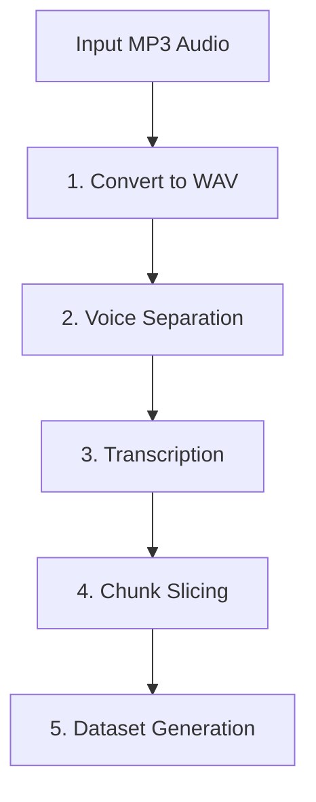
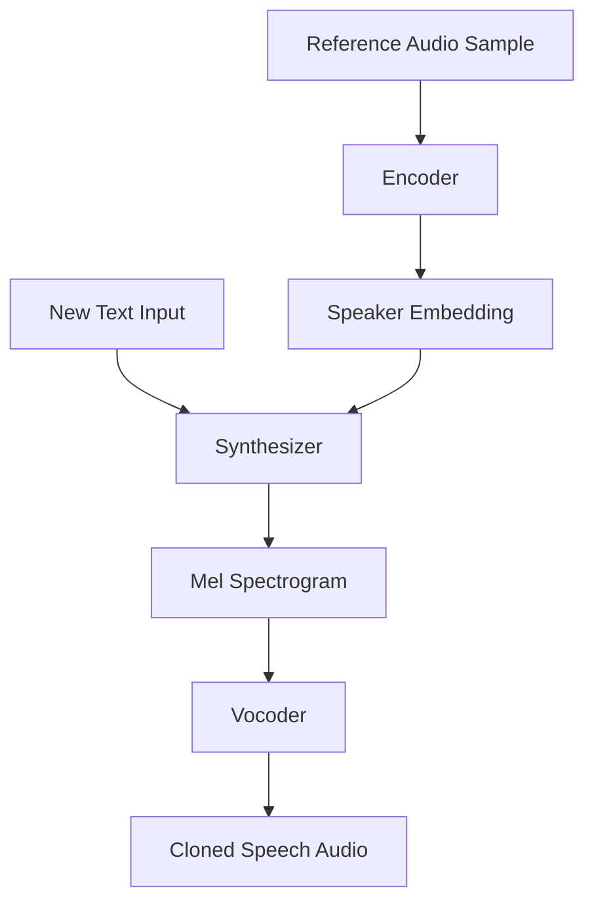
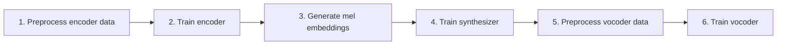

# ML Service Architecture

Documentation for the Python ML service (`audio-silence-service`) — a deep learning audio processing toolkit for voice separation, transcription, and voice cloning.

## Purpose

The ML service provides audio processing capabilities that require GPU acceleration and specialized deep learning libraries — tasks the Java backend cannot perform. It handles:

1. **Audio source separation** — isolate vocals from background noise/music
2. **Speech-to-text transcription** — generate Russian-language text from audio
3. **Voice cloning** — synthesize speech in a cloned speaker's voice
4. **Dataset generation** — produce training data for voice models

## Tech Stack

| Technology | Purpose |
|-----------|---------|
| Python 3.7+ | Language runtime |
| PyTorch | Deep learning framework (GPU-accelerated tensor operations) |
| Whisper (OpenAI) | Speech recognition — Russian transcription |
| Demucs (Facebook Research) | Music source separation — vocal isolation |
| TorchAudio | Audio I/O and transformations |
| FFmpeg | Audio format conversion and slicing |
| CUDA / NVIDIA GPU | GPU acceleration for model inference and training |

## Project Structure

```
audio-silence-service/
├── audio_processing.py            ← Main processing pipeline
├── demo_cli.py                    ← CLI interface for interactive use
├── demo_toolbox.py                ← GUI interface (Tkinter-based)
├── encoder/                       ← Speaker encoder (d-vector extraction)
├── synthesizer/                   ← Tacotron 2 text-to-speech
├── vocoder/                       ← WaveRNN vocoder
├── encoder_preprocess.py          ← Encoder data preprocessing
├── encoder_train.py               ← Encoder training script
├── synthesizer_preprocess_audio.py ← Synthesizer audio preprocessing
├── synthesizer_preprocess_embeds.py ← Mel-spectrogram embedding
├── synthesizer_train.py           ← Synthesizer training script
├── vocoder_preprocess.py          ← Vocoder data preprocessing
├── vocoder_train.py               ← Vocoder training script
├── utils/                         ← Shared utilities
├── toolbox/                       ← GUI toolbox components
├── samples/                       ← Sample audio files
├── scripts/                       ← Helper scripts
└── requirements.txt               ← Python dependencies
```

## Audio Processing Pipeline

The main pipeline in `audio_processing.py` processes raw MP3 audiobooks into clean, transcribed, chunked datasets:



### Step 1: Convert to WAV (`convert_to_wav`)

- Converts MP3 to 16kHz mono WAV format using FFmpeg
- Splits long audio files into equal-duration parts for manageable processing
- Skips files that have already been converted (idempotent)

### Step 2: Voice Separation (`clean_audio_with_demucs`)

- Uses Facebook's Demucs `htdemucs` model to separate audio into stems
- Isolates the **vocal track**, removing background music and noise
- Runs on CPU by default (configurable for GPU acceleration)
- Caches results — skips processing if the vocal file already exists

### Step 3: Transcription (`transcribe_audio`)

- Uses OpenAI's Whisper model (`medium` size) for Russian-language speech-to-text
- Generates timestamped segments with start/end times for each utterance
- Stores results in `transcription.json` with incremental segment IDs
- Appends new transcriptions to existing data without overwriting

### Step 4: Chunk Slicing (`slice_audio`)

- Cuts the cleaned vocal audio into individual chunks based on transcription timestamps
- Uses FFmpeg's stream copy mode for fast, lossless slicing
- Each chunk maps to a single transcription segment
- Adds `chunk_path` to the transcription data for downstream use

### Step 5: Dataset Generation (`create_dataset`)

- Creates a CSV file mapping each audio chunk to its transcription text
- Format: `chunk_path|text` per line
- Suitable for training text-to-speech models

## Voice Cloning Pipeline (SV2TTS)

The service includes a Real-Time Voice Cloning system based on the SV2TTS (Speaker Verification to Text-to-Speech) architecture:



### Encoder

- **Purpose**: Extract a fixed-length speaker identity vector (d-vector) from a reference audio sample
- **How it works**: Processes short audio clips and outputs a 256-dimensional embedding that captures the speaker's unique voice characteristics
- **Training**: `encoder_train.py` — trains on speaker verification data

### Synthesizer (Tacotron 2)

- **Purpose**: Convert text into a mel spectrogram conditioned on the speaker embedding
- **How it works**: Takes the text to speak and the speaker's d-vector, produces a mel spectrogram that sounds like the target speaker
- **Training**: `synthesizer_train.py` — trains on text-audio pairs with speaker embeddings

### Vocoder (WaveRNN)

- **Purpose**: Convert mel spectrograms into raw audio waveforms
- **How it works**: Neural vocoder that generates high-quality audio at sample level from mel spectrogram input
- **Training**: `vocoder_train.py` — trains on synthesized mel spectrograms

## Training Workflow

The training pipeline follows a sequential order:



| Step | Command | What It Does |
|------|---------|-------------|
| 1 | `python encoder_preprocess.py -o ./dataset/encoder -d custom ./processed_data/` | Preprocesses raw audio for encoder training |
| 2 | `python encoder_train.py 01 ./dataset/ --no_visdom -b 1500` | Trains the speaker encoder model |
| 3 | `python synthesizer_preprocess_embeds.py ./dataset --encoder_model_fpath ./saved_models/01/encoder.pt` | Generates mel-spectrogram embeddings using trained encoder |
| 4 | `python synthesizer_train.py 01 ./dataset2 -m ./saved_models/ -s 2000` | Trains the Tacotron 2 synthesizer |
| 5 | `python vocoder_preprocess.py -s ./saved_models/01/synthesizer.pt -i ./dataset/ -o ./dataset/vocoder/` | Preprocesses data for vocoder training |
| 6 | `python vocoder_train.py 01 ./dataset --syn_dir ./dataset/synthesizer --voc_dir ./dataset/vocoder -b 2000` | Trains the WaveRNN vocoder |

## Entry Points

| Script | Interface | Use Case |
|--------|-----------|----------|
| `demo_cli.py` | Command-line | Interactive voice cloning — select speaker, enter text, generate audio |
| `demo_toolbox.py` | GUI (Tkinter) | Visual interface for recording, loading audio, and generating cloned speech |
| `audio_processing.py` | Script/Import | Batch audio processing pipeline (convert → clean → transcribe → slice → dataset) |

## GPU Requirements

The service is designed for NVIDIA GPU acceleration:
- CUDA-capable GPU recommended for reasonable inference/training speed
- CPU fallback available but significantly slower
- Memory management: `torch.cuda.empty_cache()` called between operations to prevent OOM
- Mixed precision: `torch.amp.autocast` used for Demucs inference to reduce memory usage

## Related Documentation

- [System Overview](system-overview.md) — how the ML service fits in the architecture
- [Audiobook Pipeline](../pipeline/audiobook-pipeline.md) — step 3 uses audio processing capabilities
- [Local Development](../guides/local-development.md) — how to set up and run the service
