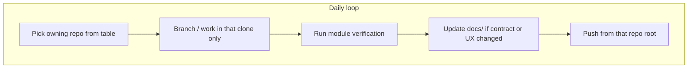

# Multi-repository daily workflow

The workspace root **`audio-library-system`** is an **aggregator folder**, not a Git repository. Each component below is a **separate clone** with its own **`git`** history, issues, and CI.

Use this page **every day** before coding: pick the **one repo** that owns the change, commit **inside that directory**, then sync cross-cutting docs in **`docs/`** when behavior spans products.

---

## Repository roles (local folders)

| Folder | Role | Typical verification |
|--------|------|----------------------|
| **`audio-library-automation-bot/`** | Spring Boot API, Flyway, Telegram/posters when enabled | `./mvnw test` (or targeted `-Dtest=…`) |
| **`audio-frontend/`** | React admin UI | `npm run lint`, `npm test` |
| **`audio-platform-cicd/`** | Shared GitHub Actions workflows | Workflow YAML review / caller-repo dry run |
| **`docs/`** | Architecture, specs, guides (often shared across repos) | Markdown links, diagrams render |
| **`audio_silence_service/`** | Demucs FastAPI microservice | Service README / tests / compose smoke |
| **`whisper/`** | Whisper FastAPI microservice | Service README / compose smoke |
| **`audio_preperation/`** | Offline Python prep scripts (not a network service) | Script-level checks per folder README |

Canonical **folder ↔ GitHub remote** names: [Repository map — GitHub repositories](repository-map.md).

---

## What to open first

| If you are… | Start in |
|-------------|----------|
| Changing REST API, DB schema, jobs, library catalog | **`audio-library-automation-bot/`** |
| Changing dashboard UI or frontend API client | **`audio-frontend/`** |
| Changing reusable CI workflows | **`audio-platform-cicd/`** |
| Changing cross-repo specs, runbooks, architecture narrative | **`docs/`** (and link from owning product README if needed) |
| Changing noise-removal HTTP API | **`audio_silence_service/`** |
| Changing transcription HTTP API | **`whisper/`** |
| Changing offline prep scripts | **`audio_preperation/`** |

---

## Integrated local run (golden path)

When you need **bot + UI + Postgres** together: [Local dev runbook](../guides/local-dev-runbook.md).

Optional ML HTTP deps (**Demucs**, **Whisper**) are **not** in the bot’s compose file — start them from their own repos when testing integration.

---

## Git discipline

1. **`cd` into the repo you changed** before `git status`, `git commit`, `git push`.
2. Do **not** assume the parent folder is a monorepo Git root.
3. Cross-repo features: **separate commits per repo** (or clearly stacked PRs), plus a **`docs/`** update when operators need one narrative.

---

## Related

- [Repository map — GitHub repositories](repository-map.md)
- [Local dev runbook](../guides/local-dev-runbook.md)
- [Schema sources of truth](schema-sources-of-truth.md)
- `.cursor/AGENTS.md` — agent operating contract
- `.cursor/rules/02-structure-and-ownership.md` — ownership boundaries
