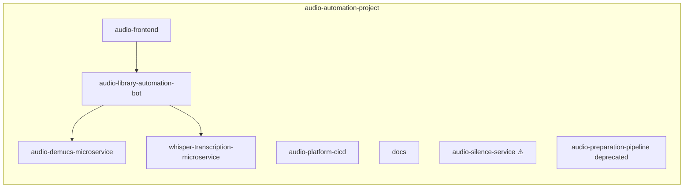

# GitHub repositories — Audio Automation Platform

Organization: [audio-automation-project](https://github.com/audio-automation-project)

Use this document to match **local workspace folders** to **canonical GitHub repos**. Each component is deployed and versioned independently.



## Repository table

| Local folder | GitHub repository | Purpose |
|----------------|-------------------|---------|
| `audio-library-automation-bot/` | https://github.com/audio-automation-project/audio-library-automation-bot | Spring Boot monolith |
| `audio-frontend/` | https://github.com/audio-automation-project/audio-frontend | React admin UI |
| `audio-platform-cicd/` | https://github.com/audio-automation-project/audio-platform-cicd | Shared CI workflows |
| `docs/` | https://github.com/audio-automation-project/docs | Specifications, guides, audits |
| `audio_silence_service/` | https://github.com/audio-automation-project/audio-demucs-microservice | FastAPI + **Demucs** HTTP API (noise separation) |
| `whisper/` | https://github.com/audio-automation-project/whisper-transcription-microservice | FastAPI + **Whisper** HTTP API |

## Notes

### Legacy naming (do not confuse)

- **`audio-silence-service`** (underscore vs hyphen irrelevant) — the existing org repo historically contains a **different codebase** (synthesizer / voice-climbing style layout: `vocoder/`, `synthesizer_train.py`, …), **not** the FastAPI Demucs service in local `audio_silence_service/`. The canonical home for **that Demucs FastAPI microservice** is **`audio-demucs-microservice`**.
- **`audio-preparation-pipeline`** — **`[DEPRECATED]`** and **archived** on GitHub. Treat as historical only.

### Preparation scripts (`audio_preperation/`)

- Local repo remote: `https://github.com/KingEGame/audio_preperation.git` (personal account).
- There is **no active** counterpart under the org matching this folder today. Migrate or rename under **audio-automation-project** when you want org ownership aligned with **`audio_preperation`**.

### Other org repositories

- Public meta: **`docs`**, **`audio-frontend`**, **`audio-platform-cicd`**, deprecated **`audio-preparation-pipeline`**.

---

**Safe.directory (Windows multi-user clones):** If Git reports “dubious ownership,” run:

```bash
git config --global --add safe.directory "E:/Projects/audio-library-system/audio_preperation"
git config --global --add safe.directory "E:/Projects/audio-library-system/audio_silence_service"
git config --global --add safe.directory "E:/Projects/audio-library-system/whisper"
```

(Add paths matching your machine.)
