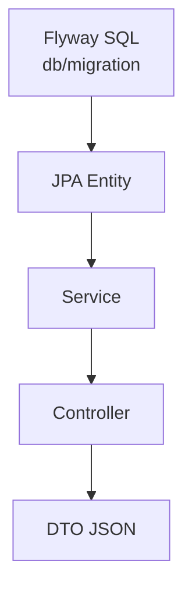
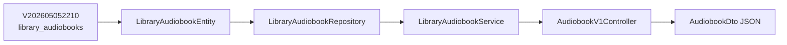

# Schema sources of truth

Where to look when **`REST JSON`**, **Java types**, and **PostgreSQL DDL** must agree.

## Rules

1. **DDL** — Flyway scripts under `audio-library-automation-bot/src/main/resources/db/migration/` are authoritative for table/column names and constraints (never rewrite applied versions for deployed DBs; add new versioned files instead).
2. **Persistence mapping** — JPA entities (`@Table`, `@Column`) must match those DDL names unless an explicit naming strategy documents otherwise (there is none today).
3. **REST payloads** — DTO field names are **`camelCase`** in JSON; they map to **`snake_case`** columns via entities/services listed below.

---

## Operational audiobook catalog

| Layer | Location |
|-------|----------|
| **DDL** | `audio-library-automation-bot/src/main/resources/db/migration/V202605052210__library_audiobooks.sql` → table **`library_audiobooks`** |
| **Entity** | `…/library/domain/LibraryAudiobookEntity.java` |
| **Repository** | `…/library/repository/LibraryAudiobookRepository.java` |
| **Service** | `…/library/service/LibraryAudiobookService.java` |
| **REST** | `…/library/web/AudiobookV1Controller.java` → **`/api/v1/library/audiobooks`** |
| **DTOs** | `…/library/dto/AudiobookDto.java`, `…/library/dto/DistributedToDto.java` |

**Public id:** API field **`id`** is UUID string **`catalog_public_id`** (not the bigint surrogate **`library_audiobooks.id`**).

**Distribution (`distributedTo`):** **`youtubeVideoId`** ↔ **`dist_youtube_video_id`**; **`telegramFileId`** ↔ **`dist_telegram_file_id`**.

**Optional mirror:** `…/firebase/service/FirestoreAudiobookService.java` — only when `firebase.enabled=true` and `firebase.firestore.sync=true`; does not replace Postgres as the source for **`GET /api/v1/library/audiobooks`**.

---

## Pipeline / cycles (Milestone A)

Normalized pipeline tables (**`cycles`**, **`audio_parts`**, **`scraped_books`**, **`job_logs`**, …) are split across Flyway versions **`V202605052130`**, **`V202605052140`**, **`V202605052150`**, **`V202605052200`**, etc.

**Canonical ER and naming:** [`docs/superpowers/specs/2026-05-05-milestone-a-normalized-schema-design.md`](../superpowers/specs/2026-05-05-milestone-a-normalized-schema-design.md).

**Implementation map:** [`docs/superpowers/plans/2026-05-05-milestone-a-normalized-schema-implementation-plan.md`](../superpowers/plans/2026-05-05-milestone-a-normalized-schema-implementation-plan.md).

---

## Job logs (dashboard polling)

| Layer | Location |
|-------|----------|
| **DDL** | Defined in cycle/integration migrations (table **`job_logs`**) |
| **REST** | **`GET /api/v1/job-logs`** — see `…/jobs/web/JobLogV1Controller.java` and response type aligned with `job_logs` rows |

Frontend: `audio-frontend/src/api/client.ts` → **`subscribeToJobLogs`**.

---

## Related documentation

- [Local dev runbook](../guides/local-dev-runbook.md) — Postgres + bot + frontend golden path
- [Database design](database-design.md) — persistence overview
- [REST API reference](../api/rest-api-reference.md) — endpoint inventory
- [DTO catalog](../data/dto-catalog.md) — field-level DTO reference
