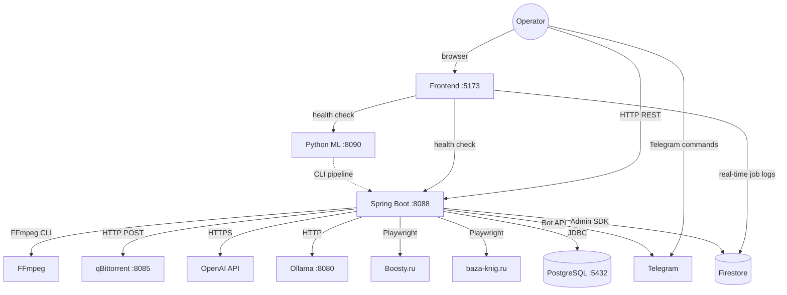

# System Overview

## Concept & Vision

The Audio Library System is a software platform that automates the entire lifecycle of audiobook production — from discovering audiobook sources online, through audio processing and cover art generation, all the way to publishing finished products on content platforms.

**Core idea**: Replace manual, repetitive audiobook production work with an integrated pipeline where each step feeds into the next automatically. An operator interacts through a Telegram bot, a REST API, or a web dashboard to trigger and monitor workflows.

**Target audience**: A single operator managing a Russian-language audiobook production and distribution pipeline across platforms like YouTube, Boosty, and Telegram.

## Services

| Service | Tech Stack | Port | Role |
|---------|-----------|------|------|
| `audio-library-automation-bot` | Java 17, Spring Boot 3.4, JPA, Flyway | 8088 | Core REST API, Telegram bot, FFmpeg pipelines, Playwright automation, AI integrations |
| `audio-frontend` | React 19, TypeScript, Vite, Tailwind CSS | 5173 | Operational dashboard: health checks, job monitoring, log viewing |
| `audio-silence-service` | Python 3.7+, PyTorch, Whisper, Demucs | 8090 | ML audio processing: voice separation, transcription, voice cloning |

## Architecture Diagram



## How the Services Interact

### Operator → Backend

The operator drives all workflows. There are three entry points:

1. **REST API** (`http://localhost:8088/api/...`) — trigger audio processing, catalog management, image generation, publishing, etc.
2. **Telegram Bot** — interact via commands (`/list`, `/get`, `/upload`, `/reupload`) to manage audiobooks and trigger uploads
3. **Web Dashboard** (`http://localhost:5173`) — monitor service health and view real-time job logs

### Backend → External Services

The backend acts as the central orchestrator. It calls out to:

- **FFmpeg** (system PATH) for all audio and video processing — compress, trim, concatenate, compose video
- **qBittorrent** (`:8085`) for torrent download lifecycle — upload magnet links, poll progress, auto-delete on completion
- **OpenAI API** for AI-powered content — DALL-E 3 image generation + GPT-4o text enhancement
- **Ollama** (`:8080`) for local LLM inference — Gemma model for search and text tasks
- **Playwright / Chromium** for browser automation — Boosty.ru content posting + baza-knig.ru catalog scraping
- **Telegram Bot API** for bot commands and file uploads
- **PostgreSQL** (`:5432`) as the primary database
- **Firebase/Firestore** (optional) for read-model projection and real-time data streaming

### Frontend → Backend + Firestore

The frontend is a lightweight monitoring dashboard:
- Polls `/actuator/health` on both the core backend and Python ML service (8-second timeout)
- Subscribes to the Firestore `job_logs` collection via `onSnapshot` for real-time job status updates

### Python ML Service

Currently operates as a standalone CLI tool. It provides capabilities the Java backend cannot: Demucs voice separation, Whisper transcription, and SV2TTS voice cloning. See [ML Service Architecture](ml-service-architecture.md) for details.

## Repository Structure

```
Audio-library-System/
├── audio-library-automation-bot/     ← Core backend (Java / Spring Boot)
├── audio-frontend/                   ← Dashboard UI (React / TypeScript / Vite)
├── audio-silence-service/            ← ML audio processing (Python / PyTorch)
├── audio-platform-cicd/              ← CI/CD workflows (GitHub Actions)
├── docs-repo/                        ← This documentation
├── scripts/                          ← Utility scripts
├── pom.xml                           ← Maven aggregator POM
└── CLAUDE.md                         ← Developer quick-reference
```

## Related Documentation

- [Backend Architecture](backend-architecture.md) — deep dive into the Java backend
- [Frontend Architecture](frontend-architecture.md) — dashboard internals
- [ML Service Architecture](ml-service-architecture.md) — Python ML service details
- [Database Design](database-design.md) — data model and persistence
- [Schema sources of truth](schema-sources-of-truth.md) — Flyway ↔ API ↔ DTO mapping index
- [Local dev runbook](../guides/local-dev-runbook.md) — run Postgres + bot + dashboard locally
- [Multi-repo daily workflow](multi-repo-daily-workflow.md) — which clone to commit in; Git discipline
- [Audiobook Pipeline](../pipeline/audiobook-pipeline.md) — 7-step production workflow
- [REST API Reference](../api/rest-api-reference.md) — full endpoint inventory
