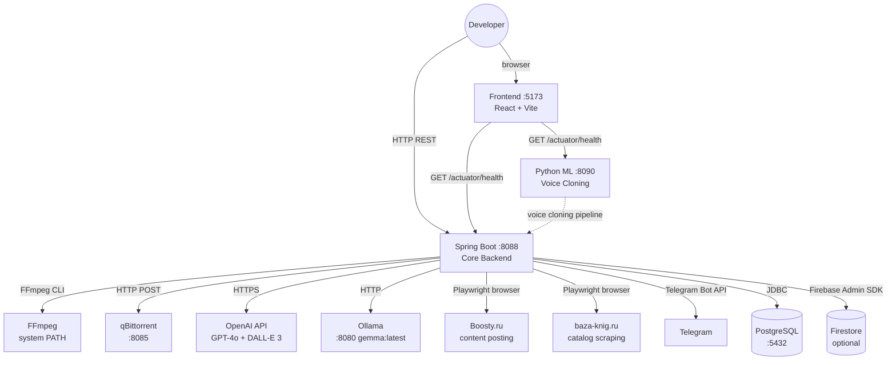

# Architecture — System Overview

---

## Service Map

| Service | Tech | Port | Role |
|---------|------|------|------|
| `audio-library-automation-bot` | Java 17, Spring Boot 3.4 | 8088 | Core REST API, Telegram bot, FFmpeg pipelines, Playwright automation |
| `audio-frontend` | React 19, TypeScript, Vite | 5173 (dev) | Operational dashboard, health checks, job monitoring |
| `audio-silence-service` | Python 3.7+, PyTorch | 8090 | ML audio processing, Real-Time Voice Cloning |

---

## System Diagram



---

## Backend Domain Package Map

```
kg.automation.rest.automatation/
  audio/        AudioController, AudioService — FFmpeg audio processing
  video/        VideoController, VideoCreation — FFmpeg video composition (partial)
  image/        BookCoverController — Java AWT cover generation
  ai/           OllamaController, OpenAiController — AI image/text generation
  ffmpeg/       ExecutionService — generic ProcessBuilder FFmpeg wrapper
  torrent/      TorrentController, QBittorrentService, TorrentMonitorScheduler
  telegram/     AudioLibraryBot (webhook), legacy HTTP controllers
  poster/       BoostyController (Playwright), YouTubeController (stub)
  search/       SearchController, BookParserService (Playwright scraping)
  library/      AudiobookV1Controller, AudiobookLibraryService, AudiobookRepository
  firebase/     FirebaseConfig, FirestoreSyncService (optional)
  gateway/      RestCallService — orchestrates inter-service HTTP calls
  file/         ProperityConfig — path configuration and directory management
  text/         TextController, ImageDescriptionTextExtractorSercvice
  Data/         DTOs: Book, AudioDescription, BookCover, TorrentInfo, SearchInformation
  config/       CorsConfig, RestConfig, SchedulerConfig, TelegramBotConfig
```

---

## Feature Flag Modes

### `app.core.enabled=true` (default — minimal safe mode)

Active domains: **Audio**, **Library**

Use this mode when:
- Running audio processing only
- No external services available (no Telegram token, no qBittorrent, no Playwright)
- Development / testing without full infrastructure

### `app.core.enabled=false` (full mode)

All domains active, including: Telegram bot, Boosty poster, YouTube (stub), AI (OpenAI + Ollama), Torrent, Search, Parser, Video, Text extraction.

Requires: Telegram bot token, Playwright/Chromium, qBittorrent, OpenAI API key (currently hardcoded).

---

## Database

| Component | Production | Local Dev |
|-----------|-----------|-----------|
| Engine | PostgreSQL 15+ | H2 in-memory |
| Profile | default | `-Dspring.profiles.active=h2` |
| Migrations | Flyway (`classpath:db/migration/`) | Hibernate DDL auto |
| Schema defined by | SQL files in `db/migration/` *(currently empty — see gaps)* | Hibernate entity annotations |

**Tables:**
- `audiobook` — core audiobook catalog
- `media_group` — collections of audiobooks
- `parsed_book` — Baza-Knig scraped results

---

## Cluster Migration Plan (Target Architecture)

The monolith is planned to split into three independent clusters. Current status: **all functionality lives in `audio-library-automation-bot`**.

| Cluster | Responsibility | Domains (from monolith) | Status |
|---------|---------------|------------------------|--------|
| **A — Acquisition** | Catalog discovery, URL resolution, file staging | Search, Parser, Torrent | Planned |
| **B — Production** | Audio/image/video processing | Audio, Image, Video, Text, AI | Planned |
| **C — Distribution** | Publishing to platforms | Poster (Boosty, YouTube), Telegram | Planned |

Inter-cluster calls use `/internal/**` endpoints authenticated via `X-Internal-Token` header with correlation ID tracking. These are defined in the gateway package but the actual cluster split has not occurred.

---

## CORS Configuration

Allowed origins: `http://localhost:5173` (Vite dev), `http://localhost:4173` (Vite preview)
Allowed methods: GET, POST, PUT, DELETE, PATCH, OPTIONS
Headers: all

Defined in `config/CorsConfig.java`.

---

## Python ML Service

The `audio-silence-service` runs the Real-Time Voice Cloning (SV2TTS) pipeline:

```
Speaker audio sample
      ↓
  Encoder (speaker verification)
      ↓
  Synthesizer (Tacotron 2 — text → mel spectrogram)
      ↓
  Vocoder (WaveRNN — mel → waveform)
      ↓
  Output audio
```

Entry points: `demo_cli.py` (CLI), `demo_toolbox.py` (GUI). No REST API is currently defined — the service is not yet integrated with the Spring Boot backend.
