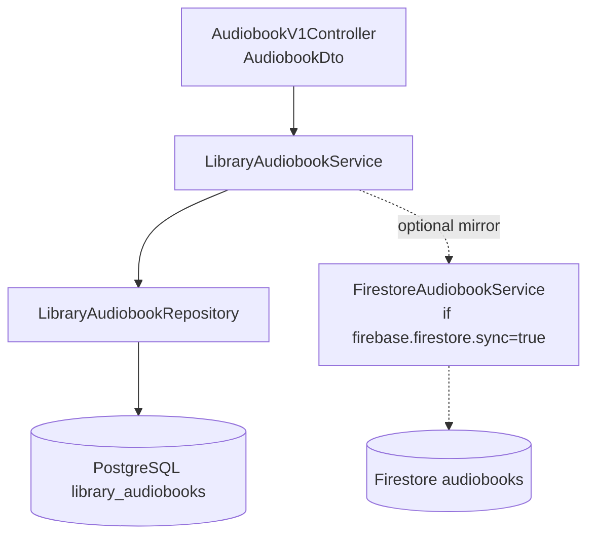

# DTO Catalog

Data Transfer Objects (DTOs) used across the Audio Library System, organized by lifecycle status.

## Boundary Rules

- **API DTOs must not be reused as persistence entities** — controllers use DTOs, repositories use JPA entities, services handle the mapping between them
- **DTO-to-entity mapping** is handled in the service layer (e.g., `LibraryAudiobookService` maps **`AudiobookDto`** ↔ **`LibraryAudiobookEntity`**)

## Active DTOs

DTOs currently used by runtime code paths.

| DTO / Model | Purpose | Producer | Consumer | Persistence |
|------------|---------|----------|----------|-------------|
| `AudiobookDto` | API payload for operational catalog CRUD | `AudiobookV1Controller` | `LibraryAudiobookService` | PostgreSQL **`library_audiobooks`** (`LibraryAudiobookEntity`) |
| `AudioDescription` | Processing/staging metadata for audio workspaces | `AudioDescriptionPersistenceService` | Production orchestration | Mapped to `audio_description` table rows |
| `Book` | Normalized parsed book metadata used during acquisition | Search and parser services | Library ingest services | Persisted as / linked to **`parsed_book`** / pipeline entities (not `library_audiobooks` unless explicitly wired) |
| `BookCover` | Cover image generation parameters | Image generation pipeline | Video/poster composition | Generated PNG assets on disk |
| `TorrentInfo` | Torrent download metadata | Torrent/search modules | Acquisition services | Torrent discovery → staged files |
| `SearchInformation` | Search results with extracted URLs | `SearchController` | `BookParserService` | In-memory (passed between steps) |
| `MonitorTorrents` | Torrent polling status response | `TorrentController` | Frontend / API callers | In-memory (real-time status) |
| `ExtractedDescription` | GPT-4o enhanced description text | `TextController` | Publishing workflows | In-memory (output for posting) |
| `Response` | Shared response envelope | API controllers | Frontend and callers | HTTP JSON response bodies |
| `OpenAiResponse` | OpenAI API chat completion wrapper | AI controllers | Image generation service | In-memory |

## DTO Mapping Flow

### AudiobookDto mapping

**`LibraryAudiobookService`** loads/saves **`AudiobookDto`** with **`id`** = **`catalog_public_id`** (UUID string). Merge rules apply partial updates for non-null JSON fields; **`distributedTo`** carries **`youtubeVideoId`** and **`telegramFileId`** only (columns **`dist_youtube_video_id`**, **`dist_telegram_file_id`**).

## DTO Field Reference

### AudiobookDto

| Field | Type | Nullable | Description |
|-------|------|----------|-------------|
| `id` | String (UUID) | No (on response) | **`catalog_public_id`** |
| `fileId` | String | Yes | Telegram file id |
| `title` | String | Yes | Title |
| `author` | String | Yes | Author |
| `narrator` | String | Yes | Narrator |
| `originalTitle` | String | Yes | Original title |
| `part` | String | Yes | Part label |
| `sourceLink` | String | Yes | Source URL |
| `duration` | Long | Yes | Seconds |
| `uploadDate` | String | Yes | Upload date |
| `description` | String | Yes | Description |
| `coverImageIds` | List of String | Yes | Cover image ids |
| `distributedTo` | DistributedToDto | Yes | YouTube + Telegram only |
| `processingStatus` | String | Yes | Pipeline status |

### DistributedToDto

| Field | Type | Description |
|-------|------|-------------|
| `youtubeVideoId` | String | YouTube video id or equivalent |
| `telegramFileId` | String | Telegram file id after publish |

### BookCover

| Field | Type | Description |
|-------|------|-------------|
| `imagePath` | String | Path to base image file |
| `title` | String | Title text to render on cover |
| `count` | int | Number of cover variants to generate |

### TorrentInfo

| Field | Type | Description |
|-------|------|-------------|
| `name` | String | Torrent name |
| `hash` | String | Torrent info hash |
| `state` | String | Download state |
| `progress` | double | Download progress (0-100) |
| `size` | long | Total size in bytes |

### SearchInformation

| Field | Type | Description |
|-------|------|-------------|
| `urls` | List | List of extracted URLs |
| `query` | String | Original search query |

## JobLog (REST / PostgreSQL)

The dashboard polls **`GET /api/v1/job-logs`** — rows come from PostgreSQL **`job_logs`** (`JobLogResponse` JSON).

| Field | Type | Description |
|-------|------|-------------|
| `jobId` | String | **`job_logs.id`** serialized as string |
| `jobType` | String | Job kind |
| `status` | String | e.g. PENDING, IN_PROGRESS, COMPLETED, FAILED |
| `startedAt` | String | ISO timestamp |
| `completedAt` | String | ISO timestamp (optional) |
| `summary` | String | Brief description (optional) |
| `errorMessage` | String | Error if failed (optional) |

## Related Documentation

- [Database Design](../architecture/database-design.md) — entity definitions and relationships
- [REST API Reference](../api/rest-api-reference.md) — endpoints that use these DTOs
- [Backend Architecture](../architecture/backend-architecture.md) — service layer mapping
