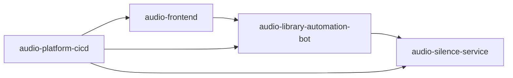

# System Landscape

## Purpose

This document defines the high-level architecture for the active Audio Automation platform.

## Components

- `audio-library-automation-bot` (core backend)
  - Primary business logic and orchestration layer.
  - Main API and automation workflows.

- `audio-silence-service` (support service)
  - Additional processing service integrated by the core backend.
  - Focused on specialized audio processing support flows.

- `audio-frontend` (planned)
  - React + Tailwind UI for operations, monitoring, and workflow management.

- `audio-platform-cicd` (planned)
  - Central CI/CD policy, validation, and deployment orchestration.

## Architecture Diagram

