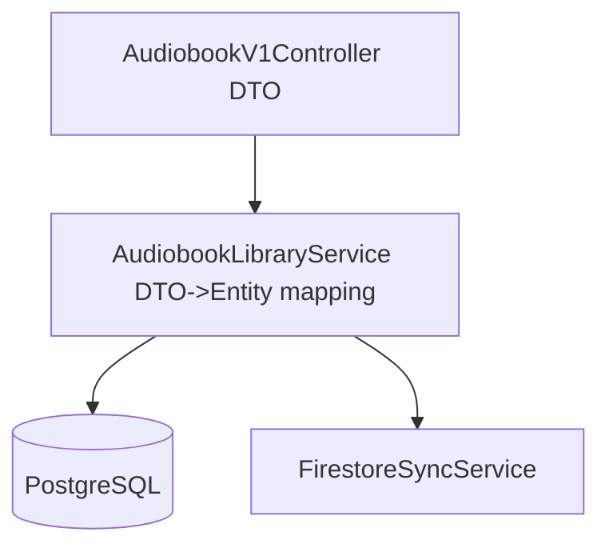

# DTO Catalog and Mapping

## Purpose
Describe which DTOs/models are in scope for this feature area and how they map across API, service, and persistence boundaries.

This document catalogs data transfer objects related to the audio library pipeline, grouped by lifecycle status with explicit evidence labels.

Scope note: This catalog is exhaustive within currently available evidence sources in `docs-repo` and currently referenced implementation paths; entries that cannot be fully proven are explicitly labeled `Unknown/Unverified`.

## Evidence Labels
Use one evidence label per row so readers can quickly validate each claim.

- `Verified in code`
- `Verified in config`
- `Inferred from docs`
- `Missing in current workspace`

## Status Groups
Use these sections to group DTO/model entries by lifecycle state.

## Active
DTOs/models currently used by runtime paths.

| DTO/Model | Purpose | Producer | Consumer | Source/Sink | Stability | Status | Evidence |
|---|---|---|---|---|---|---|---|
| AudiobookDto | API payload for audiobook CRUD | AudiobookV1Controller | AudiobookLibraryService | PostgreSQL audiobook rows | Evolving | Active | Verified in code |
| AudioDescription | Processing/staging metadata for audio workspaces and lifecycle status | AudioDescriptionPersistenceService | Production orchestration and status readers | PostgreSQL `audio_description` rows | Evolving | Active | Verified in code |
| Book | Normalized parsed book metadata used during acquisition/cataloging | Search and parser services | Library ingest and mapping services | Parsed book metadata to library rows | Evolving | Active | Inferred from docs |
| BookCover | Cover image generation payload/model used by image and poster flow | Image generation pipeline | Video/poster composition flows | Generated image assets and catalog links | Evolving | Active | Inferred from docs |
| TorrentInfo | Torrent resolution/download transfer structure for staged audio sources | Torrent/search modules | Acquisition staging and downloader services | Torrent discovery to staged files | Evolving | Active | Inferred from docs |
| Response | Shared response envelope used by selected internal/external endpoints | API controllers | Frontend and internal callers | HTTP JSON response bodies | Evolving | Active | Inferred from docs |

## Legacy
DTOs/models retained for backward compatibility.

| DTO/Model | Purpose | Producer | Consumer | Source/Sink | Stability | Status | Evidence |
|---|---|---|---|---|---|---|---|
| LegacyAudiobookPayload | Backward-compatible ingest payload from older integrations | LegacyImportAdapter | CompatibilityMappingService | Legacy import feed to compatibility mapping layer | Deprecated candidate | Legacy | Inferred from docs |
| ExtractedDescription | Legacy/transition output from earlier extraction flow before normalized status contracts | Legacy extractor path | Compatibility mapper and migration jobs | Legacy extraction output to normalized persistence | Deprecated candidate | Legacy | Inferred from docs |

## Unknown/Unverified
Objects with unclear ownership or missing verification evidence.

| DTO/Model | Purpose | Producer | Consumer | Source/Sink | Stability | Status | Evidence |
|---|---|---|---|---|---|---|---|
| UnknownAudiobookRecord | Candidate transfer object referenced in notes but not verified in current modules | Unknown | Unknown | Unknown/Unverified mapping path pending code trace | Evolving | Unknown/Unverified | Missing in current workspace |
| BookInkParser | Parser-facing model/type name referenced in project context but not verified in currently accessible source tree | Unknown | Unknown | Unknown/Unverified parser mapping path | Evolving | Unknown/Unverified | Missing in current workspace |
| MonitorTorrents | Operational monitoring DTO/model for torrent lifecycle tracking referenced in context, verification pending | Unknown | Unknown | Unknown/Unverified monitoring path | Evolving | Unknown/Unverified | Missing in current workspace |
| SearchInformation | Search result metadata object referenced in context, concrete contract not verified in current workspace | Unknown | Unknown | Unknown/Unverified search metadata path | Evolving | Unknown/Unverified | Missing in current workspace |

## Mapping Flow

Note: The `Source/Sink` column identifies the primary sink for each DTO/model. Secondary projection paths are represented in the mapping diagram.

## Boundary Rules

- API DTOs must not be reused as persistence entities.
- Unknown/unverified objects remain labeled until code evidence is found.
