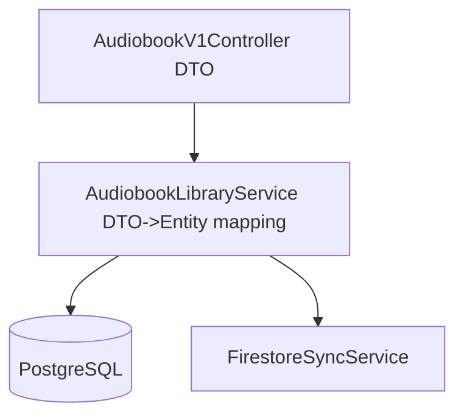

# DTO Catalog and Mapping

## Purpose
Describe which DTOs/models are in scope for this feature area and how they map across API, service, and persistence boundaries.

This document catalogs DTO/model transfer objects related to the audio library pipeline, grouped by lifecycle status with explicit evidence labels.

## Evidence Labels
Use one evidence label per row so readers can quickly validate each claim.

- `Verified in code`
- `Verified in config`
- `Inferred from docs`
- `Missing in current workspace`

## Status Groups
Use these sections to group DTO/model entries by lifecycle state.

## Active
DTOs/models currently used by runtime paths.

| DTO/Model | Purpose | Producer | Consumer | Source/Sink | Stability | Status | Evidence |
|---|---|---|---|---|---|---|---|
| AudiobookDto | API payload for audiobook CRUD | AudiobookV1Controller | AudiobookLibraryService | PostgreSQL audiobook rows | Evolving | Active | Verified in code |

## Legacy
DTOs/models retained for backward compatibility.

| DTO/Model | Purpose | Producer | Consumer | Source/Sink | Stability | Status | Evidence |
|---|---|---|---|---|---|---|---|
| LegacyAudiobookPayload | Backward-compatible ingest payload from older integrations | LegacyImportAdapter | CompatibilityMappingService | Legacy import feed to compatibility mapping layer | Deprecated | Legacy | Inferred from docs |

## Unknown/Unverified
Objects with unclear ownership or missing verification evidence.

| DTO/Model | Purpose | Producer | Consumer | Source/Sink | Stability | Status | Evidence |
|---|---|---|---|---|---|---|---|
| UnknownAudiobookRecord | Candidate transfer object referenced in notes but not verified in current modules | Unknown | Unknown | Unknown/Unverified mapping path pending code trace | Unknown | Unknown/Unverified | Missing in current workspace |

## Mapping Flow

## Boundary Rules

- API DTOs must not be reused as persistence entities.
- Unknown/unverified objects remain labeled until code evidence is found.
