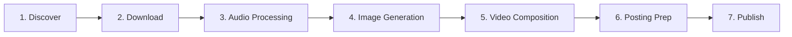
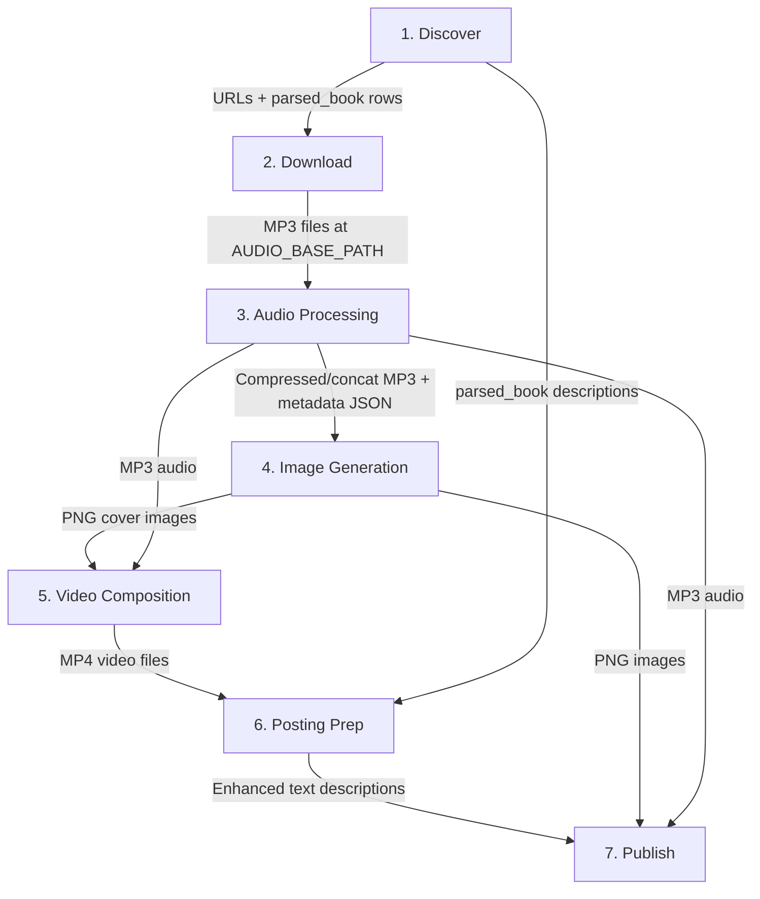

# Audiobook Production Pipeline

The Audio Library System implements a seven-step pipeline that transforms raw audiobook sources into published content across multiple platforms.

## Pipeline Overview

## Step-by-Step Walkthrough

### Step 1: Discover

**Goal**: Find audiobook sources online and extract metadata.

| Aspect | Detail |
|--------|--------|
| **Endpoint** | `GET /api/search?query=<text>` → `POST /api/parser/parse` |
| **How it works** | Search queries are proxied through a local LLM endpoint (Ollama at `:8080` with `live_search.google` model). The response is parsed with regex to extract URLs. These URLs are then fed to the Playwright-based parser that scrapes baza-knig.ru. |
| **Input** | Search query text (e.g., book title or author) |
| **Output** | List of URLs (`SearchInformation`) + parsed book metadata stored in `parsed_book` table |
| **Technologies** | Ollama LLM proxy, Playwright/Chromium, regex URL extraction |

### Step 2: Download

**Goal**: Download audiobook files via torrent and stage them for processing.

| Aspect | Detail |
|--------|--------|
| **Endpoint** | `POST /api/torrent/upload` → `POST /api/torrent/monitor` |
| **How it works** | Torrent files from the configured `torrentsPath` are uploaded to qBittorrent via its Web API. The monitor endpoint polls torrent status until all reach `stalledUp` or `uploading` state, then auto-deletes them from qBittorrent. |
| **Input** | Torrent files at the configured path |
| **Output** | Downloaded audio files staged at `AUDIO_BASE_PATH` |
| **Technologies** | qBittorrent Web API (login, upload, poll, delete) |

### Step 3: Audio Processing

**Goal**: Clean, compress, and assemble raw audio files into production-ready format.

| Aspect | Detail |
|--------|--------|
| **Endpoint** | `POST /api/audio/compress` → `POST /api/audio/trim` → `POST /api/audio/concatenate` |
| **How it works** | Raw MP3 files are compressed to 128kbps and output to `audioC/`. Files can be trimmed from a specified start time to remove intros. Finally, all files in a directory are concatenated into a single MP3 with a metadata JSON containing chapter durations. |
| **Input** | Directory of raw MP3 files |
| **Output** | Compressed MP3 files + concatenated single file + `description.json` metadata |
| **Technologies** | FFmpeg (compression, trimming, concatenation via `ExecutionService`) |

The Python ML service can also be used at this stage for advanced processing:
- **Demucs** — separate vocals from background music/noise
- **Whisper** — transcribe the audio for chapter markers
- See [ML Service Architecture](../architecture/ml-service-architecture.md) for details.

### Step 4: Image Generation

**Goal**: Create book covers and promotional images.

| Aspect | Detail |
|--------|--------|
| **Endpoint** | `POST /api/book-cover/generate` and/or `POST /api/ai/openai/image` |
| **How it works** | Book covers are generated using Java AWT: renders "АУДИОКНИГА" header, the title text, and a year footer in Comic Sans MS Bold on a base image. Alternatively, DALL-E 3 can generate AI images from text prompts (1792×1024, vivid style). |
| **Input** | Base image path + title text + count (AWT) or text prompt (DALL-E) |
| **Output** | PNG images in `image/` directory (named `1.png`, `2.png`, etc.) |
| **Technologies** | Java AWT (cover rendering), OpenAI DALL-E 3 (AI image generation) |

### Step 5: Video Composition

**Goal**: Combine cover images with audio into video files.

| Aspect | Detail |
|--------|--------|
| **Endpoint** | `POST /api/video/create` |
| **How it works** | The service matches PNG images to MP3 audio files by filename. For each matched pair, `VideoCreation.start()` composites the image with the audio and a particle overlay MP4 into a video. |
| **Input** | Directory of PNG images + directory of MP3 audio + particle overlay MP4 |
| **Output** | MP4 video files in `video/` directory |
| **Technologies** | FFmpeg (image + audio + overlay → MP4 composition) |

### Step 6: Posting Preparation

**Goal**: Prepare descriptions, chapters, and metadata for publishing.

| Aspect | Detail |
|--------|--------|
| **Endpoint** | `POST /api/text/description` |
| **How it works** | Reads `ParsedBookEntity` records from the database, concatenates their descriptions, and sends the combined text to OpenAI GPT-4o (2500 token limit, 0.3 temperature) for enhancement. Returns a polished, publication-ready description. |
| **Input** | Parsed book records from database |
| **Output** | Enhanced description text (`ExtractedDescription` JSON) |
| **Technologies** | OpenAI GPT-4o |

### Step 7: Publish

**Goal**: Post finished content to distribution platforms.

| Aspect | Detail |
|--------|--------|
| **Endpoint** | `POST /api/boosty/post` + Telegram bot commands |
| **How it works** | **Boosty**: Playwright automates a real Chromium browser session — logs in, navigates to the post creation page, pairs image and audio files by filename, uploads them, adds hardcoded tags (аудиокнига, дар, магия, фантастика, etc.), and publishes. **Telegram**: The webhook bot handles `/upload` and `/reupload` commands to send files to Telegram chats. |
| **Input** | Image directory + audio directory + cycle name (Boosty); file ID + chat ID (Telegram) |
| **Output** | Published posts on Boosty.ru; files sent to Telegram chats |
| **Technologies** | Playwright/Chromium (Boosty), Telegram Bot API |

## Data Flow Between Steps

## Frontend Monitoring

While the pipeline runs, the frontend dashboard provides real-time visibility:

## Related Documentation

- [REST API Reference](../api/rest-api-reference.md) — detailed endpoint specs for each step
- [Backend Architecture](../architecture/backend-architecture.md) — service layer internals
- [ML Service Architecture](../architecture/ml-service-architecture.md) — advanced audio processing
