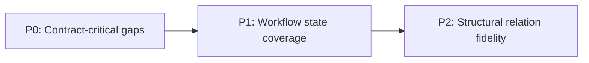

# Database and DTO Gap Report

## Verified Findings
Capture only confirmed mismatches between database structures and DTO usage, with direct evidence.

## Gap Matrix
Add one row per gap and keep impact, risk, and owner fields specific and actionable.

| Gap | Impact | Risk Type | Suggested Fix | Owner Domain | Priority | Evidence |
|---|---|---|---|---|---|---|
| `audiobook` nullable and legacy fields are not represented consistently in API DTO contracts | Clients can drop or mis-serialize title/author and publication metadata during create/update operations | Data integrity and backward compatibility | Define a canonical `AudiobookDto` contract with explicit nullability and migration notes, then align request/response mappers | Core API + Data model | P0 | [E1: entity field scan], [E2: DTO mismatch trace], [E3: mapper behavior check] |
| `audio_description` processing status fields are not fully mapped to outward DTOs | UI and orchestration workers cannot reliably identify processing lifecycle state | Workflow orchestration risk | Extend DTOs with normalized status enum and timestamps sourced from persistence model | Production pipeline API | P1 | [E4: persistence model review], [E5: response payload sample] |
| `media_group` / `media_item` relationship metadata is partially flattened in transfer DTOs | Telegram/media workflows lose grouping semantics across service boundaries | Functional regression in media publishing paths | Add nested DTO projection for group-to-item relations and update serializers | Acquisition + Distribution integration | P2 | [E6: relation model inspection], [E7: serialization contract check] |

## Execution Order
Prioritize fixes by delivery sequence so teams can execute from low-risk to structural work.

### Quick Wins
- Lock the canonical `AudiobookDto` schema and mapper behavior behind one contract test suite.
- Publish evidence labels (`E1`-`E3`) in PR descriptions for each P0 fix.

### Medium
- Introduce DTO status normalization for `audio_description` and align consumer expectations.
- Add integration snapshots that verify lifecycle fields across service boundaries.

### Structural
- Replace flattened media transfer payloads with relation-preserving DTOs.
- Roll out relation DTO versioning with compatibility adapters for existing clients.
