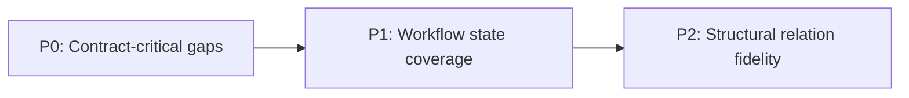

# Database and DTO Gap Report

## Verified Findings
Capture only confirmed mismatches between database structures and DTO usage, with direct evidence.

## Gap Matrix
Add one row per gap and keep impact, risk, and owner fields specific and actionable.

| Gap | Impact | Risk Type | Suggested Fix | Owner Domain | Priority | Evidence |
|---|---|---|---|---|---|---|
| `audiobook` nullable and legacy fields are not represented consistently in API DTO contracts | Clients can drop or mis-serialize title/author and publication metadata during create/update operations | Data integrity and backward compatibility | Define a canonical `AudiobookDto` contract with explicit nullability and migration notes, then align request/response mappers | Core API + Data model | P0 | `Verified in code`: `audio-library-automation-bot/src/main/java/kg/automation/rest/automatation/library/service/AudiobookLibraryService.java` (`applyDto`, `toDto`, `mergeForUpdate`); `Verified in code`: `audio-library-automation-bot/src/main/java/kg/automation/rest/automatation/library/web/AudiobookV1Controller.java` (`create`, `update`) |
| `audio_description` processing status fields are not fully mapped to outward DTOs | UI and orchestration workers cannot reliably identify processing lifecycle state | Workflow orchestration risk | Extend DTOs with normalized status enum and timestamps sourced from persistence model | Production pipeline API | P1 | `Verified in code`: `audio-library-automation-bot/src/main/java/kg/automation/rest/automatation/library/service/AudioDescriptionPersistenceService.java`; `Inferred from docs`: `architecture/audio-platform-overview.md` (`Owned data` mentions `audio_description` staging fields); `Missing in current workspace`: dedicated outward DTO contract for `audio_description` status lifecycle |
| `media_group` / `media_item` relationship metadata is partially flattened in transfer DTOs | Telegram/media workflows lose grouping semantics across service boundaries | Functional regression in media publishing paths | Add nested DTO projection for group-to-item relations and update serializers | Acquisition + Distribution integration | P2 | `Verified in code`: `audio-library-automation-bot/src/main/java/kg/automation/rest/automatation/library/service/JsonMediaGroupImportService.java` (`media_groups.json` import via `MediaGroupRepository`); `Verified in code`: `audio-library-automation-bot/src/main/java/kg/automation/rest/automatation/telegram/service/AudioLibraryService.java` (`toMediaGroupEntity` usage path); `Missing in current workspace`: explicit `MediaGroupDto`/`MediaItemDto` transfer schema in docs-repo |

## Execution Order
Prioritize fixes by delivery sequence so teams can execute from low-risk to structural work.

### Quick Wins
- Lock the canonical `AudiobookDto` schema and mapper behavior behind one contract test suite.
- Publish traceable evidence pointers (`Verified in code`, `Inferred from docs`, `Missing in current workspace`) in PR descriptions for each P0 fix.

### Medium
- Introduce DTO status normalization for `audio_description` and align consumer expectations.
- Add integration snapshots that verify lifecycle fields across service boundaries.

### Structural
- Replace flattened media transfer payloads with relation-preserving DTOs.
- Roll out relation DTO versioning with compatibility adapters for existing clients.

## Definition of done for this pass

- DTO catalog is exhaustive within currently available evidence sources and includes all currently referenced core types, with `Active`, `Legacy`, and `Unknown/Unverified` status labeling plus evidence tags per row.
- Architecture overview keeps only high-level data/persistence guidance and links to detailed documentation instead of embedding low-level credential matrices or SQL persistence internals.
- Internal cluster API references in the overview point to valid, current plan/spec paths under `docs-repo/superpowers`.
- Detailed Data Documentation entries in the overview use clickable markdown links for architecture, feature, and report documents.
- Gap report findings remain evidence-backed and prioritized, with this definition-of-done section explicitly capturing pass completion criteria aligned to the documentation spec intent.
