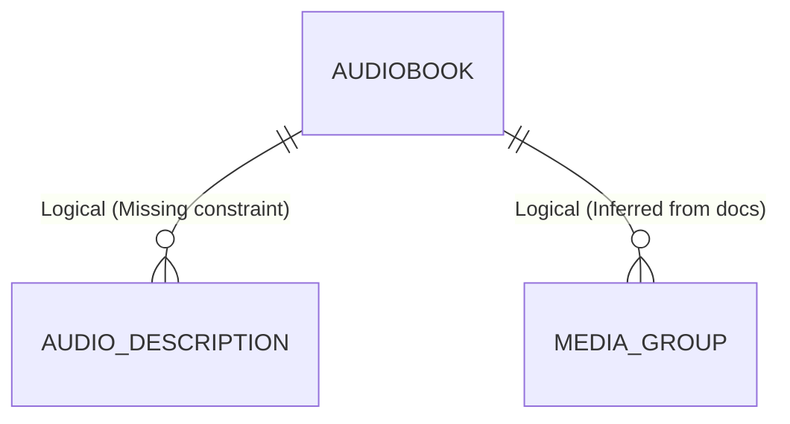
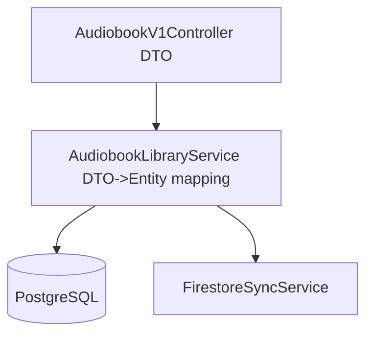
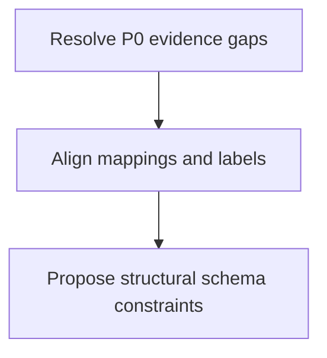

# Database and DTO Documentation Refresh Implementation Plan

> **For agentic workers:** REQUIRED SUB-SKILL: Use superpowers:subagent-driven-development (recommended) or superpowers:executing-plans to implement this plan task-by-task. Steps use checkbox (`- [ ]`) syntax for tracking.

**Goal:** Deliver an evidence-driven documentation set that explains database/table relationships and DTO/model connections, including explicit gaps and prioritized follow-up actions.

**Architecture:** Keep `architecture/audio-platform-overview.md` as the high-level cluster narrative and move schema/DTO detail into dedicated docs. Build one database architecture doc, one DTO feature catalog, and one report doc with confidence labels (`Verified in code`, `Verified in config`, `Inferred from docs`, `Missing in current workspace`). Validate consistency with repeatable markdown checks and cross-link integrity.

**Tech Stack:** Markdown, Mermaid, PowerShell, `rg`, git

---

## Scope Check

The approved spec is focused on one subsystem (documentation architecture for database + DTO understanding). No additional decomposition is required before implementation.

## File Structure

- Modify: `architecture/audio-platform-overview.md`  
  Responsibility: keep high-level platform architecture and link to detailed docs.
- Create: `architecture/database-and-relations.md`  
  Responsibility: domain map, logical/physical relationship matrix, rationale, and Mermaid ER/data-flow diagrams.
- Create: `features/dto-catalog-and-mapping.md`  
  Responsibility: exhaustive DTO/model inventory (Active/Legacy/Unknown) with producer/consumer/source mappings.
- Modify/Create: `reports/database-dto-gap-report.md`  
  Responsibility: evidence-backed gaps, risk/impact matrix, priorities, and execution order.
- Modify: `superpowers/specs/2026-04-20-database-dto-documentation-design.md` (optional, only if traceability link is missing)  
  Responsibility: add backlink to plan file after implementation.

### Task 1: Baseline Audit and Documentation Scaffolding

**Files:**
- Create: `features/dto-catalog-and-mapping.md`
- Modify (if missing sections): `reports/database-dto-gap-report.md`
- Test: N/A (command-driven checks in this task)

- [ ] **Step 1: Capture evidence inventory from code/config into terminal output**

Run:
```powershell
rg -n "Flyway|spring\.flyway|ddl-auto|@Entity|@Table|Dto|DTO|record " "..\audio-library-automation-bot" -g "*.java" -g "*.properties" -g "*.yml" -g "*.sql"
```
Expected: matches for Spring/Flyway/JPA/DTO references that can be cited in docs.

- [ ] **Step 2: Verify/create required documentation folders**

Run:
```powershell
ls
if (-not (Test-Path "features")) { New-Item -ItemType Directory -Path "features" | Out-Null }
if (-not (Test-Path "reports")) { New-Item -ItemType Directory -Path "reports" | Out-Null }
```
Expected: `features` and `reports` directories exist at repo root.

- [ ] **Step 3: Create initial DTO catalog skeleton with required sections**

```markdown
# DTO Catalog and Mapping

## Purpose
This document catalogs all DTO/model transfer objects related to the audio library pipeline and marks their current status.

## Evidence Labels
- `Verified in code`
- `Verified in config`
- `Inferred from docs`
- `Missing in current workspace`

## Status Groups
## Active
## Legacy
## Unknown/Unverified
```

- [ ] **Step 4: Create/normalize gap report skeleton with required matrix columns**

```markdown
# Database and DTO Gap Report

## Verified Findings

## Gap Matrix
| Gap | Impact | Risk Type | Suggested Fix | Owner Domain | Priority | Evidence |
|---|---|---|---|---|---|---|

## Execution Order
### Quick Wins
### Medium
### Structural
```

- [ ] **Step 5: Commit scaffolding**

```bash
git add features/dto-catalog-and-mapping.md reports/database-dto-gap-report.md
git commit -m "docs: scaffold dto catalog and gap report structure"
```

### Task 2: Build `architecture/database-and-relations.md` from Evidence

**Files:**
- Create: `architecture/database-and-relations.md`
- Test: `architecture/database-and-relations.md` (content checks)

- [ ] **Step 1: Write failing content check for required sections**

Run:
```powershell
rg -n "## Domain Map|## Relationship Matrix|## Relationship Rationale|## Constraint and Index Backlog|mermaid" "architecture/database-and-relations.md"
```
Expected: FAIL initially (`No such file` or missing matches).

- [ ] **Step 2: Create minimal document with required sections and evidence legend**

```markdown
# Database and Relations

## Evidence Labels
- `Verified in code`
- `Verified in config`
- `Inferred from docs`
- `Missing in current workspace`

## Domain Map
## Relationship Matrix
## Relationship Rationale
## Constraint and Index Backlog
```

- [ ] **Step 3: Add Mermaid ER + cross-domain flow diagrams**

````markdown



````

- [ ] **Step 4: Re-run content check to verify pass**

Run:
```powershell
rg -n "## Domain Map|## Relationship Matrix|## Relationship Rationale|## Constraint and Index Backlog|```mermaid" "architecture/database-and-relations.md"
```
Expected: PASS with matches for all required sections and diagram fences.

- [ ] **Step 5: Commit architecture database doc**

```bash
git add architecture/database-and-relations.md
git commit -m "docs: add evidence-driven database relations architecture"
```

### Task 3: Expand DTO Catalog with Exhaustive Status Mapping

**Files:**
- Modify: `features/dto-catalog-and-mapping.md`
- Test: `features/dto-catalog-and-mapping.md` (coverage checks)

- [ ] **Step 1: Write failing check for mandatory DTO columns and statuses**

Run:
```powershell
rg -n "Producer|Consumer|Source/Sink|Stability|Evidence|Active|Legacy|Unknown/Unverified" "features/dto-catalog-and-mapping.md"
```
Expected: FAIL or partial matches before full table content is added.

- [ ] **Step 2: Add canonical DTO mapping table format**

```markdown
| DTO/Model | Purpose | Producer | Consumer | Source/Sink | Stability | Status | Evidence |
|---|---|---|---|---|---|---|---|
| AudiobookDto | API payload for audiobook CRUD | AudiobookV1Controller | AudiobookLibraryService | PostgreSQL audiobook rows | Evolving | Active | Verified in code |
```

- [ ] **Step 3: Add module transfer diagram and boundary rules**

````markdown


## Boundary Rules
- API DTOs must not be reused as persistence entities.
- Unknown/unverified objects remain labeled until code evidence is found.
````

- [ ] **Step 4: Re-run coverage check**

Run:
```powershell
rg -n "Producer|Consumer|Source/Sink|Stability|Evidence|Active|Legacy|Unknown/Unverified|Boundary Rules|mermaid" "features/dto-catalog-and-mapping.md"
```
Expected: PASS with complete section and table coverage.

- [ ] **Step 5: Commit DTO catalog**

```bash
git add features/dto-catalog-and-mapping.md
git commit -m "docs: document dto catalog with status and mapping boundaries"
```

### Task 4: Update Platform Overview and Finalize Gap Report Priorities

**Files:**
- Modify: `architecture/audio-platform-overview.md`
- Modify: `reports/database-dto-gap-report.md`
- Test: both files via content checks

- [ ] **Step 1: Write failing cross-link check**

Run:
```powershell
rg -n "database-and-relations\.md|dto-catalog-and-mapping\.md|database-dto-gap-report\.md" "architecture/audio-platform-overview.md"
```
Expected: FAIL before links are added.

- [ ] **Step 2: Add explicit “Detailed Data Documentation” links section to overview**

```markdown
## Detailed Data Documentation

- Database relationships and rationale: `architecture/database-and-relations.md`
- DTO catalog and mapping: `features/dto-catalog-and-mapping.md`
- Open gaps and priorities: `reports/database-dto-gap-report.md`
```

- [ ] **Step 3: Fill gap report with prioritized matrix and execution flow Mermaid**

````markdown
| Gap | Impact | Risk Type | Suggested Fix | Owner Domain | Priority | Evidence |
|---|---|---|---|---|---|---|
| Entity/DTO references not found in current workspace snapshot | High | Maintainability | Mark as unknown and verify against active modules | Shared | P0 | Missing in current workspace |


````

- [ ] **Step 4: Run final consistency checks**

Run:
```powershell
rg -n "Detailed Data Documentation|database-and-relations\.md|dto-catalog-and-mapping\.md|database-dto-gap-report\.md" "architecture/audio-platform-overview.md"
rg -n "## Gap Matrix|Priority|P0|P1|P2|mermaid|Evidence" "reports/database-dto-gap-report.md"
```
Expected: PASS with required links, matrix columns, priorities, and Mermaid flow.

- [ ] **Step 5: Commit overview and report completion**

```bash
git add architecture/audio-platform-overview.md reports/database-dto-gap-report.md
git commit -m "docs: cross-link architecture docs and prioritize db dto gaps"
```

### Task 5: Verification, Spec Traceability, and PR-Ready Final Check

**Files:**
- Modify (only if absent): `superpowers/specs/2026-04-20-database-dto-documentation-design.md`
- Test: full repo documentation integrity checks

- [ ] **Step 1: Verify all required deliverables exist**

Run:
```powershell
ls architecture/database-and-relations.md
ls features/dto-catalog-and-mapping.md
ls reports/database-dto-gap-report.md
```
Expected: all files listed with no path errors.

- [ ] **Step 2: Verify evidence-label consistency across docs**

Run:
```powershell
rg -n "Verified in code|Verified in config|Inferred from docs|Missing in current workspace" architecture/*.md features/*.md reports/*.md
```
Expected: all four labels appear in each detailed document where claims are made.

- [ ] **Step 3: Add optional traceability backlink from spec to plan (if missing)**

```markdown
## Implementation Plan

- `superpowers/plans/2026-04-20-database-dto-documentation-implementation-plan.md`
```

- [ ] **Step 4: Run git status and review diff**

Run:
```bash
git status
git diff -- architecture/audio-platform-overview.md architecture/database-and-relations.md features/dto-catalog-and-mapping.md reports/database-dto-gap-report.md
```
Expected: only intended documentation files changed, with no placeholder text.

- [ ] **Step 5: Final commit**

```bash
git add architecture/audio-platform-overview.md architecture/database-and-relations.md features/dto-catalog-and-mapping.md reports/database-dto-gap-report.md superpowers/specs/2026-04-20-database-dto-documentation-design.md superpowers/plans/2026-04-20-database-dto-documentation-implementation-plan.md
git commit -m "docs: complete evidence-driven database and dto documentation suite"
```

---

## Self-Review Checklist (Completed)

- Spec coverage: every approved deliverable has a dedicated task and verification step.
- Placeholder scan: no TODO/TBD or vague “implement later” steps remain.
- Type consistency: evidence label vocabulary and file paths are consistent across tasks.
