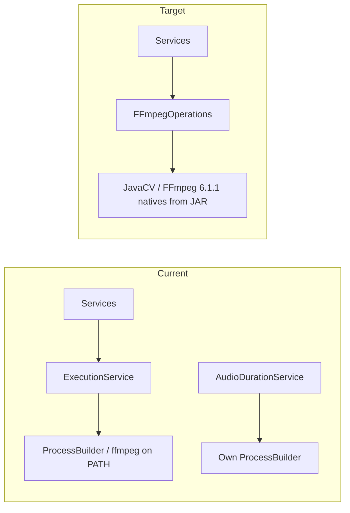

# ADR-001 (JavaCV over FFmpeg CLI) — full implementation plan

Derived from [`../specs/adr-001-javacv-over-ffmpeg-cli.md`](../specs/adr-001-javacv-over-ffmpeg-cli.md) and a 2026-05-05 inventory of `audio-library-automation-bot`.

**Goal:** Replace ProcessBuilder / shell `ffmpeg` usage with **JavaCV (Bytedeco)**, pin FFmpeg **6.1.1** via Maven natives, remove container `apt-get install ffmpeg`, fix duration/concat edge cases, and leave a single high-level API (`FFmpegOperations`) so application services never touch JavaCV types directly.

**Skills for execution:** Use `superpowers:executing-plans` task-by-task; use `superpowers:verification-before-completion` before claiming done; optionally `superpowers:using-git-worktrees` for isolation.

**Superpowers note:** Quality improves with subagents; if available, prefer `superpowers:subagent-driven-development` for parallel work (e.g. audio vs video slices).

---

## Reality check vs ADR

| ADR statement | Current repo |
|---------------|--------------|
| `foundation/pom.xml` + `foundation/.../FFmpegOperations.java` | **No `foundation` module** — only `audio-library-automation-bot/pom.xml`. **Decision (pick one):** (A) Add `foundation` as a Maven submodule used by the bot, or (B) Implement `FFmpegOperations` under `kg.automation.rest.automatation.ffmpeg` until the monolith splits. **Recommendation:** (B) for speed; extract to `foundation` when the multi-module split lands. |
| Shared hardcoded `filePath.txt` concat bug | **Partially stale:** `AudioConcatenatorService` already uses `Files.createTempFile("ffmpeg-concat-", ".txt")` and deletes in `finally`. **Still migrate** to JavaCV concat to remove concat-list temp files entirely and align with ADR. |
| Central bean | Today: **`ExecutionService`** wraps `ProcessBuilder` and **does not throw** on non-zero exit (only logs JSON to stdout). Call sites must be updated to **fail fast** via `FFmpegOperations` throwing on error. |

---

## Scope — files and behavior to migrate

### Must migrate (FFmpeg / media pipeline)

| Area | File | Current mechanism | Target |
|------|------|-------------------|--------|
| Execute helper | `ffmpeg/service/ExecutionService.java` | `ProcessBuilder` | **Replace or deprecate** in favor of `FFmpegOperations`; do not keep dual paths long-term. |
| Concat | `audio/service/AudioConcatenatorService.java` | concat demuxer + temp `.txt` list | **`concatMp3Files(List<Path> inputs, Path output)`** via JavaCV (no concat list file, safe under concurrency). |
| Compress | `audio/service/AudioCompressorService.java` | `String.format` + **`split(" ")`** (breaks paths with spaces) | **`compressToMp3(Path in, Path out)`** with explicit path handling. |
| Trim | `audio/service/AudioTrimmerService.java` | `split(" ` after format | **`trimCopy(Path in, Path out, long startSeconds)`** — fix quoting/split. |
| Duration | `audio/service/AudioDurationService.java` | `ffmpeg -i` + stderr line parse; **parsing looks fragile** (`split("")[2]` etc.) | **`durationMicros(Path)`** via `FFmpegFrameGrabber.getLengthInTime()` (or equivalent), then format for API response. |
| Video | `video/service/VideoCreation.java` | two `ffmpeg` command arrays; **GPU `h264_nvenc` hardcoded** | **`preRenderOverlay` / `createFinalVideo`** in JavaCV; **default CPU `libx264`** (or configurable), **`h264_nvenc`** only when env/profile says GPU available (align ADR). |

### Out of scope (do not replace with JavaCV in this ADR)

| File | Reason |
|------|--------|
| `image/service/BookCoverService.java` | Uses its own `ProcessBuilder` — verify whether ImageMagick/GraphicsMagick vs ffmpeg; **leave unchanged** unless it shells out to `ffmpeg` (confirm during spike). |
| `poster/authorization/.../BoostyAuthorization.java` | Browser/automation-related `ProcessBuilder`, not FFmpeg. |

---

## Maven / dependency design

### Dependencies (version pins from ADR; verify latest patch on Maven Central before merge)

- `org.bytedeco:javacv:1.5.10`
- `org.bytedeco:ffmpeg:6.1.1-1.5.10` with **classifier** `${ffmpeg.classifier}`

### Profiles (property `ffmpeg.classifier`)

- **linux-x86_64** — CI, Docker build, Railway.
- **windows-x86_64** — local Windows dev.
- **Optional:** `macosx-arm64` / `macosx-x86_64` profiles for Mac developers (ADR omitted; add if team needs).

**Active by default:** Do **not** use `javacv-platform` (all OS binaries ~500MB). Use **one classifier per build**, matching the machine or CI image.

### CI / Docker

- **Dockerfile:** Remove `apt-get install ffmpeg` from runtime stage; rely on bundled natives.
- **GitHub Actions / host builds:** Set `ffmpeg.classifier` to **linux-x86_64** explicitly (`-P` or `-Dffmpeg.classifier=...`).
- **Windows dev:** Default profile or document `mvnw -Dffmpeg.classifier=windows-x86_64 test`.

### JAR size

Expect **~80–120 MB** extra for Linux x86_64 natives — acceptable per ADR; document in README/runbook.

---

## Core implementation: `FFmpegOperations`

**Package (if not using submodule):** `kg.automation.rest.automatation.ffmpeg` (e.g. `FFmpegOperations.java`).

**Design rules:**

1. **No JavaCV types** in public methods — use `Path`, `Duration`, and domain exceptions (e.g. `MediaProcessingException`).
2. **All** `FFmpegFrameGrabber` / `FFmpegFrameRecorder` / filter setup lives here.
3. **Errors:** throw checked or unchecked exception with cause; **do not** rely on parsing exit codes from a shell process.
4. **Logging:** use SLF4J; remove reliance on `System.out` + Gson `Response` from `ExecutionService` for normal operation paths (optional: keep `ExecutionService` as deprecated shim during transition only).

**Suggested method surface (refine during spike)**

| Method | Purpose |
|--------|---------|
| `void concatMp3ToLame128k(List<Path> sortedInputs, Path output)` | Match current concat: libmp3lame 128k. |
| `void transcodeMp3Lame240k44k1(Path input, Path output)` | Match `AudioCompressorService`. |
| `void trimAudioStreamCopy(Path input, Path output, long startSeconds)` | Match trim (`-acodec copy` semantics). |
| `long durationMicros(Path audioFile)` | Replace `AudioDurationService` probe. |
| `void renderImageParticlesOverlay(Path image, Path particlesMovOrMp4, Path segmentOut, Duration segmentMaxLen)` | Replace `preRenderOverlay` — **spike required** for filter graph parity (`overlay=x=(W-w)/2:y=(H-h)/2`, loop image, 2 min cap). |
| `void muxVideoAudioCopy(Path videoSegment, Path audioMp3, Path outputMp4)` | Replace `createFinalVideo` (`-shortest`, stream copy). |

**Video codec selection**

- Property e.g. `app.video.encoder=cpu` | `nvenc` (default **cpu** / libx264 for Railway).
- When `nvenc`, select NVENC encoder in JavaCV; when CPU, libx264 with same approximate quality presets as current CLI intent.

---

## Phasing strategy (risk reduction)

JavaCV **audio** paths are straightforward; **video filter_complex + overlay** is the highest risk.

| Phase | Deliverables | When to ship |
|-------|----------------|--------------|
| **P0** | Maven profiles + `FFmpegOperations` + migrate **AudioCompressor**, **AudioTrimmer**, **AudioDuration**, **AudioConcatenator** + tests + Docker without apt ffmpeg | First mergeable vertical slice |
| **P1** | **VideoCreation** overlay + mux | After P0 stable; spike proves filter parity |
| **P2** | Remove dead `ExecutionService` code paths, optional `foundation` extraction | Cleanup |

If P1 slips, **temporary** compromise (explicitly **not** ADR-end state): keep **only** video as CLI behind a feature flag is discouraged — prefer completing P1 before removing system FFmpeg from Docker.

---

## Testing strategy

### Unit tests (fast, no heavy natives)

- **Mock `FFmpegOperations`** where tests currently mock `ExecutionService`:
  - `AudioConcatenatorServiceTest` — change mock type; adjust assertions: **no longer** require `-i` + concat list path if concat no longer builds that command; assert **`FFmpegOperations.concat...` called once** with expected paths/count.
  - `AudioTrimmerServiceTest` — assert **`trimAudioStreamCopy`** (or final method name) invoked with correct `startSeconds` and paths.

- **New unit tests** for `FFmpegOperations` with **mocked grabbers/recorders** — only if you introduce thin wrappers/interfaces for testability; otherwise rely on integration tests.

### Integration tests (JavaCV natives required)

- **Profile:** `media-it` or run only when `ffmpeg.classifier` matches host (skip on mismatch).
- **Assets:** Tiny real MP3/PNG/short MP4 under `src/test/resources/media/` (generate once, commit; ensure license-free samples).
- **Cases:**
  - Concat 2–3 MP3s → output exists, duration > 0.
  - Compress / trim round-trip sanity (file size / duration bounds).
  - Duration API matches `getLengthInTime()` within tolerance.
  - Video: overlay + mux produces playable MP4 (optional: ffprobe in test only if CLI still allowed on **test** image — prefer JavaCV read-back for duration).

### Negative tests

- Missing input file → clear exception from `FFmpegOperations`.
- Corrupt input → failure surfaced to caller (not exit code 0 with silent success).

---

## Verification checklist (must all pass before “done”)

Run from `audio-library-automation-bot/`:

1. **Compile + unit tests:** `./mvnw -q test` (or with active profile: `./mvnw -q -Dffmpeg.classifier=windows-x86_64 test` on Windows).
2. **Integration tests (if added):** `./mvnw -q -Pmedia-it verify` (define profile in `pom.xml`).
3. **Package:** `./mvnw -q -DskipTests package` with the same classifier used in Docker build.
4. **Docker:** `docker build -t audio-bot:javacv .` — confirm **no** `ffmpeg` apt line and container still starts; hit a health endpoint.
5. **Manual smoke (full stack):**
   - Concat + compress + trim + duration from dashboard or REST (per your existing routes).
   - Video path with `APP_CORE_ENABLED=false`: generate one short MP4; verify playable output and acceptable encode time on CPU.
6. **Regression:** Grep for **`ProcessBuilder`** + **`"ffmpeg"`** in `src/main/java` — should be **zero** inside migrated services (exceptions documented if any tool remains non-FFmpeg).

---

## Step-by-step task list (executing-plans style)

Use checkboxes during implementation.

### Task 1: Maven — JavaCV + classifiers

- [ ] Add `javacv` + `ffmpeg` (classified) dependencies and `ffmpeg.classifier` property.
- [ ] Add profiles: `linux-x86_64`, `windows-x86_64` (and optional macOS).
- [ ] Document active profile in `README` or `CLAUDE.md` “Build & Run” (developer must match OS).
- [ ] **Verify:** `./mvnw -q -DskipTests dependency:tree | findstr /i bytedeco` (Windows) or `grep`.

### Task 2: Spike — Hello JavaCV

- [ ] Small `@Test` or `main`-free spike proving `FFmpegFrameGrabber` opens a bundled test MP3 and `getLengthInTime()` works on **CI Linux** and **dev Windows**.
- [ ] **Verify:** spike test green on both OSes (or skip Mac if unsupported).

### Task 3: Implement `FFmpegOperations` — audio

- [ ] Implement concat / transcode / trim / duration per “method surface” above.
- [ ] Replace injectable dependency in services; remove use of `ExecutionService` from those classes.
- [ ] **Verify:** unit tests updated; integration tests for audio pass.

### Task 4: `AudioDurationService` fix

- [ ] Replace stderr parsing with grabber length; fix formatted output if needed (keep API contract if used by controllers).
- [ ] **Verify:** test with VBR MP3 sample if available (ADR motivation).

### Task 5: Video — `VideoCreation`

- [ ] Port `preRenderOverlay` and `createFinalVideo` to JavaCV; add encoder selection property.
- [ ] **Verify:** manual smoke + optional IT with short assets.

### Task 6: Docker + deploy path

- [ ] Remove FFmpeg from Dockerfile runtime stage; align multi-stage build with classifier (build must bundle linux-x86_64).
- [ ] **Verify:** `docker build` + run; Railway deploy dry-run if applicable.

### Task 7: Cleanup

- [ ] Delete or narrow `ExecutionService` to unused; remove dead imports.
- [ ] Grep verification (no stray `ffmpeg` CLI in migrated code).

### Task 8: ADR / docs touch-up (minimal)

- [ ] If implementation package differs from ADR `foundation/...`, add one sentence to ADR “Implementation Location” cross-linking actual package **or** schedule follow-up ADR for submodule extraction.

---

## Risks and mitigations

| Risk | Mitigation |
|------|------------|
| JavaCV video filter graph ≠ CLI behavior | Spike early; compare outputs side-by-side (duration, resolution, overlay position). |
| JAR size / deploy limits | Classifier-only deps; monitor Railway limits. |
| Mac ARM devs blocked | Add `macosx-arm64` profile or document Rosetta/x86 JVM. |
| Tests flaky on CI without GPU | Default CPU encoder in tests; NVENC only in manual/GPU env. |

---

## Definition of done

- No production code path depends on **system-installed** `ffmpeg` for the migrated features.
- Pinned FFmpeg version via Bytedeco in `pom.xml`.
- **All automated verifications** in the checklist executed on the target merge branch.
- Known exceptions (`BookCoverService`, non-FFmpeg `ProcessBuilder`) **documented** in code comment or this plan’s “Out of scope” table.

---

## References

- ADR: [`../specs/adr-001-javacv-over-ffmpeg-cli.md`](../specs/adr-001-javacv-over-ffmpeg-cli.md)
- Current Dockerfile: `audio-library-automation-bot/Dockerfile`
- Services using FFmpeg today: `AudioConcatenatorService`, `AudioCompressorService`, `AudioTrimmerService`, `AudioDurationService`, `VideoCreation`, `ExecutionService`
