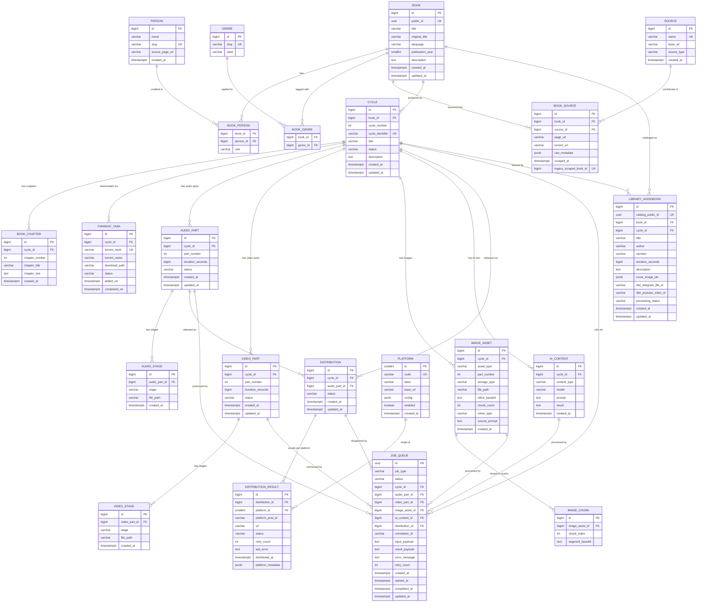
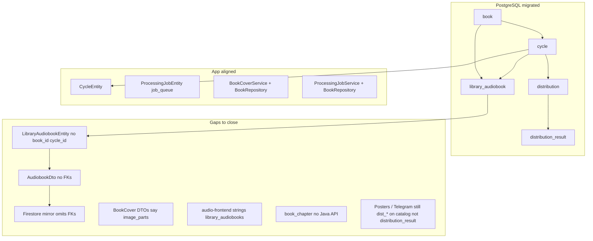

# Optimized ER Diagram — audio-library-automation-bot
**Date:** 2026-05-07  
**Status:** Flyway **Phases 1–9** + gap-closure (singular tables, `cycle` semantics) **applied** through migration **`V202605072463`**. **Phase 10 — application alignment** (below) tracks Java/REST/frontend work so runtime behavior matches §2.

---

## 0. Design principles

This is the **target** schema. Current tables are listed in section 1 as reference only.

| Principle | Rule |
|---|---|
| One entity = one table | No fat tables merging domains |
| No polymorphic FKs | No "exactly one of these three must be set" patterns |
| No path-column proliferation | Pipeline stages stored as rows, not columns |
| Platform-agnostic distribution | `distribution` is the release intent; `distribution_result` is the per-platform outcome |
| IDs: internal vs public | `id BIGINT` for joins; `public_id UUID` for REST/external |
| Timestamps everywhere | Every table has `created_at`; mutable tables also have `updated_at` (trigger-managed) |
| Enums for closed sets | Use ENUM for status/type; `VARCHAR(32) + CHECK` for open sets |
| DB enforces what it can | Constraints, triggers, and procedures encode invariants — not just application code |

---

## 1. Current tables (reference only)

| Current table | Domain | Fate |
|---|---|---|
| `parsed_book` | legacy acquisition | **Drop** after backfill |
| `scraped_books` | acquisition | **Replace** → `book_source` |
| `cycles` | production | **Rename** `cycle` + add `book_id FK` + drop title/author strings |
| `audio_parts` | production | **Rename** `audio_part` + drop 4 path columns → `audio_stage` |
| `video_parts` | production | **Rename** `video_part` + drop path columns → `video_stage` |
| `image_parts` | production | **Replace** → `image_asset` |
| `image_base64_chunks` | production | **Replace** → `image_chunk` (single typed parent) |
| `ai_generated_content` | production | **Rename** `ai_content` + drop IMAGE rows → `image_asset` |
| `torrent_tasks` | acquisition | **Rename** `torrent_task` (no structure change) |
| `distribution_records` | distribution | **Replace** → `distribution` + `distribution_result` |
| `telegram_media_groups` | distribution | **Drop** — folded into `distribution_result.platform_metadata` |
| `telegram_media_items` | distribution | **Drop** — folded into `distribution_result.platform_metadata` |
| `processing_jobs` | operations | **Rename** `job_queue` + add typed FKs |
| `job_logs` | operations | **Drop** — `job_queue` carries status history |
| `library_audiobooks` | catalog | **Keep** + add `book_id` + `cycle_id` FKs |
| `pipeline_message_log` | audit DB | Unchanged (separate schema) |
| `pipeline_message_attempt` | audit DB | Unchanged (separate schema) |

---

## 2. Target schema

### 2.1 Domain overview

```
Bibliographic  →  book, person, book_person, genre, book_genre
Text           →  book_chapter
Acquisition    →  source, book_source, torrent_task
Production     →  cycle, audio_part, audio_stage, video_part, video_stage,
                  image_asset, image_chunk, ai_content
Distribution   →  platform, distribution, distribution_result
Operations     →  job_queue
Catalog        →  library_audiobook
Audit DB       →  pipeline_message_log, pipeline_message_attempt  (unchanged, separate schema)
```

**24 tables** (4 legacy dropped, 2 Telegram-specific collapsed, `job_event` dropped, `series`/`series_book` dropped as not needed by this domain).

**Core relationship direction:**
```
book (1) ──► cycle (many, ordered by cycle_number)    Part 1, Part 2 … ∞ — each a continuation
cycle (1) ──► book_chapter (many, ordered by chapter_number)  text of this part, in order
cycle (1) ──► audio_part (many, ordered by part_number)       audio files for this part
cycle (1) ──► distribution (many)                             release record per content unit
distribution (1) ──► distribution_result (many)               one result per platform

Full story text:  ORDER BY cycle.cycle_number, book_chapter.chapter_number
```

---

### 2.2 Bibliographic domain

#### `book`

| Column | Type | Constraint |
|---|---|---|
| `id` | BIGINT GENERATED ALWAYS | PK |
| `public_id` | UUID DEFAULT gen_random_uuid() | UNIQUE NOT NULL |
| `title` | VARCHAR(512) | NOT NULL |
| `original_title` | VARCHAR(512) | |
| `language` | VARCHAR(8) | CHECK (language ~ '^[a-z]{2,3}$') — BCP-47 |
| `publication_year` | SMALLINT | CHECK (publication_year BETWEEN 1000 AND 2100) |
| `description` | TEXT | |
| `created_at` | TIMESTAMPTZ | NOT NULL DEFAULT now() |
| `updated_at` | TIMESTAMPTZ | NOT NULL DEFAULT now() |

#### `person`
Unified table for any human role. Role is expressed in `book_person`.

| Column | Type | Constraint |
|---|---|---|
| `id` | BIGINT GENERATED ALWAYS | PK |
| `name` | VARCHAR(512) | NOT NULL |
| `slug` | VARCHAR(512) | UNIQUE |
| `source_page_url` | VARCHAR(1024) | |
| `created_at` | TIMESTAMPTZ | NOT NULL DEFAULT now() |

#### `book_person`

| Column | Type | Constraint |
|---|---|---|
| `book_id` | BIGINT | NOT NULL FK → book ON DELETE CASCADE |
| `person_id` | BIGINT | NOT NULL FK → person ON DELETE RESTRICT |
| `role` | book_person_role | NOT NULL ENUM: `AUTHOR, CO_AUTHOR, TRANSLATOR, NARRATOR` |
| PK | (book_id, person_id, role) | |

#### `genre`

| Column | Type | Constraint |
|---|---|---|
| `id` | BIGINT GENERATED ALWAYS | PK |
| `slug` | VARCHAR(128) | UNIQUE NOT NULL |
| `label` | VARCHAR(256) | NOT NULL |

#### `book_genre`

| Column | Type | Constraint |
|---|---|---|
| `book_id` | BIGINT | NOT NULL FK → book ON DELETE CASCADE |
| `genre_id` | BIGINT | NOT NULL FK → genre ON DELETE RESTRICT |
| PK | (book_id, genre_id) | |

---

### 2.3 Text domain

#### `book_chapter`
Chapters belong to a **cycle**, not directly to a book. Each cycle is a story continuation,
so its chapters are ordered within that cycle. To read the entire book in story order,
join through `cycle.cycle_number` then `book_chapter.chapter_number`.

| Column | Type | Constraint |
|---|---|---|
| `id` | BIGINT GENERATED ALWAYS | PK |
| `cycle_id` | BIGINT | NOT NULL FK → cycle ON DELETE CASCADE |
| `chapter_number` | INT | NOT NULL CHECK (chapter_number >= 1) |
| `chapter_title` | VARCHAR(512) | |
| `chapter_text` | TEXT | |
| `created_at` | TIMESTAMPTZ | NOT NULL DEFAULT now() |
| UNIQUE | (cycle_id, chapter_number) | no duplicate chapter numbers within a cycle |

Full book text query:
```sql
SELECT c.cycle_number, bc.chapter_number, bc.chapter_title, bc.chapter_text
FROM book_chapter bc
JOIN cycle c ON bc.cycle_id = c.id
WHERE c.book_id = :bookId
ORDER BY c.cycle_number, bc.chapter_number;
```

---

### 2.4 Acquisition domain

#### `source`

| Column | Type | Constraint |
|---|---|---|
| `id` | BIGINT GENERATED ALWAYS | PK |
| `name` | VARCHAR(256) | UNIQUE NOT NULL |
| `base_url` | VARCHAR(1024) | |
| `source_type` | VARCHAR(32) | NOT NULL CHECK (source_type IN ('WEB_SCRAPER','TORRENT_INDEX','MANUAL')) |
| `created_at` | TIMESTAMPTZ | NOT NULL DEFAULT now() |

#### `book_source`

| Column | Type | Constraint |
|---|---|---|
| `id` | BIGINT GENERATED ALWAYS | PK |
| `book_id` | BIGINT | NOT NULL FK → book ON DELETE CASCADE |
| `source_id` | BIGINT | NOT NULL FK → source ON DELETE RESTRICT |
| `page_url` | VARCHAR(2048) | |
| `torrent_url` | VARCHAR(2048) | |
| `raw_metadata` | JSONB | NOT NULL DEFAULT '{}' |
| `scraped_at` | TIMESTAMPTZ | NOT NULL DEFAULT now() |
| `legacy_scraped_book_id` | BIGINT | UNIQUE WHERE NOT NULL |

#### `torrent_task`

| Column | Type | Constraint |
|---|---|---|
| `id` | BIGINT GENERATED ALWAYS | PK |
| `cycle_id` | BIGINT | NOT NULL FK → cycle ON DELETE CASCADE |
| `torrent_hash` | VARCHAR(100) | NOT NULL UNIQUE |
| `torrent_name` | VARCHAR(512) | |
| `download_path` | VARCHAR(2048) | |
| `status` | torrent_status | NOT NULL DEFAULT 'PENDING' ENUM: `PENDING, DOWNLOADING, STALLED, COMPLETED, FAILED, DELETED` |
| `added_on` | TIMESTAMPTZ | |
| `completed_on` | TIMESTAMPTZ | CHECK (completed_on IS NULL OR added_on IS NULL OR completed_on >= added_on) |

---

### 2.5 Production domain

One `book` has many `cycle` rows — same book re-produced across parts (Part 1, Part 2 … ∞).

#### `cycle`
Each cycle is one ordered part of a book's story. `cycle_number` defines the sequence —
Part 1 is `cycle_number = 1`, Part 2 is `cycle_number = 2`, and so on indefinitely.
Chapters and audio parts hang off the cycle, not the book.

| Column | Type | Constraint |
|---|---|---|
| `id` | BIGINT GENERATED ALWAYS | PK |
| `book_id` | BIGINT | NOT NULL FK → book ON DELETE RESTRICT |
| `cycle_number` | INT | NOT NULL CHECK (cycle_number >= 1) |
| `cycle_identifier` | VARCHAR(512) | NOT NULL UNIQUE — URL/system slug, e.g. `hobbit-part-2` |
| *(removed)* | | **`title` / `author` dropped** — human-readable title lives on **`book.title`** via `book_id` (see §1 hub fate) |
| `status` | cycle_status | NOT NULL DEFAULT 'PENDING' |
| `description` | TEXT | |
| `created_at` | TIMESTAMPTZ | NOT NULL DEFAULT now() |
| `updated_at` | TIMESTAMPTZ | NOT NULL DEFAULT now() |
| UNIQUE | (book_id, cycle_number) | no duplicate part numbers for the same book |

`cycle_status` ENUM: `PENDING, SEARCHING, DOWNLOADING, PROCESSING_AUDIO, PROCESSING_IMAGE, PROCESSING_VIDEO, POSTING, COMPLETED, FAILED`

#### `audio_part`

| Column | Type | Constraint |
|---|---|---|
| `id` | BIGINT GENERATED ALWAYS | PK |
| `cycle_id` | BIGINT | NOT NULL FK → cycle ON DELETE CASCADE |
| `part_number` | INT | NOT NULL CHECK (part_number >= 1) |
| `duration_seconds` | BIGINT | CHECK (duration_seconds IS NULL OR duration_seconds >= 0) |
| `status` | part_status | NOT NULL DEFAULT 'PENDING' ENUM: `PENDING, IN_PROGRESS, COMPLETED, FAILED` |
| `created_at` | TIMESTAMPTZ | NOT NULL DEFAULT now() |
| `updated_at` | TIMESTAMPTZ | NOT NULL DEFAULT now() |
| UNIQUE | (cycle_id, part_number) | |

#### `audio_stage`
One row per pipeline stage per audio part. Add a new stage (e.g. `NOISE_REMOVED`) with no DDL change.

| Column | Type | Constraint |
|---|---|---|
| `id` | BIGINT GENERATED ALWAYS | PK |
| `audio_part_id` | BIGINT | NOT NULL FK → audio_part ON DELETE CASCADE |
| `stage` | audio_stage_type | NOT NULL ENUM: `ORIGINAL, CONCATENATED, TRIMMED, COMPRESSED, NOISE_REMOVED, TRANSCRIBED` |
| `file_path` | VARCHAR(2048) | NOT NULL CHECK (LENGTH(TRIM(file_path)) > 0) |
| `created_at` | TIMESTAMPTZ | NOT NULL DEFAULT now() |
| UNIQUE | (audio_part_id, stage) | |

#### `video_part`

| Column | Type | Constraint |
|---|---|---|
| `id` | BIGINT GENERATED ALWAYS | PK |
| `cycle_id` | BIGINT | NOT NULL FK → cycle ON DELETE CASCADE |
| `part_number` | INT | NOT NULL CHECK (part_number >= 1) |
| `duration_seconds` | BIGINT | CHECK (duration_seconds IS NULL OR duration_seconds >= 0) |
| `status` | part_status | NOT NULL DEFAULT 'PENDING' |
| `created_at` | TIMESTAMPTZ | NOT NULL DEFAULT now() |
| `updated_at` | TIMESTAMPTZ | NOT NULL DEFAULT now() |
| UNIQUE | (cycle_id, part_number) | |

#### `video_stage`

| Column | Type | Constraint |
|---|---|---|
| `id` | BIGINT GENERATED ALWAYS | PK |
| `video_part_id` | BIGINT | NOT NULL FK → video_part ON DELETE CASCADE |
| `stage` | video_stage_type | NOT NULL ENUM: `PRE_RENDERED, FINAL` |
| `file_path` | VARCHAR(2048) | NOT NULL CHECK (LENGTH(TRIM(file_path)) > 0) |
| `created_at` | TIMESTAMPTZ | NOT NULL DEFAULT now() |
| UNIQUE | (video_part_id, stage) | |

#### `image_asset`
Replaces `image_parts` + IMAGE rows from `ai_generated_content`.

| Column | Type | Constraint |
|---|---|---|
| `id` | BIGINT GENERATED ALWAYS | PK |
| `cycle_id` | BIGINT | NOT NULL FK → cycle ON DELETE CASCADE |
| `asset_type` | image_asset_type | NOT NULL ENUM: `COVER_ART, BASE_AI_COVER, THUMBNAIL` |
| `part_number` | INT | CHECK (part_number IS NULL OR part_number >= 1) |
| `storage_type` | image_storage_type | NOT NULL ENUM: `FILE_PATH, INLINE_BASE64, CHUNKED_BASE64` |
| `file_path` | VARCHAR(2048) | |
| `inline_base64` | TEXT | |
| `chunk_count` | INT | NOT NULL DEFAULT 0 CHECK (chunk_count >= 0) |
| `mime_type` | VARCHAR(128) | |
| `source_prompt` | TEXT | |
| `created_at` | TIMESTAMPTZ | NOT NULL DEFAULT now() |
| CHECK | see section 3.1 | storage columns must match storage_type |

#### `image_chunk`
Replaces `image_base64_chunks`. Single typed parent — no polymorphic nullable FKs.

| Column | Type | Constraint |
|---|---|---|
| `id` | BIGINT GENERATED ALWAYS | PK |
| `image_asset_id` | BIGINT | NOT NULL FK → image_asset ON DELETE CASCADE |
| `chunk_index` | INT | NOT NULL CHECK (chunk_index >= 0) |
| `segment_base64` | TEXT | NOT NULL |
| UNIQUE | (image_asset_id, chunk_index) | |

#### `ai_content`
Text and description outputs only. Image outputs live in `image_asset`.

| Column | Type | Constraint |
|---|---|---|
| `id` | BIGINT GENERATED ALWAYS | PK |
| `cycle_id` | BIGINT | NOT NULL FK → cycle ON DELETE CASCADE |
| `content_type` | ai_content_type | NOT NULL ENUM: `TEXT, DESCRIPTION` |
| `model` | VARCHAR(255) | |
| `prompt` | TEXT | |
| `result` | TEXT | |
| `created_at` | TIMESTAMPTZ | NOT NULL DEFAULT now() |

---

### 2.6 Distribution domain

`distribution` = the release intent (one per content unit).  
`distribution_result` = the per-platform outcome (one per platform per distribution).

#### `platform`

| Column | Type | Constraint |
|---|---|---|
| `id` | SMALLINT | PK |
| `code` | VARCHAR(32) | UNIQUE NOT NULL |
| `label` | VARCHAR(128) | NOT NULL |
| `base_url` | VARCHAR(512) | |
| `config` | JSONB | NOT NULL DEFAULT '{}' |
| `enabled` | BOOLEAN | NOT NULL DEFAULT TRUE |
| `created_at` | TIMESTAMPTZ | NOT NULL DEFAULT now() |

Seed data:

| id | code | `config` keys |
|---|---|---|
| 1 | `YOUTUBE` | `channel_id, default_playlist_id, default_visibility` |
| 2 | `BOOSTY` | `profile_url, default_access_level` |
| 3 | `TELEGRAM` | `chat_id, caption_template` |
| 4 | `TWITCH` | `channel_name, category_id` (disabled) |
| 5 | `PATREON` | `default_tier_ids, default_is_public` (disabled) |

#### `distribution`
One row = "publish this content unit to all enabled platforms."

| Column | Type | Constraint |
|---|---|---|
| `id` | BIGINT GENERATED ALWAYS | PK |
| `cycle_id` | BIGINT | NOT NULL FK → cycle ON DELETE CASCADE |
| `audio_part_id` | BIGINT | FK → audio_part ON DELETE RESTRICT — null = cycle-level release |
| `status` | release_status | NOT NULL DEFAULT 'PENDING' ENUM: `PENDING, IN_PROGRESS, COMPLETED, PARTIAL, FAILED` |
| `created_at` | TIMESTAMPTZ | NOT NULL DEFAULT now() |
| `updated_at` | TIMESTAMPTZ | NOT NULL DEFAULT now() |
| UNIQUE | (cycle_id, audio_part_id) WHERE audio_part_id IS NOT NULL | |
| UNIQUE | (cycle_id) WHERE audio_part_id IS NULL | one cycle-level release per cycle |

`PARTIAL` = at least one platform succeeded and at least one failed.
`distribution.status` is auto-maintained by a trigger on `distribution_result` (see section 3.3).

#### `distribution_result`
One row per platform per distribution.

| Column | Type | Constraint |
|---|---|---|
| `id` | BIGINT GENERATED ALWAYS | PK |
| `distribution_id` | BIGINT | NOT NULL FK → distribution ON DELETE CASCADE |
| `platform_id` | SMALLINT | NOT NULL FK → platform ON DELETE RESTRICT |
| `platform_post_id` | VARCHAR(512) | ID assigned by the platform after publishing |
| `url` | VARCHAR(2048) | |
| `status` | platform_result_status | NOT NULL DEFAULT 'PENDING' ENUM: `PENDING, SUCCESS, FAILED` |
| `retry_count` | INT | NOT NULL DEFAULT 0 CHECK (retry_count >= 0) |
| `last_error` | TEXT | |
| `distributed_at` | TIMESTAMPTZ | |
| `platform_metadata` | JSONB | NOT NULL DEFAULT '{}' |
| UNIQUE | (distribution_id, platform_id) | |

`platform_post_id` per platform:

| Platform | `platform_post_id` | Full `platform_metadata` example |
|---|---|---|
| TELEGRAM | `AgACBQADxxx` (file_id) | `{"chat_id":-100123,"message_id":456,"media_group_id":"mg_99","file_id":"AgACxxx","is_cover":false}` |
| YOUTUBE | `dQw4w9WgXcY` | `{"video_id":"dQw4w9WgXcY","channel_id":"UCxxx","playlist_id":"PLxxx","visibility":"public"}` |
| BOOSTY | `post_54321` | `{"post_id":"post_54321","post_url":"boosty.to/blog/54321","access_level":"subscriber"}` |
| TWITCH | `vod_abc123` | `{"vod_id":"abc123","channel":"myaudiobooks","stream_id":"s_xyz"}` |
| PATREON | `98765` | `{"post_id":"98765","tier_ids":[1,2],"is_public":false}` |

---

### 2.7 Operations domain

`job_event` is dropped. `job_queue` carries all async work tracking.
All FKs are ON DELETE SET NULL so in-flight jobs survive cascade deletes on their target.

#### `job_queue`

| Column | Type | Constraint |
|---|---|---|
| `id` | UUID DEFAULT gen_random_uuid() | PK |
| `job_type` | VARCHAR(64) | NOT NULL |
| `status` | job_status | NOT NULL DEFAULT 'PENDING' ENUM: `PENDING, IN_PROGRESS, COMPLETED, FAILED` |
| `cycle_id` | BIGINT | FK → cycle ON DELETE SET NULL — always set for context |
| `audio_part_id` | BIGINT | FK → audio_part ON DELETE SET NULL |
| `video_part_id` | BIGINT | FK → video_part ON DELETE SET NULL |
| `image_asset_id` | BIGINT | FK → image_asset ON DELETE SET NULL |
| `ai_content_id` | BIGINT | FK → ai_content ON DELETE SET NULL |
| `distribution_id` | BIGINT | FK → distribution ON DELETE SET NULL |
| `correlation_id` | VARCHAR(64) | for grouping related jobs |
| `input_payload` | TEXT | JSON |
| `result_payload` | TEXT | JSON |
| `error_message` | TEXT | |
| `retry_count` | INT | NOT NULL DEFAULT 0 CHECK (retry_count >= 0) |
| `created_at` | TIMESTAMPTZ | NOT NULL DEFAULT now() |
| `started_at` | TIMESTAMPTZ | |
| `completed_at` | TIMESTAMPTZ | CHECK (completed_at IS NULL OR completed_at >= created_at) |
| `updated_at` | TIMESTAMPTZ | NOT NULL DEFAULT now() |

Job type → which FK is set:

| `job_type` | FK set |
|---|---|
| `AUDIO_CONCATENATE`, `AUDIO_COMPRESS`, `AUDIO_NOISE_REMOVE` | `audio_part_id` |
| `VIDEO_RENDER` | `video_part_id` |
| `IMAGE_GENERATE` | `image_asset_id` |
| `AI_DESCRIBE`, `AI_TEXT` | `ai_content_id` |
| `DISTRIBUTE` | `distribution_id` |
| `TORRENT_SUBMIT`, `TORRENT_MONITOR` | `cycle_id` only |

---

### 2.8 Catalog bridge

#### `library_audiobook`
Operational REST API catalog. String columns are a **denormalized read cache** — they stay
until `book_id` and `cycle_id` are fully backfilled and the API layer is updated to join through.

| Column | Type | Constraint |
|---|---|---|
| `id` | BIGINT GENERATED ALWAYS | PK |
| `catalog_public_id` | UUID DEFAULT gen_random_uuid() | UNIQUE NOT NULL |
| `book_id` | BIGINT | FK → book ON DELETE RESTRICT — nullable during migration |
| `cycle_id` | BIGINT | FK → cycle ON DELETE RESTRICT — nullable during migration |
| `file_id` | VARCHAR(256) | |
| `title` | VARCHAR(512) | NOT NULL DEFAULT '' |
| `author` | VARCHAR(512) | |
| `narrator` | VARCHAR(512) | |
| `original_title` | VARCHAR(512) | |
| `part` | VARCHAR(128) | |
| `source_link` | VARCHAR(2048) | |
| `duration_seconds` | BIGINT | CHECK (duration_seconds IS NULL OR duration_seconds >= 0) |
| `description` | TEXT | |
| `cover_image_ids` | JSONB | NOT NULL DEFAULT '[]' |
| `dist_telegram_file_id` | VARCHAR(256) | |
| `dist_youtube_video_id` | VARCHAR(512) | |
| `processing_status` | VARCHAR(32) | NOT NULL DEFAULT 'IDLE' CHECK (LENGTH(TRIM(processing_status)) > 0) |
| `created_at` | TIMESTAMPTZ | NOT NULL DEFAULT now() |
| `updated_at` | TIMESTAMPTZ | NOT NULL DEFAULT now() |

---

## 3. Database objects

### 3.1 CHECK constraints

```sql
-- book
ALTER TABLE book ADD CONSTRAINT chk_book_language
    CHECK (language IS NULL OR language ~ '^[a-z]{2,3}(-[A-Z]{2})?$');

ALTER TABLE book ADD CONSTRAINT chk_book_publication_year
    CHECK (publication_year IS NULL OR publication_year BETWEEN 1000 AND 2100);


-- cycle
ALTER TABLE cycle ADD CONSTRAINT chk_cycle_number
    CHECK (cycle_number >= 1);

-- book_chapter (FK is now cycle_id, not book_id)
ALTER TABLE book_chapter ADD CONSTRAINT chk_book_chapter_number
    CHECK (chapter_number >= 1);

-- torrent_task
ALTER TABLE torrent_task ADD CONSTRAINT chk_torrent_task_completed_on
    CHECK (completed_on IS NULL OR added_on IS NULL OR completed_on >= added_on);

-- audio_part
ALTER TABLE audio_part ADD CONSTRAINT chk_audio_part_number
    CHECK (part_number >= 1);

ALTER TABLE audio_part ADD CONSTRAINT chk_audio_part_duration
    CHECK (duration_seconds IS NULL OR duration_seconds >= 0);

-- audio_stage
ALTER TABLE audio_stage ADD CONSTRAINT chk_audio_stage_file_path
    CHECK (LENGTH(TRIM(file_path)) > 0);

-- video_part
ALTER TABLE video_part ADD CONSTRAINT chk_video_part_number
    CHECK (part_number >= 1);

ALTER TABLE video_part ADD CONSTRAINT chk_video_part_duration
    CHECK (duration_seconds IS NULL OR duration_seconds >= 0);

-- video_stage
ALTER TABLE video_stage ADD CONSTRAINT chk_video_stage_file_path
    CHECK (LENGTH(TRIM(file_path)) > 0);

-- image_asset: storage columns must be consistent with storage_type
ALTER TABLE image_asset ADD CONSTRAINT chk_image_asset_storage
    CHECK (
        (storage_type = 'FILE_PATH'      AND file_path IS NOT NULL
                                         AND inline_base64 IS NULL
                                         AND chunk_count = 0)
     OR (storage_type = 'INLINE_BASE64' AND inline_base64 IS NOT NULL
                                         AND file_path IS NULL
                                         AND chunk_count = 0)
     OR (storage_type = 'CHUNKED_BASE64' AND chunk_count > 0
                                          AND file_path IS NULL
                                          AND inline_base64 IS NULL)
    );

ALTER TABLE image_asset ADD CONSTRAINT chk_image_asset_part_number
    CHECK (part_number IS NULL OR part_number >= 1);

-- image_chunk
ALTER TABLE image_chunk ADD CONSTRAINT chk_image_chunk_index
    CHECK (chunk_index >= 0);

-- distribution_result
ALTER TABLE distribution_result ADD CONSTRAINT chk_dist_result_retry
    CHECK (retry_count >= 0);

-- job_queue
ALTER TABLE job_queue ADD CONSTRAINT chk_job_queue_completed_at
    CHECK (completed_at IS NULL OR completed_at >= created_at);

ALTER TABLE job_queue ADD CONSTRAINT chk_job_queue_started_at
    CHECK (started_at IS NULL OR started_at >= created_at);

ALTER TABLE job_queue ADD CONSTRAINT chk_job_queue_retry
    CHECK (retry_count >= 0);

-- library_audiobook
ALTER TABLE library_audiobook ADD CONSTRAINT chk_library_audiobook_duration
    CHECK (duration_seconds IS NULL OR duration_seconds >= 0);

ALTER TABLE library_audiobook ADD CONSTRAINT chk_library_audiobook_status
    CHECK (LENGTH(TRIM(processing_status)) > 0);
```

---

### 3.2 Indexes

```sql
-- ── BIBLIOGRAPHIC ──────────────────────────────────────────────

CREATE INDEX ix_book_title            ON book(title);
CREATE INDEX ix_book_language         ON book(language);

CREATE INDEX ix_book_person_book      ON book_person(book_id);
CREATE INDEX ix_book_person_person    ON book_person(person_id);
CREATE INDEX ix_book_person_role      ON book_person(role);

CREATE INDEX ix_book_genre_book       ON book_genre(book_id);
CREATE INDEX ix_book_genre_genre      ON book_genre(genre_id);

-- ── TEXT ────────────────────────────────────────────────────────

-- ordered chapter fetch within a cycle
CREATE INDEX ix_book_chapter_cycle    ON book_chapter(cycle_id, chapter_number);

-- ── CYCLE (add cycle_number ordering index) ──────────────────────

-- list all parts of a book in story order
CREATE INDEX ix_cycle_book_number     ON cycle(book_id, cycle_number);

-- ── ACQUISITION ─────────────────────────────────────────────────

CREATE INDEX ix_book_source_book      ON book_source(book_id);
CREATE INDEX ix_book_source_source    ON book_source(source_id);
CREATE INDEX ix_book_source_scraped   ON book_source(scraped_at DESC);

CREATE INDEX ix_torrent_task_cycle    ON torrent_task(cycle_id);
CREATE INDEX ix_torrent_task_status   ON torrent_task(status);

-- ── PRODUCTION ──────────────────────────────────────────────────

CREATE INDEX ix_cycle_book            ON cycle(book_id);
CREATE INDEX ix_cycle_status          ON cycle(status);

CREATE INDEX ix_audio_part_cycle      ON audio_part(cycle_id);
CREATE INDEX ix_audio_part_status     ON audio_part(cycle_id, status);

CREATE INDEX ix_audio_stage_part      ON audio_stage(audio_part_id);

CREATE INDEX ix_video_part_cycle      ON video_part(cycle_id);
CREATE INDEX ix_video_part_status     ON video_part(cycle_id, status);

CREATE INDEX ix_video_stage_part      ON video_stage(video_part_id);

CREATE INDEX ix_image_asset_cycle     ON image_asset(cycle_id);
CREATE INDEX ix_image_asset_type      ON image_asset(cycle_id, asset_type);

-- ordered chunk fetch: SELECT * FROM image_chunk WHERE image_asset_id=? ORDER BY chunk_index
CREATE INDEX ix_image_chunk_asset     ON image_chunk(image_asset_id, chunk_index);

CREATE INDEX ix_ai_content_cycle      ON ai_content(cycle_id);
CREATE INDEX ix_ai_content_type       ON ai_content(cycle_id, content_type);

-- ── DISTRIBUTION ─────────────────────────────────────────────────

CREATE INDEX ix_distribution_cycle    ON distribution(cycle_id);
CREATE INDEX ix_distribution_status   ON distribution(status);
CREATE INDEX ix_distribution_part     ON distribution(audio_part_id) WHERE audio_part_id IS NOT NULL;

CREATE INDEX ix_dist_result_dist      ON distribution_result(distribution_id);
CREATE INDEX ix_dist_result_platform  ON distribution_result(platform_id, status);
CREATE INDEX ix_dist_result_status    ON distribution_result(distribution_id, status);

-- GIN for metadata queries: find all Telegram rows for a chat, etc.
CREATE INDEX ix_dist_result_metadata  ON distribution_result USING GIN (platform_metadata);

-- ── OPERATIONS ───────────────────────────────────────────────────

-- scheduler picks up pending/in-progress jobs — partial index for performance
CREATE INDEX ix_job_queue_active      ON job_queue(status, created_at)
    WHERE status IN ('PENDING', 'IN_PROGRESS');

CREATE INDEX ix_job_queue_cycle       ON job_queue(cycle_id)   WHERE cycle_id IS NOT NULL;
CREATE INDEX ix_job_queue_audio_part  ON job_queue(audio_part_id) WHERE audio_part_id IS NOT NULL;
CREATE INDEX ix_job_queue_video_part  ON job_queue(video_part_id) WHERE video_part_id IS NOT NULL;
CREATE INDEX ix_job_queue_image_asset ON job_queue(image_asset_id) WHERE image_asset_id IS NOT NULL;
CREATE INDEX ix_job_queue_ai_content  ON job_queue(ai_content_id) WHERE ai_content_id IS NOT NULL;
CREATE INDEX ix_job_queue_dist        ON job_queue(distribution_id) WHERE distribution_id IS NOT NULL;
CREATE INDEX ix_job_queue_correlation ON job_queue(correlation_id) WHERE correlation_id IS NOT NULL;

-- ── CATALOG ──────────────────────────────────────────────────────

CREATE INDEX ix_lib_audiobook_book    ON library_audiobook(book_id)  WHERE book_id IS NOT NULL;
CREATE INDEX ix_lib_audiobook_cycle   ON library_audiobook(cycle_id) WHERE cycle_id IS NOT NULL;
CREATE INDEX ix_lib_audiobook_status  ON library_audiobook(processing_status);
```

---

### 3.3 Functions and triggers

#### `set_updated_at()` — shared trigger function

```sql
CREATE OR REPLACE FUNCTION set_updated_at()
RETURNS TRIGGER LANGUAGE plpgsql AS $$
BEGIN
    NEW.updated_at = now();
    RETURN NEW;
END;
$$;
```

Applied to every table that has `updated_at`:

```sql
CREATE TRIGGER trg_book_updated_at
    BEFORE UPDATE ON book
    FOR EACH ROW EXECUTE FUNCTION set_updated_at();

CREATE TRIGGER trg_cycle_updated_at
    BEFORE UPDATE ON cycle
    FOR EACH ROW EXECUTE FUNCTION set_updated_at();

CREATE TRIGGER trg_audio_part_updated_at
    BEFORE UPDATE ON audio_part
    FOR EACH ROW EXECUTE FUNCTION set_updated_at();

CREATE TRIGGER trg_video_part_updated_at
    BEFORE UPDATE ON video_part
    FOR EACH ROW EXECUTE FUNCTION set_updated_at();

CREATE TRIGGER trg_distribution_updated_at
    BEFORE UPDATE ON distribution
    FOR EACH ROW EXECUTE FUNCTION set_updated_at();

CREATE TRIGGER trg_job_queue_updated_at
    BEFORE UPDATE ON job_queue
    FOR EACH ROW EXECUTE FUNCTION set_updated_at();

CREATE TRIGGER trg_library_audiobook_updated_at
    BEFORE UPDATE ON library_audiobook
    FOR EACH ROW EXECUTE FUNCTION set_updated_at();
```

#### `fn_sync_distribution_status()` — auto-updates `distribution.status` from results

Called after any INSERT or UPDATE on `distribution_result`.
Rules: PENDING if any result is still PENDING, COMPLETED if all SUCCESS,
FAILED if all FAILED, PARTIAL otherwise.

```sql
CREATE OR REPLACE FUNCTION fn_sync_distribution_status()
RETURNS TRIGGER LANGUAGE plpgsql AS $$
DECLARE
    v_total   INT;
    v_success INT;
    v_failed  INT;
    v_pending INT;
    v_new_status release_status;
BEGIN
    SELECT
        COUNT(*),
        COUNT(*) FILTER (WHERE status = 'SUCCESS'),
        COUNT(*) FILTER (WHERE status = 'FAILED'),
        COUNT(*) FILTER (WHERE status = 'PENDING')
    INTO v_total, v_success, v_failed, v_pending
    FROM distribution_result
    WHERE distribution_id = NEW.distribution_id;

    v_new_status := CASE
        WHEN v_total = 0               THEN 'PENDING'
        WHEN v_pending > 0             THEN 'IN_PROGRESS'
        WHEN v_success = v_total       THEN 'COMPLETED'
        WHEN v_failed  = v_total       THEN 'FAILED'
        ELSE                                'PARTIAL'
    END;

    UPDATE distribution
    SET status = v_new_status, updated_at = now()
    WHERE id = NEW.distribution_id;

    RETURN NEW;
END;
$$;

CREATE TRIGGER trg_dist_result_sync_status
    AFTER INSERT OR UPDATE OF status ON distribution_result
    FOR EACH ROW EXECUTE FUNCTION fn_sync_distribution_status();
```

#### `fn_validate_image_asset_chunks()` — keeps `chunk_count` consistent with actual rows

```sql
CREATE OR REPLACE FUNCTION fn_validate_image_asset_chunks()
RETURNS TRIGGER LANGUAGE plpgsql AS $$
BEGIN
    -- after inserting/deleting a chunk, sync chunk_count on the parent
    UPDATE image_asset
    SET chunk_count = (
        SELECT COUNT(*) FROM image_chunk WHERE image_asset_id = NEW.image_asset_id
    )
    WHERE id = NEW.image_asset_id;
    RETURN NEW;
END;
$$;

CREATE TRIGGER trg_image_chunk_sync_count
    AFTER INSERT OR DELETE ON image_chunk
    FOR EACH ROW EXECUTE FUNCTION fn_validate_image_asset_chunks();
```

---

### 3.4 Stored procedures

#### `sp_refresh_distribution_status(p_distribution_id)` — manual re-sync

Callable from Java when a batch retry finishes, to force a status recalculation.

```sql
CREATE OR REPLACE PROCEDURE sp_refresh_distribution_status(p_distribution_id BIGINT)
LANGUAGE plpgsql AS $$
DECLARE
    v_total   INT;
    v_success INT;
    v_failed  INT;
    v_pending INT;
    v_status  release_status;
BEGIN
    SELECT
        COUNT(*),
        COUNT(*) FILTER (WHERE status = 'SUCCESS'),
        COUNT(*) FILTER (WHERE status = 'FAILED'),
        COUNT(*) FILTER (WHERE status = 'PENDING')
    INTO v_total, v_success, v_failed, v_pending
    FROM distribution_result
    WHERE distribution_id = p_distribution_id;

    v_status := CASE
        WHEN v_total = 0         THEN 'PENDING'
        WHEN v_pending > 0       THEN 'IN_PROGRESS'
        WHEN v_success = v_total THEN 'COMPLETED'
        WHEN v_failed  = v_total THEN 'FAILED'
        ELSE                          'PARTIAL'
    END;

    UPDATE distribution SET status = v_status, updated_at = now()
    WHERE id = p_distribution_id;
END;
$$;
```

#### `sp_fail_stale_jobs(p_older_than_minutes INT)` — reaps stuck IN_PROGRESS jobs

Run on a schedule (e.g. every 30 minutes) to mark jobs that have been IN_PROGRESS
longer than the given threshold as FAILED.

```sql
CREATE OR REPLACE PROCEDURE sp_fail_stale_jobs(p_older_than_minutes INT DEFAULT 60)
LANGUAGE plpgsql AS $$
BEGIN
    UPDATE job_queue
    SET
        status        = 'FAILED',
        error_message = 'Marked failed by stale-job cleanup after ' ||
                        p_older_than_minutes || ' minutes',
        updated_at    = now()
    WHERE status     = 'IN_PROGRESS'
      AND started_at < now() - (p_older_than_minutes || ' minutes')::INTERVAL;
END;
$$;
```

#### `sp_backfill_book_from_cycles()` — Phase 1 migration helper

Inserts a `book` row for each unique title/author combination in `cycles`,
then links `cycle.book_id`. Run once outside Flyway after creating the `book` table.

```sql
CREATE OR REPLACE PROCEDURE sp_backfill_book_from_cycles()
LANGUAGE plpgsql AS $$
DECLARE
    r RECORD;
    v_book_id BIGINT;
    v_person_id BIGINT;
BEGIN
    FOR r IN
        SELECT DISTINCT title, author
        FROM cycles
        WHERE book_id IS NULL AND title IS NOT NULL
    LOOP
        -- insert book if not already created
        INSERT INTO book (title)
        VALUES (r.title)
        ON CONFLICT DO NOTHING
        RETURNING id INTO v_book_id;

        IF v_book_id IS NULL THEN
            SELECT id INTO v_book_id FROM book WHERE title = r.title LIMIT 1;
        END IF;

        -- insert person if author string is present
        IF r.author IS NOT NULL THEN
            INSERT INTO person (name)
            VALUES (r.author)
            ON CONFLICT (slug) DO NOTHING;

            SELECT id INTO v_person_id FROM person WHERE name = r.author LIMIT 1;

            INSERT INTO book_person (book_id, person_id, role)
            VALUES (v_book_id, v_person_id, 'AUTHOR')
            ON CONFLICT DO NOTHING;
        END IF;

        -- link cycles to the book
        UPDATE cycles SET book_id = v_book_id
        WHERE title = r.title AND book_id IS NULL;
    END LOOP;
END;
$$;
```

#### `sp_backfill_book_source_from_scraped_books()` — Phase 2 migration helper

```sql
CREATE OR REPLACE PROCEDURE sp_backfill_book_source_from_scraped_books()
LANGUAGE plpgsql AS $$
DECLARE
    v_source_id BIGINT;
BEGIN
    -- ensure baza-knig source row exists
    INSERT INTO source (name, source_type, base_url)
    VALUES ('baza-knig', 'WEB_SCRAPER', 'https://baza-knig.org')
    ON CONFLICT (name) DO NOTHING;

    SELECT id INTO v_source_id FROM source WHERE name = 'baza-knig';

    INSERT INTO book_source (book_id, source_id, page_url, torrent_url, raw_metadata, scraped_at, legacy_scraped_book_id)
    SELECT
        c.book_id,
        v_source_id,
        sb.source_url,
        sb.torrent_url,
        jsonb_build_object(
            'title',      sb.title,
            'author',     sb.author,
            'reader',     sb.reader,
            'year',       sb.year,
            'genre',      sb.genre,
            'cycle_name', sb.cycle_name,
            'cycle_part', sb.cycle_part
        ),
        sb.scraped_at,
        sb.id
    FROM scraped_books sb
    JOIN cycles c ON c.id = sb.cycle_id
    WHERE c.book_id IS NOT NULL
    ON CONFLICT DO NOTHING;
END;
$$;
```

---

## 4. ER Diagram



---

## 5. Migration phases

No existing migration file is modified. New files use `VYYYYMMDDHHMM__name.sql`.
Nullable FKs first, constraints tightened after backfill is confirmed.

### Phase 1 — Bibliographic core
- `book.sql` — create `book`, `person`, `book_person`, `genre`, `book_genre`
- `cycle_book_fk.sql` — add nullable `book_id` to `cycles`
- `library_audiobook_fks.sql` — add nullable `book_id`, `cycle_id` to `library_audiobooks`
- Run `CALL sp_backfill_book_from_cycles()` once
- `cycle_book_id_not_null.sql` — set NOT NULL; drop `cycles.title`, `cycles.author`

### Phase 2 — Acquisition normalization
- `source.sql` — create `source`, `book_source`
- Run `CALL sp_backfill_book_source_from_scraped_books()` once
- `scraped_books_retire.sql` — rename to `_scraped_books_legacy`

### Phase 3 — Text domain
- `book_chapter.sql` — create `book_chapter`

### Phase 4 — Audio pipeline stages
- `audio_stage.sql` — create `audio_stage`
- Backfill path columns → `audio_stage` rows
- `audio_part_drop_paths.sql` — drop 4 path columns

### Phase 5 — Video pipeline stages
- `video_stage.sql` — create `video_stage`
- Backfill path columns → `video_stage` rows
- `video_part_drop_paths.sql` — drop path columns

### Phase 6 — Unified image storage
- `image_asset.sql` — create `image_asset`, `image_chunk`
- Backfill `image_parts` → `image_asset`; `image_base64_chunks` → `image_chunk`
- Backfill `ai_generated_content` IMAGE rows → `image_asset`
- `ai_content_drop_image.sql` — drop IMAGE from enum; drop storage columns from `ai_generated_content`; rename to `ai_content`
- `drop_image_parts.sql`, `drop_image_base64_chunks.sql`

### Phase 7 — Distribution split + platform table
- `platform.sql` — create `platform`, seed 5 rows (TWITCH/PATREON with `enabled=false`)
- `distribution_split.sql` — create `distribution`, `distribution_result`; migrate `distribution_records`; add `fn_sync_distribution_status` trigger
- `drop_telegram_tables.sql` — drop `telegram_media_groups`, `telegram_media_items`
- `drop_distribution_records.sql`

### Phase 8 — Job queue expansion
- `job_queue_fks.sql` — add `video_part_id`, `image_asset_id`, `ai_content_id`, `distribution_id`, `started_at`, `completed_at`, `error_message` to `processing_jobs`; rename to `job_queue`
- `drop_job_logs.sql`

### Phase 9 — Retire legacy tables
- `drop_parsed_book.sql`
- `drop_scraped_books_legacy.sql`

### Phase 10 — Application layer alignment (post-Flyway)

> **For agentic workers:** implement with the subagent-driven pattern; each bullet can be a PR-sized slice. Verify with `./mvnw test`, `FlywayCycleSchemaIT`, and API smoke tests. No new `V*.sql` unless Phase 10 discovers a **schema bug** (prefer new migration over editing applied files).

**Goal:** Every subsystem that reads or writes pipeline/catalog data uses the **new table names and relationships** from §2; optional fields in Postgres are **mapped in JPA** where the product needs them; **dual-write** (catalog strings vs `distribution_result`) is **explicit** until upload flows are migrated.

#### Audit summary — DB vs application



| Area | Current state | Risk |
|------|----------------|------|
| **Catalog (`library_audiobook`)** | Columns `book_id`, `cycle_id` exist in DB; **not mapped** on `LibraryAudiobookEntity` / `AudiobookDto`. | Admin API and sync cannot link catalog rows to `book`/`cycle`; denormalized strings can drift. |
| **Firestore audiobook mirror** | `FirestoreAudiobookService` / `toMap` / `fromDoc` have no `bookId`/`cycleId`. | Same drift; dashboard using Firestore sees incomplete graph. |
| **audio-frontend** | Copy still says `library_audiobooks`; types may omit FKs. | Confusing operators; optional fields never sent. |
| **`book_chapter`** | Table exists (Phase 3); **no** entity/repository/REST in Java. | Text/alignment pipeline from §2.3 not usable from the app. |
| **Distribution model** | `DistributionEntity` / `DistributionResultEntity` / repositories exist; **upload and Telegram flows** still favor `library_audiobook.dist_*` + `DistributedToDto`. | Plan §2.6 “platform-agnostic distribution” not the single source of truth for outcomes. |
| **`job_queue`** | `ProcessingJobEntity` includes expanded FKs; **not all job executors** may set `video_part_id`, `image_asset_id`, `ai_content_id`, `distribution_id`. | Dashboard and stale-job logic less useful until populated. |
| **Javadoc / comments** | Some `BookCover*` / responses still reference **`image_parts`**. | Misleading for contributors. |

#### Workstreams (suggested order)

1. **Catalog bridge (high value)**  
   - Add `bookId`, `cycleId` to `LibraryAudiobookEntity` (nullable), `AudiobookDto`, `merge` / `toDto` in `LibraryAudiobookService`.  
   - Extend `FirestoreAudiobookService` merge and map when `firebase.firestore.sync=true`.  
   - Repository query helpers: `findByBookId`, `findByCycleId` if needed.  
   - Tests: `LibraryAudiobookService` unit tests + optional `@DataJpaTest` on `library_audiobook` FK columns.

2. **Frontend + API contract**  
   - `audio-frontend`: rename UI copy to `library_audiobook`; extend TS types for optional `bookId` / `cycleId`.  
   - Optionally expose **`/api/v1/audiobooks`** OpenAPI or static doc snippet so clients stay in sync.

3. **`book_chapter` API (medium)**  
   - `BookChapterEntity`, repository, service, `GET/POST` (or internal-only) under `/api/v1/cycles/{id}/chapters` per §2.3.  
   - Flyway already created table; add integration test with embedded Postgres.

4. **Distribution write path (larger)**  
   - On successful YouTube/Telegram/Boosty upload: upsert `distribution` + `distribution_result` (**platform_id** from seed), sync `platform_metadata` JSON, keep or deprecate `dist_*` on catalog per product decision.  
   - Align `AudioLibraryBot` / poster services with new persistence; add tests with Testcontainers or mocked repos.

5. **Job executors**  
   - Audit `AudioJobExecutor` and siblings: set all relevant `job_queue` FKs and `started_at` / `completed_at` per §2.7 matrix.

6. **Hygiene**  
   - Replace remaining **`image_parts`** mentions in `BookCover*.java` / `BookCoverGenerateResponse` with **`image_asset`**.

#### Definition of done (Phase 10)

- [ ] Catalog CRUD can persist and return `book_id` / `cycle_id` where applicable.  
- [ ] Frontend and Firestore mirror consistent with backend DTO (when sync enabled).  
- [ ] At least one **read** path for `book_chapter` or documented decision to defer.  
- [ ] Upload/distribution documented as **either** dual-write to `distribution_result` **or** explicit ADR “defer to Phase 10.4”.  
- [ ] `./mvnw test` green; no Hibernate `validate` mismatch on `library_audiobook`.

---

## 6. Naming conventions

| Rule | Form |
|---|---|
| Tables | snake_case singular: `book`, `audio_part`, `distribution_result` |
| PKs | `id BIGINT GENERATED ALWAYS AS IDENTITY` |
| Public REST key | `public_id UUID DEFAULT gen_random_uuid()` |
| FKs | `{referenced_table}_id` |
| M:N join tables | `{table_a}_{table_b}` alphabetical |
| Timestamps | `TIMESTAMPTZ NOT NULL DEFAULT now()` |
| Status values | UPPER: `PENDING`, `COMPLETED`, `FAILED` |
| Indexes | `ix_{table}_{columns}` |
| Unique constraints | `uq_{table}_{columns}` |
| CHECK constraints | `chk_{table}_{column}` |
| Triggers | `trg_{table}_{purpose}` |
| Functions | `fn_{purpose}()` |
| Procedures | `sp_{purpose}()` |

---

## 7. Open questions

| # | Question | Recommendation |
|---|---|---|
| 1 | `library_audiobook` fate: writable table or view eventually? | Keep writable; add FKs now; deprecate string columns after Phase 1 is stable |
| 2 | `source_type` open set — VARCHAR+CHECK or ENUM? | `VARCHAR(32) + CHECK IN (...)` — new scraper types without a redeploy |
| 3 | `distribution` unique for nullable `audio_part_id` | Two partial unique indexes — one for part-level, one for cycle-level |
| 4 | `platform_metadata` DB validation | Add per-platform CHECK trigger if strict; otherwise validate in Java before insert |
| 5 | Twitch/Patreon: when to enable? | Insert with `enabled=false` in Phase 7; flip when uploader code ships |
| 6 | `sp_fail_stale_jobs` — run on a cron or Spring `@Scheduled`? | Spring `@Scheduled` calls `CALL sp_fail_stale_jobs(60)` — keeps scheduling in one place |
