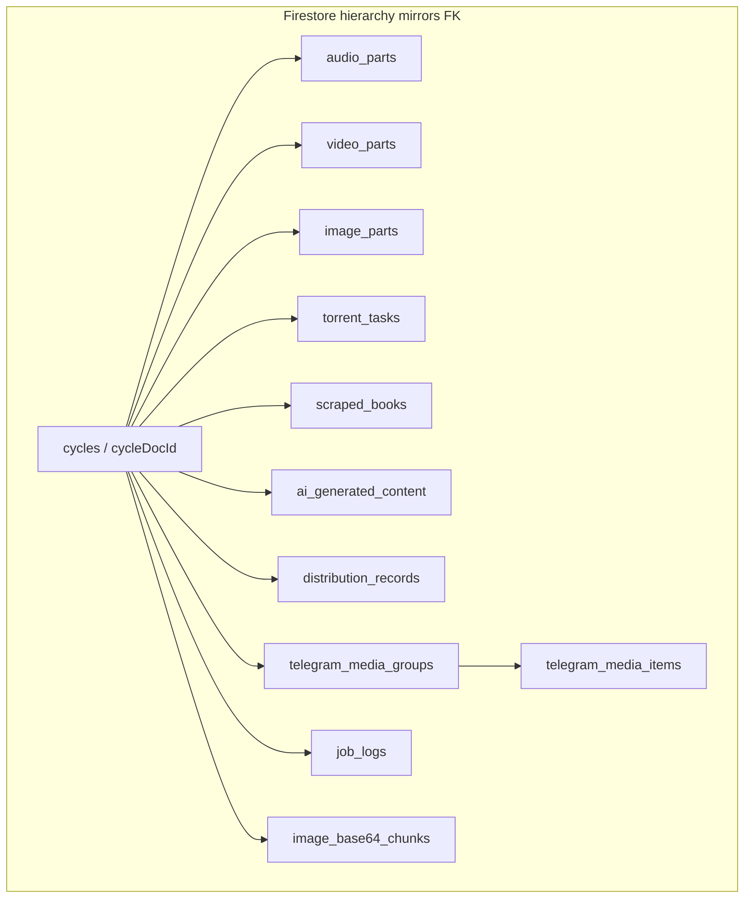
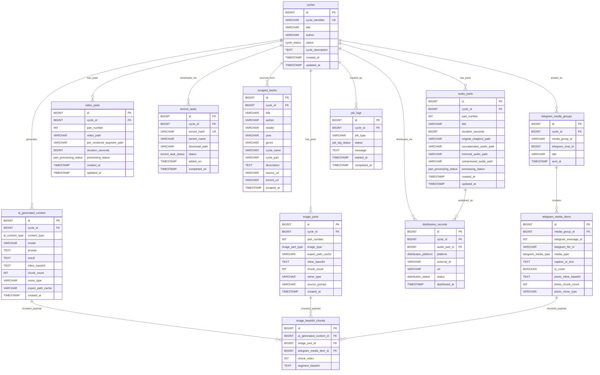
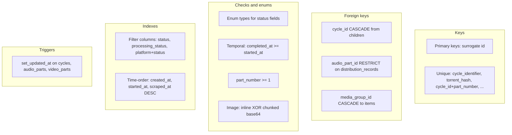

# Design Spec: Milestone A — Cycle-centric data model (Postgres + Firestore)

**Date:** 2026-05-05  
**Status:** Supersedes §5.2-aligned Milestone A draft — **the ER below is the single canonical domain model** for persisted pipeline state.  
**Scope:** Milestone **A** in program order **A → C → B** (extend SQL and jobs first; core ergonomics **C** and RabbitMQ **B** later).  

**Historical note:** `audio-library-automation-bot/ARCHITECTURE_REPORT_AND_PLAN.md` §5.2 described an alternate normalized layout (`authors` / `books` / `audio_jobs`). That layout is **not** the target for Milestone A anymore; keep the report for narrative (workers, queues) only unless it is revised separately.

---

## Related documents

| Document | Role |
|----------|------|
| `audio-library-automation-bot/ARCHITECTURE_REPORT_AND_PLAN.md` | Worker/migration narrative; §5.2 DDL is **deprecated** for this codebase until reconciled |
| `docs/superpowers/specs/2026-05-05-monolith-to-workers-roadmap-design.md` | C-phase spine (persistence / async) |
| `docs/superpowers/specs/adr-001-javacv-over-ffmpeg-cli.md` | FFmpeg/JavaCV seam unchanged |

---

## Single domain model (Postgres and Firebase must match conceptually)

We maintain **one** structural model—the ER in this document—not a separate “Firebase shape” and “SQL shape.” **Flyway** defines the **relational** encoding (**tables, FKs, enums**). **Firestore** defines the **document** encoding using the **same entity names, fields, and enum labels** (logical **camelCase** on documents). Application services map through a **single internal representation** (DTOs / records / domain objects) so writers do not fork business meaning per backend.

**Authoritative store (runtime):** At any moment **exactly one** backend should be treated as **system of record** per aggregate to avoid split-brain writes (recommended default for automation reliability: **PostgreSQL** for cycles/parts/jobs; Firestore as **optional mirror** for dashboard/listeners until an explicit cutover). Regardless of which store leads, **field semantics stay identical**—only presence (mirrored vs SQL-only) may differ during transition.

**Anti-pattern:** A legacy Firestore `audiobooks` tree that uses unrelated fields or nesting **without** mapping to `cycles` / `audio_parts` / … becomes a second database model; new code must **not** extend that drift—migrate toward this model.

---

## Naming convention (logical vs physical)

The ER below uses **camelCase** attribute labels for readability (matching your diagram).

| Layer | Convention |
|-------|------------|
| **Logical / Firestore document fields** | **camelCase** (e.g. `cycleIdentifier`, `partNumber`, `inlineBase64`, `chunkCount`, `mimeType`, `concatenatedAudioPath`) |
| **PostgreSQL columns (Flyway)** | **snake_case** (e.g. `cycle_identifier`, `part_number`, `inline_base64`, `chunk_count`, `mime_type`, `concatenated_audio_path`) |

**IDs**

| Store | Rule |
|-------|------|
| **Postgres** | Surrogate **`BIGSERIAL`** `id` where the ER shows `BIGINT id PK`; FKs reference those ids. **`cycle_identifier`** remains a stable **business** unique key (string). |
| **Firestore** | Prefer **`cycle_identifier`** (or stringified SQL id) as **`cycles/{cycleDocId}`** document id so URLs and searches stay stable; child docs carry **`cycleId`** / **`sqlId`** as needed for joins during hybrid phases. |

Primary keys use **`BIGSERIAL`** in Postgres unless otherwise noted. **`BYTEA` / JSONB** (Postgres) and **map** fields (Firestore) are reserved for extensions—not required for Milestone A.

---

## Firestore mirror layout (aligned to the same ER)

Nest children under each cycle so the hierarchy mirrors FK **`cycle_id`** relationships. Use **subcollections** named **exactly** like SQL tables (lowercase, plural). **Facebook group posts are out of scope** — no SQL table and no Firestore root collection for them in this model.

| Path pattern | Maps to SQL |
|--------------|-------------|
| `cycles/{cycleDocId}` | **`cycles`** row |
| `cycles/{cycleDocId}/audio_parts/{partDocId}` | **`audio_parts`** (`partDocId` can be `${partNumber}` or auto-id + field `partNumber`) |
| `cycles/{cycleDocId}/video_parts/{partDocId}` | **`video_parts`** |
| `cycles/{cycleDocId}/image_parts/{partDocId}` | **`image_parts`** |
| `cycles/{cycleDocId}/torrent_tasks/{taskDocId}` | **`torrent_tasks`** (`torrentHash` unique → usable as `taskDocId` when stable) |
| `cycles/{cycleDocId}/scraped_books/{bookDocId}` | **`scraped_books`** |
| `cycles/{cycleDocId}/ai_generated_content/{contentDocId}` | **`ai_generated_content`** |
| `cycles/{cycleDocId}/distribution_records/{distDocId}` | **`distribution_records`** |
| `cycles/{cycleDocId}/telegram_media_groups/{groupDocId}` | **`telegram_media_groups`** |
| `cycles/{cycleDocId}/telegram_media_groups/{groupDocId}/telegram_media_items/{itemDocId}` | **`telegram_media_items`** |
| `cycles/{cycleDocId}/job_logs/{logDocId}` | **`job_logs`** |
| `cycles/{cycleDocId}/image_base64_chunks/{chunkDocId}` | **`image_base64_chunks`** — document fields **`ownerKind`**, **`ownerSqlId`**, **`chunkIndex`**, **`segmentBase64`** (flat under cycle so paths stay shallow; **`chunkDocId`** e.g. `{ownerKind}-{ownerId}-{chunkIndex}`) |

**Distribution ↔ audio:** In SQL, **`distribution_records.audio_part_id`** points to **`audio_parts.id`**. In Firestore, each **`distribution_records`** document includes **`audioPartId`** (Firestore doc id or **`sqlId`** bigint during hybrid sync)—same meaning as the FK.

**AI rows (`ai_generated_content`):** Firestore documents mirror SQL: **`contentType`**, **`model`**, **`prompt`**, **`result`**, **`mimeType`**, **`inlineBase64`**, **`chunkCount`**, **`exportPathCache`** (optional), **`createdAt`**. When **`chunkCount` > 0**, image bytes live in **`image_base64_chunks`** subcollection (Firestore **~1 MiB per document** limit — chunk below that). See §Binary images in the database.

**Enums:** Store enum values as **strings** using the **same literals** as PostgreSQL enums / checks (`cycle_status`, `part_processing_status`, …).



---

## Operational catalog: `library_audiobooks`

The **cycle-centric** ER below models pipeline/production state (`cycles`, `audio_parts`, …). Separately, Flyway defines **`library_audiobooks`** for the **flat operational audiobook catalog** exposed at **`GET /api/v1/library/audiobooks`** (`AudiobookDto` / `LibraryAudiobookEntity`).

| Physical column | Role |
|-----------------|------|
| **`catalog_public_id`** (UUID, unique) | Public id — serialized as **`AudiobookDto.id`** |
| **`dist_youtube_video_id`**, **`dist_telegram_file_id`** | **`distributedTo`** in JSON (`youtubeVideoId`, `telegramFileId`) — only distribution fields persisted today |
| **`cover_image_ids`** (JSONB) | List of cover references |
| *(others)* | Metadata (`title`, `file_id`, `processing_status`, …) |

**Source of truth:** `audio-library-automation-bot/src/main/resources/db/migration/V202605052210__library_audiobooks.sql`. Optional Firestore **`audiobooks`** documents should use the same **`distributedTo`** field names when mirroring.

---

## Binary images in the database (base64; chunked when needed)

**Policy:** Raster images (**AI-generated art**, **`image_parts`**, Telegram **`photo`** payloads when persisted) are stored **in PostgreSQL** as **Base64** text — **not** on the filesystem as the source of truth. Optional **`export_path_cache`** / legacy **`image_path`** fields may hold a **derived export path** for FFmpeg or tooling, but **must be reproducible** from DB payloads.

| Strategy | When | Parent row | Chunk rows |
|----------|------|------------|------------|
| **Inline** | Encoded size ≤ **`max_inline_base64_chars`** (implement default e.g. **4_000_000** chars ≈ ~3 MB PNG after encoding — tune per ops) | **`inline_base64 TEXT NOT NULL`**, **`chunk_count = 0`** | No chunk rows |
| **Chunked** | Encoded size exceeds threshold | **`inline_base64 IS NULL`**, **`chunk_count > 0`** matching number of chunks | **`image_base64_chunks.segment_base64`** ordered by **`chunk_index`** 0..n−1 |

**Reassembly:** `concat(segment_base64 ORDER BY chunk_index)` → valid single Base64 string → decode to bytes → image.

**New table: `image_base64_chunks`**

| Column | Type | Notes |
|--------|------|--------|
| **`id`** | BIGSERIAL PK | |
| **`ai_generated_content_id`** | BIGINT NULL FK **`ON DELETE CASCADE`** | Exactly **one** of the three parent FKs non-null |
| **`image_part_id`** | BIGINT NULL FK **`ON DELETE CASCADE`** | |
| **`telegram_media_item_id`** | BIGINT NULL FK **`ON DELETE CASCADE`** | |
| **`chunk_index`** | INT NOT NULL **`CHECK (chunk_index >= 0)`** | |
| **`segment_base64`** | TEXT NOT NULL | Fragment of the full Base64 string (no newlines inside segment unless included deliberately in encoding) |

**CHECK:** Exactly one parent FK column is non-null (implement via **`CHECK`** counting non-nulls or a small **`scope`** enum + **`CHECK`**).

**UNIQUE (partial):** **`UNIQUE (ai_generated_content_id, chunk_index) WHERE ai_generated_content_id IS NOT NULL`** (and analogous partial unique indexes for **`image_part_id`** and **`telegram_media_item_id`**).

**Firestore:** Prefer **`inlineBase64`** on the parent document only under size limits; otherwise **`chunkCount`** on parent and one document per chunk under **`image_base64_chunks`** with fields **`chunkIndex`**, **`segmentBase64`**.

---

## PostgreSQL enums

Prefer native **`CREATE TYPE … AS ENUM (...)`** with **exact** labels below (stable Java/Hibernate mapping). Alternative: **`VARCHAR` + `CHECK`** if enum churn is expected—implementation plan chooses one per family.

| Enum | Values |
|------|--------|
| **`cycle_status`** | `PENDING`, `SEARCHING`, `DOWNLOADING`, `PROCESSING_AUDIO`, `PROCESSING_IMAGE`, `PROCESSING_VIDEO`, `POSTING`, `COMPLETED`, `FAILED` |
| **`part_processing_status`** | `PENDING`, `IN_PROGRESS`, `COMPLETED`, `FAILED` |
| **`torrent_task_status`** | `PENDING`, `DOWNLOADING`, `STALLED_UP`, `COMPLETED`, `FAILED`, `DELETED_FROM_CLIENT` |
| **`image_part_type`** | `cover_art`, `base_ai_cover`, `thumbnail` |
| **`ai_content_type`** | `TEXT`, `IMAGE`, `DESCRIPTION` — see §AI generated content (polymorphic payloads) |
| **`distribution_platform`** | `YOUTUBE`, `BOOSTY`, `TELEGRAM` |
| **`distribution_status`** | `PENDING`, `SUCCESS`, `FAILED` |
| **`telegram_media_type`** | `photo`, `audio`, `text` |
| **`job_log_status`** | `PENDING`, `IN_PROGRESS`, `COMPLETED`, `FAILED` |

---

## Entity relationship (canonical)



---

## AI generated content (polymorphic payloads)

One table (**`ai_generated_content`**) / one Firestore subcollection stores **every** LLM or diffusion output tied to a cycle—plain text, long descriptions, or **generated images**—without splitting unrelated **logical** tables. **Image bytes** themselves follow §Binary images in the database (**`inline_base64`** / **`image_base64_chunks`**).

| **`content_type`** | **`result`** (TEXT) | **Image storage** | **`mime_type`** |
|--------------------|---------------------|-------------------|-----------------|
| **`TEXT`** | Primary output | **`inline_base64`/`chunk_count`/`chunks` unused** (NULL / 0) | NULL |
| **`DESCRIPTION`** | Primary output | Same as TEXT | NULL |
| **`IMAGE`** | Optional caption / notes | **`inline_base64`** **or** **`chunk_count` + `image_base64_chunks`**; **`mime_type`** required when payload complete | `image/png`, `image/jpeg`, … |

**`export_path_cache`:** Optional VARCHAR — **cache** of last written file path for video pipeline tools; **must not** be the only copy of pixels.

**Cross-links:** The same pixels often surface as **`image_parts`** (**`image_type = base_ai_cover`**) with aligned **`inline_base64`** / chunk refs; **`ai_generated_content`** keeps **prompt/model/provenance** even when **`image_parts`** holds the display row.

---

## PostgreSQL constraints, indexes, and triggers

Flyway migrations **must** implement the rules below (adjust names only if a prior migration already defines a shared trigger function—then **reuse** it).

### Defaults (all child tables of `cycles`)

| Rule | Choice |
|------|--------|
| **Primary keys** | **`BIGSERIAL`** / **`GENERATED … AS IDENTITY`** — single surrogate **`id`**. |
| **Timestamps** | **`created_at TIMESTAMPTZ NOT NULL DEFAULT now()`** where the ER shows **`created_at`**; use **`TIMESTAMPTZ`** everywhere for server-local ambiguity avoidance. |
| **FK `cycle_id` → `cycles(id)`** | **`ON DELETE CASCADE`** — deleting a cycle removes its dependent rows (opt-in later for soft-delete cycles if product requires retention). |
| **Enum columns** | Back with PostgreSQL **`CREATE TYPE … AS ENUM`** (§PostgreSQL enums). If migration churn becomes painful, switch family to **`TEXT` + CHECK** in a later version—do not edit applied enum labels blindly. |

### Trigger function: `updated_at`

Attach **`BEFORE UPDATE`** triggers only to tables that expose **`updated_at`** in the canonical ER (**`cycles`**, **`audio_parts`**, **`video_parts`**).

```sql
CREATE OR REPLACE FUNCTION set_updated_at()
RETURNS TRIGGER AS $$
BEGIN
  NEW.updated_at := CURRENT_TIMESTAMP;
  RETURN NEW;
END;
$$ LANGUAGE plpgsql;

-- Per table (PostgreSQL 14+):
CREATE TRIGGER trg_cycles_updated_at
  BEFORE UPDATE ON cycles
  FOR EACH ROW EXECUTE FUNCTION set_updated_at();
-- Repeat for audio_parts, video_parts with matching trigger names.
```

Use **`EXECUTE PROCEDURE`** instead of **`EXECUTE FUNCTION`** if your Postgres build rejects the keyword (both are valid in supported versions depending on packaging).

---

### Table: `cycles`

| Kind | Definition |
|------|------------|
| **NOT NULL** | **`cycle_identifier`**, **`status`**, **`created_at`**, **`updated_at`** |
| **UNIQUE** | **`cycle_identifier`** |
| **CHECK** | None beyond enum domain |
| **Indexes** | **`UNIQUE (cycle_identifier)`** (same as constraint); **`INDEX (status)`** for queue/dashboard filters |

---

### Table: `audio_parts`

| Kind | Definition |
|------|------------|
| **FK** | **`cycle_id` → `cycles(id)`** **ON DELETE CASCADE** |
| **NOT NULL** | **`cycle_id`**, **`part_number`**, **`processing_status`**, **`created_at`**, **`updated_at`** |
| **UNIQUE** | **`UNIQUE (cycle_id, part_number)`** — one row per part index inside a cycle |
| **CHECK** | **`part_number >= 1`**; **`duration_seconds IS NULL OR duration_seconds >= 0`** |
| **Indexes** | **`UNIQUE (cycle_id, part_number)`**; **`INDEX (cycle_id)`** (redundant if unique prefix suffices—keep if planner prefers narrow scans); **`INDEX (processing_status)`** for job polling |
| **Trigger** | **`set_updated_at`** |

---

### Table: `video_parts`

| Kind | Definition |
|------|------------|
| **FK** | **`cycle_id` → `cycles(id)`** **ON DELETE CASCADE** |
| **NOT NULL** | **`cycle_id`**, **`part_number`**, **`processing_status`**, **`created_at`**, **`updated_at`** |
| **UNIQUE** | **`UNIQUE (cycle_id, part_number)`** |
| **CHECK** | **`part_number >= 1`**; **`duration_seconds IS NULL OR duration_seconds >= 0`** |
| **Indexes** | **`UNIQUE (cycle_id, part_number)`**; **`INDEX (processing_status)`** |
| **Trigger** | **`set_updated_at`** |

---

### Table: `image_parts`

| Kind | Definition |
|------|------------|
| **FK** | **`cycle_id` → `cycles(id)`** **ON DELETE CASCADE** |
| **NOT NULL** | **`cycle_id`**, **`part_number`**, **`image_type`**, **`created_at`**; **`chunk_count NOT NULL DEFAULT 0`** |
| **UNIQUE** | **`UNIQUE (cycle_id, part_number)`** |
| **CHECK** | **`part_number >= 1`**; **`chunk_count >= 0`**; completed raster rows: **`mime_type IS NOT NULL`** implies **`inline_base64 IS NOT NULL XOR chunk_count > 0`** (pending rows may violate until filled — implement strict **`CHECK`** only if generation is synchronous in DB transaction) |
| **Indexes** | **`UNIQUE (cycle_id, part_number)`**; **`INDEX (cycle_id, image_type)`** for cover lookups |

---

### Table: `torrent_tasks`

| Kind | Definition |
|------|------------|
| **FK** | **`cycle_id` → `cycles(id)`** **ON DELETE CASCADE** |
| **NOT NULL** | **`cycle_id`**, **`torrent_hash`**, **`status`** |
| **UNIQUE** | **`torrent_hash`** — global identity for qBittorrent/WebUI hash |
| **CHECK** | **`completed_on IS NULL OR added_on IS NULL OR completed_on >= added_on`** |
| **Indexes** | **`UNIQUE (torrent_hash)`**; **`INDEX (cycle_id)`**; **`INDEX (status)`** for schedulers |

---

### Table: `scraped_books`

| Kind | Definition |
|------|------------|
| **FK** | **`cycle_id` → `cycles(id)`** **ON DELETE CASCADE** |
| **NOT NULL** | **`cycle_id`**, **`scraped_at`** |
| **CHECK** | None mandatory (scraped rows may be sparse); optional **`CHECK (title IS NOT NULL OR source_url IS NOT NULL)`** if business requires one anchor |
| **Indexes** | **`INDEX (cycle_id)`**; **`INDEX (cycle_id, scraped_at DESC)`** for recent-first lists |

---

### Table: `ai_generated_content`

| Kind | Definition |
|------|------------|
| **FK** | **`cycle_id` → `cycles(id)`** **ON DELETE CASCADE** |
| **NOT NULL** | **`cycle_id`**, **`content_type`**, **`created_at`**; **`chunk_count NOT NULL DEFAULT 0`** |
| **CHECK** | **`chunk_count >= 0`**; **`content_type IN ('TEXT','IMAGE','DESCRIPTION')`** when not native enum; **`NOT (content_type IN ('TEXT','DESCRIPTION')) OR (chunk_count = 0 AND inline_base64 IS NULL)`**; for **`IMAGE`** rows at rest (when **`mime_type`** set): **`(inline_base64 IS NOT NULL AND chunk_count = 0) OR (inline_base64 IS NULL AND chunk_count > 0)`** — omit or soften if generation spans transactions |
| **Indexes** | **`INDEX (cycle_id, content_type)`**; **`INDEX (cycle_id, created_at DESC)`** |

---

### Table: `image_base64_chunks`

| Kind | Definition |
|------|------------|
| **FK** | **`ai_generated_content_id` → `ai_generated_content(id)` ON DELETE CASCADE**; **`image_part_id` → `image_parts(id)` ON DELETE CASCADE**; **`telegram_media_item_id` → `telegram_media_items(id)` ON DELETE CASCADE** |
| **NOT NULL** | **`chunk_index`**, **`segment_base64`** |
| **CHECK** | Exactly **one** parent id non-null: **`(CASE WHEN ai_generated_content_id IS NOT NULL THEN 1 ELSE 0 END) + (CASE WHEN image_part_id IS NOT NULL THEN 1 ELSE 0 END) + (CASE WHEN telegram_media_item_id IS NOT NULL THEN 1 ELSE 0 END) = 1`** |
| **UNIQUE** | Partial unique indexes: **`(ai_generated_content_id, chunk_index)`**, **`(image_part_id, chunk_index)`**, **`(telegram_media_item_id, chunk_index)`** (each **`WHERE`** respective id **IS NOT NULL**) |
| **Indexes** | B-tree on each nullable parent id column for deletes / joins |
| **Flyway order** | **`CREATE TABLE`** only **after** **`ai_generated_content`**, **`image_parts`**, and **`telegram_media_items`** exist |

---

### Table: `distribution_records`

| Kind | Definition |
|------|------------|
| **FK** | **`cycle_id` → `cycles(id)`** **ON DELETE CASCADE**; **`audio_part_id` → `audio_parts(id)`** **ON DELETE RESTRICT** — prevents deleting an **`audio_parts`** row that still has distribution audit rows (choose **`SET NULL`** instead only if **`audio_part_id`** is nullable and product accepts orphan distributions) |
| **NOT NULL** | **`cycle_id`**, **`platform`**, **`status`** |
| **CHECK** | **`distributed_at IS NULL OR distributed_at <= CURRENT_TIMESTAMP`** (optional soft sanity); **`url IS NULL OR length(trim(url)) > 0`** |
| **Indexes** | **`INDEX (cycle_id)`**; **`INDEX (audio_part_id)`**; **`INDEX (platform, status)`**; **`INDEX (cycle_id, platform)`** |

---

### Table: `telegram_media_groups`

| Kind | Definition |
|------|------------|
| **FK** | **`cycle_id` → `cycles(id)`** **ON DELETE CASCADE** |
| **NOT NULL** | **`cycle_id`** |
| **UNIQUE** | **`UNIQUE (cycle_id, media_group_id)`** where **`media_group_id`** is NOT NULL—use **partial unique index** **`WHERE media_group_id IS NOT NULL`** if Telegram IDs can be temporarily empty |
| **Indexes** | **`INDEX (cycle_id)`**; **`INDEX (telegram_chat_id)`** |

---

### Table: `telegram_media_items`

| Kind | Definition |
|------|------------|
| **FK** | **`media_group_id` → `telegram_media_groups(id)`** **ON DELETE CASCADE** |
| **NOT NULL** | **`media_group_id`**, **`media_type`**; **`photo_chunk_count NOT NULL DEFAULT 0`** |
| **CHECK** | When **`media_type = 'photo'`** and photo persisted: **`photo_mime_type IS NOT NULL`** and **`(photo_inline_base64 IS NOT NULL AND photo_chunk_count = 0) OR (photo_inline_base64 IS NULL AND photo_chunk_count > 0)`** — optional strictness |
| **UNIQUE** | **`UNIQUE (media_group_id, telegram_message_id)`** when **`telegram_message_id`** is NOT NULL (partial unique index if nullable) |
| **Indexes** | **`INDEX (media_group_id)`** |

---

### Table: `job_logs`

| Kind | Definition |
|------|------------|
| **FK** | **`cycle_id` → `cycles(id)`** **ON DELETE CASCADE** |
| **NOT NULL** | **`cycle_id`**, **`job_type`**, **`status`**, **`started_at`** |
| **CHECK** | **`completed_at IS NULL OR completed_at >= started_at`** |
| **Indexes** | **`INDEX (cycle_id, started_at DESC)`**; **`INDEX (cycle_id, status)`** |

---

### Legacy / orchestration: `processing_jobs` (when altered per §Legacy reconciliation)

| Kind | Definition |
|------|------------|
| **FK** | **`cycle_id` → `cycles(id)`** **ON DELETE SET NULL** (job row may outlive cycle archival); **`audio_part_id` → `audio_parts(id)`** **ON DELETE SET NULL** |
| **Indexes** | **`INDEX (cycle_id)`**; **`INDEX (audio_part_id)`**; **`INDEX (status)`** if varchar/enum filtered |

---

### Constraint summary diagram



---

## Executive summary

1. **`cycles`** is the **aggregate root** for pipeline state (`cycle_status` drives high-level workflow).
2. **Media artifacts** are **part-grained**: **`audio_parts`**, **`video_parts`**, **`image_parts`** keyed by **`cycle_id`** + **`part_number`**.
3. **Acquisition** uses **`torrent_tasks`**; **discovery metadata** uses **`scraped_books`** (successor concept to legacy **`parsed_book`**—see §Legacy reconciliation).
4. **Distribution** uses **`distribution_records`** (+ optional Telegram structures **`telegram_media_groups`** / **`telegram_media_items`**).
5. **Operational history** uses **`job_logs`** per cycle.
6. **Raster images** live **in Postgres/Firestore as Base64**: **`inline_base64`** or **`image_base64_chunks`** (§Binary images in the database); **`ai_generated_content`** **`IMAGE`** rows and **`image_parts`** / Telegram **`photo`** items follow the same rules; optional **`export_path_cache`** is not authoritative.
7. **Postgres (Flyway) and Firestore** express **the same model**: identical entity names, fields (camelCase in Firestore / snake_case in SQL), and enum literals—no parallel unrelated schemas. **Facebook ingestion/storage is excluded** from this schema (use external tooling or ad-hoc storage outside this model if ever needed).
8. **Relational integrity is explicit:** §PostgreSQL constraints, indexes, and triggers defines **NOT NULL**, **UNIQUE**, **CHECK**, **FK delete rules**, **indexes**, and **`updated_at`** triggers—Flyway must implement them (not optional polish).

---

## Goals (Milestone A)

- Ship Flyway migrations creating **all tables and enums** above (**including `image_base64_chunks`**) **and** the rules in §PostgreSQL constraints, indexes, and triggers plus §Binary images in the database (FKs, **UNIQUE**, **CHECK**, indexes, **`set_updated_at`** triggers, **`TIMESTAMPTZ`** defaults)—**relational projection** of the canonical ER with production-grade integrity.
- Document and adopt the **Firestore hierarchy** in §Firestore mirror layout so dashboards and listeners read/write **the same aggregates** as SQL (field parity).
- Define **legacy reconciliation** from **`parsed_book`** toward **`scraped_books`** + **`cycles`** (data migration script or follow-up migration version).
- Wire **`POST /api/v1/jobs/audio/concatenate`** (or successor) so execution **updates `audio_parts`** paths and **`processing_status`**, and optionally advances **`cycles.status`** when policy dictates (implementation detail).
- Add or refactor **Firestore writers/readers** to use **shared DTOs** (or mappers from one domain type) when mirroring commits—avoid maintaining divergent Firestore-only shapes long-term.

## Non-goals (Milestone A)

- RabbitMQ / external workers (**B**).
- **Declaring Firestore the sole system of record** without an explicit cutover plan—that remains a product decision; until then pick **one** writer authority per aggregate (recommended: Postgres leads).
- Full Telegram automation wiring—**schema + mapping parity first**, integrations can trail if URLs/secrets are not ready.

---

## Legacy reconciliation

| Legacy | Target |
|--------|--------|
| **`parsed_book`** | **`scraped_books`** rows attached to a **`cycles`** row (derive **`cycle_id`** from stable **`cycle_name`** + **`source_directory`** or create one cycle per scrape batch—implementation plan picks deterministic rule). |
| **`processing_jobs`** (UUID async API) | **Keep** for REST correlation **or** extend **`job_logs`** with **`correlation_uuid UUID UNIQUE`** + payload columns—**decision:** prefer **short term** keeping **`processing_jobs`** and adding **`processing_jobs.audio_part_id`** → **`audio_parts(id)`**, **`processing_jobs.cycle_id`** → **`cycles(id)`** nullable, plus **`job_logs`** mirror for cycle-visible history. Deprecate dual layer when API migrates to **`job_logs.id`** or UUID on **`job_logs`**. |

---

## Concatenate flow (aligned to `audio_parts`)

1. Resolve or create **`cycles`** (required FK for **`audio_parts`** in this model).
2. Resolve or create **`audio_parts`** row for **`(cycle_id, part_number)`** (default **`part_number = 1`** if API stays single-part).
3. Set **`original_chapters_path`** / workspace paths from request; **`processing_status = IN_PROGRESS`** during run.
4. On success: **`concatenated_audio_path`** populated, **`processing_status = COMPLETED`**.
5. **`processing_jobs`** (if retained): update status in parallel; insert **`job_logs`** row **`job_type = AUDIO_CONCATENATE`** for **`cycle_id`**.

Directory-only jobs **without** a natural cycle: create **`cycles`** row with **`cycle_identifier`** = generated UUID string, **`title`** optional placeholder, **`status = PROCESSING_AUDIO`**.

---

## Hibernate / Flyway / Firestore adapters

- **Flyway owns Postgres DDL.** Prod profile **`ddl-auto=validate`** — entities must match snake_case columns.
- Milestone A may map **only** actively used tables (`cycles`, `audio_parts`, `processing_jobs`, `job_logs`) in JPA; other tables SQL-only until features need them.
- **`FirestoreAudiobookService`** (and similar): refactor incrementally toward **reading/writing `cycles` and children** per §Firestore mirror layout, not a legacy document shape that diverges from this ER. During hybrid operation, **after SQL commit**, optional async projection updates Firestore with **the same field set** (see `firebase.firestore.sync` patterns already in config—extend collection paths to match this spec).

---

## Testing expectations

- Migration smoke: clean Postgres applies all versions.
- Integration: concatenate job creates/updates **`audio_parts`** and completes **`processing_status`**.
- Optional: **`parsed_book` → scraped_books** fixture test.

---

## Risks

| Risk | Mitigation |
|------|------------|
| **`cycles` required** vs path-only concatenate | Always create a synthetic **`cycles`** row for ad-hoc jobs |
| Dual **`processing_jobs`** + **`job_logs`** | Document dual-write rules; converge UUID surface in Milestone C |
| Enum churn | Prefer PostgreSQL enums only after labels stabilize; else **`CHECK`** varchar |
| **Postgres ↔ Firestore drift** | Shared domain/DTO layer; same enum strings; integration tests or reconciliation script comparing **`cycle_identifier`** snapshots |
| **Split-brain writes** | Enforce **one authority** per aggregate; mirror path is **read-through projection** or event-after-commit only |
| **Large Base64 in JVM heap** | Stream decode / write via temp files **only** as processing scratch; persist chunks with bounded **`segment_base64`** row sizes; tune **`max_inline_base64_chars`** |

---

## Implementation hand-off

Refresh **`docs/superpowers/plans/2026-05-05-milestone-a-normalized-schema-implementation-plan.md`** against **this** spec (cycle-centric Flyway chunks + `audio_parts` wiring—not §5.2 `audio_jobs`).
