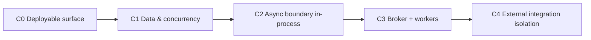

# Design Spec: Monolith evolution toward workers (C → B → A)

**Date:** 2026-05-05  
**Scope:** Order delivery as **migration trajectory (C)**, then **engineering discipline in the existing Spring Boot monolith (B)**, then **milestones/product slices(A)**. Aligns staged delivery with `audio-library-automation-bot/ARCHITECTURE_REPORT_AND_PLAN.md` without assuming a broker or workers exist on day one.  
**Out of scope for this note:** Detailed schema DDL, queue technology choice beyond “message broker,” and superseding alternate specs (see **Related documents**).

---

## Executive summary

1. **`ARCHITECTURE_REPORT_AND_PLAN.md`** remains the north star (Postgres authority, eventual async lanes, worker processes, external integration isolation).
2. **Engineering execution** proceeds by **thickening seams inside one deployable** (strangler): orchestration vs execution, persistence vs integration adapters, observable job lifecycle—all before RabbitMQ becomes mandatory.
3. **Shipping** follows **milestones M0–M4** mapped to phases **C0–C4** so the frontend and ops get value at each step without breaking contracts mid-flight.

This path **defers full “Firestore-only / no Postgres”** designs (documented separately) unless the team explicitly reprisioritizes persistence; Postgres remains the pragmatic system of record through at least **C1–C3**.

---

## Related documents

- `audio-library-automation-bot/ARCHITECTURE_REPORT_AND_PLAN.md` — bottlenecks, target microservices shape, RabbitMQ/worker narrative.
- `docs/superpowers/specs/2026-04-20-firebase-full-migration-design.md` — alternate “Firebase as primary store” vision; reconcile intentionally before merging persistence strategy with this roadmap.
- `docs/audit/architecture.md` — current service map and `app.core.enabled` semantics.

---

## Phase flow (migration spine — Section C approved)

| Phase | Target outcome | Pragmatic scope |
|-------|----------------|-----------------|
| **C0** | Core API observable and hostable | Core REST, health/actuator, Postgres connectivity, deployment (e.g. Docker/Railway), CORS/env contract for `audio-frontend`. Firebase explicitly required or narrowed via profile/feature flag—never accidental breakage of boot. |
| **C1** | SQL-aligned system of record; monolith hazards reduced | Persist job/book metadata paths that drive operations; isolate or retire whole-file JSON read/write hotspots; bounded directory scans and concat/list discipline per architecture report. |
| **C2** | Logical queue before physical broker | Heavy work behind durable **jobs** (`ACCEPTED` → `RUNNING` → `DONE`/`FAILED`). API returns quickly (e.g. `202` + job id); executor remains in JVM or companion process until **C3**. Correlation/job id logging. |
| **C3** | Match report worker split | Message broker + dedicated worker(s) for FFmpeg-heavy lanes; Postgres remains status source of truth; API/Telegram as orchestrators only. |
| **C4** | PolyAPI-scale concerns | Isolate long-running or fragile external auth (Boosty/Playwright, YouTube, OpenAI) from synchronous HTTP; rate limits and timeouts bounded. |

**Explicit early deferrals:** Redis cache layer, PolyAPI breadth, separate torrent/video workers—until **C2 exit** reduces risk of distributed debugging while local concurrency/memory issues remain.

**C1 → C2 gate (examples):** No shared mutable cross-request artifacts (e.g. global concat file lists); job identifiers and statuses visible in Postgres; worst memory patterns either removed or documented with hard ceilings.

---

## Engineering change strategy (Section B approved)

**Branching and delivery**

- Prefer **small PRs**, each tagged mentally to **C-phase** (`C1-concurrency`, `C1-persistence`) for traceability.
- Use **`APP_CORE_ENABLED` and Firebase-related flags** to keep a runnable “core deploy” path when optional integrations regress.
- Staging aligns with prod assumptions (Postgres + FFmpeg), with documented deltas only.

**Seams inside the monolith**

| Seam | Direction |
|------|-----------|
| Orchestration vs execution | HTTP/Telegram express **intent**; execution paths shrink behind a single **`JobRunner` / executor** abstraction over time. |
| Persistence vs integration | Postgres owns authoritative job/work metadata; Firestore integrations live behind adapters until strategy is unified with other specs. |
| External I/O | qBittorrent, Whisper/silence services, Boosty/Playwright: **facade-only** imports from domain code. |

**Gates per change**

- Unit tests for filesystem/temp semantics and status transitions; env-gated integration tests where external URLs exist.
- Logging includes **correlation id** and **job id** once **C2** surfaces jobs.
- Public API adopts **stable async contract** (`202` + job resource) early even if work still completes in-process (**C2**).

**Deprecation**

- Do not extend **`JsonFileService`-style whole-file JSON** state; migrate reads toward SQL or cap with enforced limits until removed in **C1**.
- Ban new uses of shared hardcoded paths for multi-tenant/multi-request concurrency; retire remaining sites on **C1** timeline.

**Order inside B**

1. Minimal Postgres model + Flyway when migrations are introduced.  
2. Concurrency/memory foot-guns.  
3. `JobRunner` + async HTTP contract while still embedded.  
4. Broker + second process (**C3**).

---

## Milestones & product slices (Section A approved)

| Milestone | Phase | Product / UX outcome | Technical exit signal |
|-----------|-------|-------------------------|-------------------------|
| **M0** | C0 | Dashboard can aim `VITE_CORE_API_URL` at hosted API; operators trust health and CORS. | Reproducible container/build; Postgres + secrets documented; Firebase policy explicit. |
| **M1** | C1 | Operators trust bookkeeping: jobs/books not corrupted by races or fragile JSON files. | Metadata/jobs on Postgres; JSON hotspots migrated or capped; regression tests on audio paths. |
| **M2** | C2 | Long operations feel **non-blocking**; job status visible (poll first; SSE/WS optional later). | `202` + job GET; executor behind seam; correlated logs. |
| **M3** | C3 | Processing scales on separate compute without rewriting the frontend job model. | Broker + worker MVP for one lane; status still in Postgres; retry policy documented. |
| **M4** | C4 | Publishing integrations fail **safely** without wedging core API threads. | Isolated adapters, timeouts, optional handoff queues. |

**Frontend sequencing:** health/env (M0) → minimal job/history if API exposes (M1+) → primary job UX (M2) → unchanged contract into M3 if job API is stable.

---

## Risks & mitigations

| Risk | Mitigation |
|------|------------|
| Two persistence visions (Postgres roadmap vs Firebase-only spec) | Decision checkpoint before **C1** schema investments; explicitly version API projections. |
| Premature RabbitMQ (**C3** too early) | Hold **C3** until **C1 gate** cleared; simulate queue with tables + polling if needed. |
| Railway/small VMs OOM during FFmpeg | Enforce concurrency limits at **C2** executor; sizing docs for worker hosts at **M3**. |

---

## Testing & observability (cross-cutting)

- **Unit:** path safety, concat/trim invariants (existing patterns expanded).  
- **Integration:** optional `RUN_EXTERNAL_SERVICE_TESTS`-style guards for silence/Whisper URLs.  
- **Ops:** actuator health usable from `audio-frontend`; job endpoints eventually feed dashboard job list.

---

## Spec self-review (checklist)

- **Placeholders:** None required; broker vendor and exact job REST shape remain implementation details for the follow-up implementation plan—this spec states outcomes and sequencing only.  
- **Consistency:** C/B/A narratives align; Postgres authority through **C3** does not silently adopt the Firebase-full replacement spec.  
- **Scope:** Single coherent program of work—implementation tasks belong in `writing-plans` output, not duplicated here as long checklists.

---

## Approval record

| Section | Status |
|---------|--------|
| C — Migration trajectory | Approved (user) |
| B — Engineering change strategy | Approved (user) |
| A — Milestones | Approved (user consolidation) |

**Next step:** Review this file in-repo; then invoke **writing-plans** for a phased implementation backlog (tasks, owners optional, verification commands).
