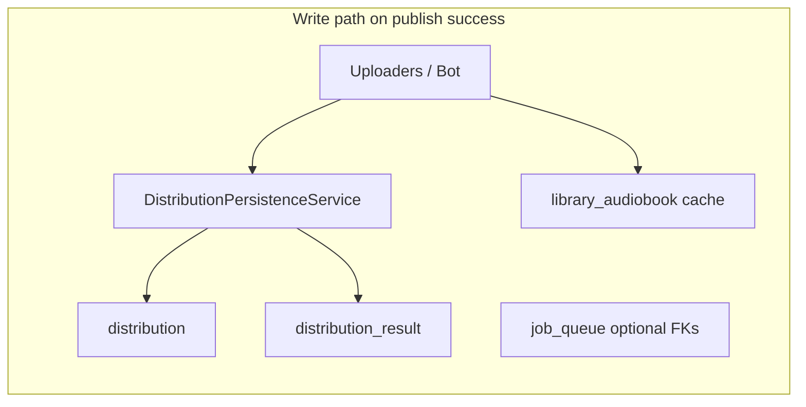
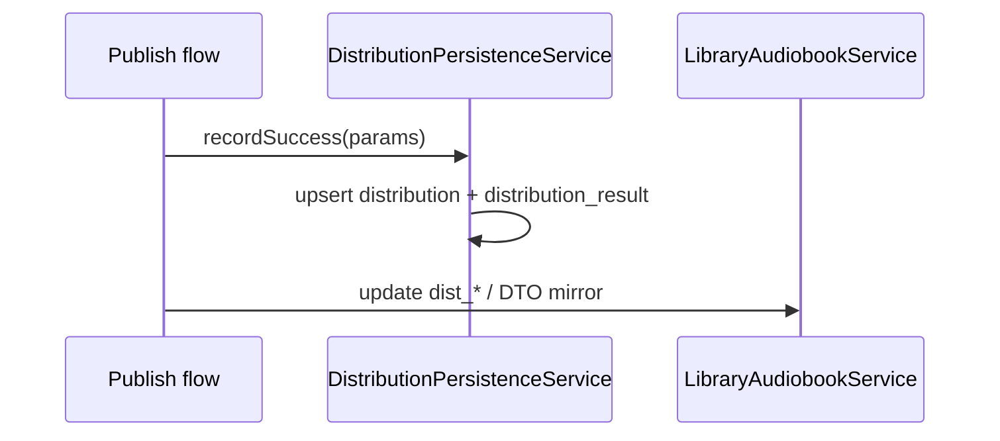

# Application / database alignment (schema B) — design spec

**Date:** 2026-05-07  
**Status:** Approved for implementation planning  
**Parent context:** PostgreSQL migrations complete through **`V202605072463`** ([optimized ER plan](../plans/2026-05-07-optimized-er-diagram-plan.md), Phase 10).

---

## 1. Goal

Bring **runtime code** (Java JPA, REST DTOs, optional Firestore mirror, `audio-frontend`, upload/bot flows) in line with the **current** database model: correct table semantics, mapped columns, and **dual-write** distribution persistence while retaining **`library_audiobook`** denormalized fields as an operator-facing cache until a later removal phase.

## 2. Non-goals

- **No new Flyway migrations** unless implementation uncovers a genuine schema defect (prefer new `V*.sql` over editing applied files).
- **Do not drop** `library_audiobook.dist_telegram_file_id` / `dist_youtube_video_id` in this phase.
- **Do not** require the admin UI to read only `distribution_result` in this phase (cache + DB truth coexist by design).

## 3. Architecture overview

- **System of record for platform outcomes:** `distribution` + `distribution_result` (see ER plan §2.6).
- **Operator cache:** `library_audiobook` string/distribution columns and `AudiobookDto.distributedTo` remain populated in the same business flows so existing dashboards and Telegram behavior keep working.

## 4. Workstreams

### 4.1 Catalog bridge (`library_audiobook`)

**Database (already exists):** `book_id`, `cycle_id` nullable FKs on `library_audiobook`.

**Changes:**

| Layer | Action |
|-------|--------|
| `LibraryAudiobookEntity` | Map `bookId`, `cycleId` (`Long`, nullable). |
| `AudiobookDto` | Add optional `bookId`, `cycleId` (use `Long`; REST JSON numbers). |
| `LibraryAudiobookService` | `mergeIncomingOntoEntity`, `toDto` read/write these fields. |
| `FirestoreAudiobookService` | `merge`, `fromDoc`, `toMap` include same keys when sync is enabled. |
| `LibraryAudiobookRepository` | Add queries if product needs `findByBookId`, `findByCycleId` (add only when a caller exists). |

**Validation:** Hibernate `ddl-auto=validate` against PostgreSQL; no phantom columns.

### 4.2 `book_chapter` API

**Database (existing):** `book_chapter` per migration `V202605072370__book_chapter.sql` (columns: `id`, `cycle_id`, `chapter_number`, `chapter_title`, `chapter_text`, `created_at`).

**Changes:**

| Component | Responsibility |
|-----------|----------------|
| `BookChapterEntity` | JPA mapping to `book_chapter`. |
| `BookChapterRepository` | `findByCycleIdOrderByChapterNumberAsc`; optional `findByCycleIdAndChapterNumber`. |
| `BookChapterService` | CRUD orchestration; verify `cycle` exists via `CycleRepository`. |
| REST | Under `CycleV1Controller` or dedicated controller: base path `/api/v1/cycles/{cycleId}/chapters`. |

**Suggested HTTP surface (align with existing style in repo):**

- `GET /api/v1/cycles/{cycleId}/chapters` — ordered list; **404** if cycle does not exist.
- `PUT /api/v1/cycles/{cycleId}/chapters/{chapterNumber}` — upsert one chapter (idempotent by natural key); **409** on conflict if a different strategy is chosen—spec prefers **upsert** so **200** with body is acceptable.

Alternatively `POST` for create only with **409** on duplicate `(cycle_id, chapter_number)` — pick one pattern and apply consistently in implementation plan.

**DTOs:** `BookChapterResponse` (and optional `BookChapterRequest`) in `pipeline.dto` or `library.dto` per existing package conventions.

### 4.3 Distribution dual-write

**Existing entities:** `DistributionEntity`, `DistributionResultEntity`, `PlatformEntity`; repositories `DistributionRepository`, `DistributionResultRepository`, and a `PlatformRepository` (add if missing).

**New service (name implementation):** e.g. `DistributionPersistenceService`:

1. Resolve `PlatformEntity` by **`code`** — must match seed: `YOUTUBE`, `TELEGRAM`, `BOOSTY` (see ER plan §2.6 seed table).
2. **Find or create** `DistributionEntity` for `(cycle_id, audio_part_id)`:
   - Cycle-level release: `audio_part_id IS NULL` — use `DistributionRepository.findByCycleIdAndAudioPartIdIsNull(cycleId)`.
   - Part-level: use `findByCycleIdAndAudioPartId(cycleId, audioPartId)` when applicable.
3. **Upsert** `DistributionResultEntity` for `(distribution_id, platform_id)`:
   - Set `status` (`SUCCESS` / `FAILED`), `platform_post_id`, `url`, `distributed_at`, `platform_metadata` (JSONB per plan examples).
4. DB trigger `fn_sync_distribution_status` (already in migrations) maintains aggregate `distribution.status` — callers must not bypass result rows for success paths.

**Call sites (implementation plan enumerates files):** YouTube uploader path, Boosty poster path, Telegram **`AudioLibraryBot`** / **`AudioLibraryService`** when a publish completes, and any controller that today only updates `LibraryAudiobookService` + `DistributedToDto`.

**Ordering:** Prefer **same `@Transactional` boundary** as catalog cache update when both touch the same user-visible outcome, or document ordering (distribution first, then cache) to simplify failure analysis.

**Failures:** If platform row missing for code → log at **error** and throw a **clear** `IllegalStateException` or domain exception (implementation chooses); do not silently skip `distribution_result`.

### 4.4 `job_queue` FK audit

**Entity:** `ProcessingJobEntity` already maps `video_part_id`, `image_asset_id`, `ai_content_id`, `distribution_id`.

**Task:** Audit **`AudioJobExecutor`** and related job runners for each **`JobType`**; set FKs per ER plan §2.7 matrix when that job type is implemented. Do not add dead code for job types with no executor.

**Timestamps:** Set `started_at` / `completed_at` where the executor transitions status so `sp_fail_stale_jobs` and dashboards remain meaningful.

### 4.5 Legacy hygiene (documentation and strings)

- Replace **incorrect** references to dropped objects in Javadoc/comments—e.g. **`image_parts`** → **`image_asset`** in `BookCover*.java`, `BookCoverGenerateResponse`, etc.
- Grep for stale table names: `library_audiobooks`, `cycles` (as table name in SQL strings), `audio_parts`, `video_parts` in **Java** (migrations may still mention historical names in old files — do not edit applied `V*.sql`).
- **`audio-frontend`:** UI copy and `client.ts` comments → **`library_audiobook`**; extend TS types for optional `bookId` / `cycleId`.

## 5. Testing

| Area | Minimum tests |
|------|----------------|
| Catalog bridge | Unit tests for merge/`toDto` with null and non-null FKs. |
| `book_chapter` | Integration test: migrate DB, create cycle, upsert chapters, GET list ordering. |
| Distribution service | `@DataJpaTest` or integration test: upsert creates expected rows; unique constraints respected. |
| Regression | `./mvnw test` full suite green. |

## 6. Definition of done

- [ ] `LibraryAudiobookEntity` / `AudiobookDto` / services mirror `book_id` / `cycle_id` from PostgreSQL.
- [ ] Firestore mirror fields aligned when `firebase.firestore.sync=true`.
- [ ] `book_chapter` readable (and writable per chosen verb) from REST with cycle existence checks.
- [ ] Successful publishes write **`distribution` + `distribution_result`** and still update catalog cache fields used today.
- [ ] Job executors audited; documented gaps if a job type is not implemented.
- [ ] Stale naming in code comments / frontend copy corrected where applicable.
- [ ] No Hibernate validate failures against Flyway-current schema.

## 7. Follow-up (outside this spec)

- Single source of truth: read distribution IDs from API/joins only; **drop** `dist_*` columns (new migration).
- `book_chapter` bulk import, pagination, authz hardening.
- OpenAPI publication for `/api/v1/**` contracts.

## 8. Self-review log

| Check | Result |
|-------|--------|
| Placeholders | None intentionally left; HTTP verb details for chapters offer two patterns—implementation plan must pick one. |
| Consistency | Dual-write is explicit; aligns with ER plan §2.6 and Phase 10 parent plan. |
| Scope | Single cohesive delivery (B); file-system isolation is out of scope. |
| Ambiguity | Chapter endpoint: **one** of POST-create vs PUT-upsert—resolved in implementation plan to avoid spec drift. |

---

**Next step:** Implementation plan (`writing-plans`) derived from this spec; execute in slices (catalog → chapters → distribution → jobs → hygiene).
