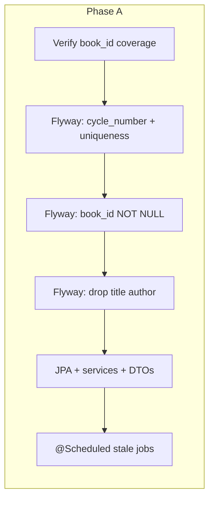
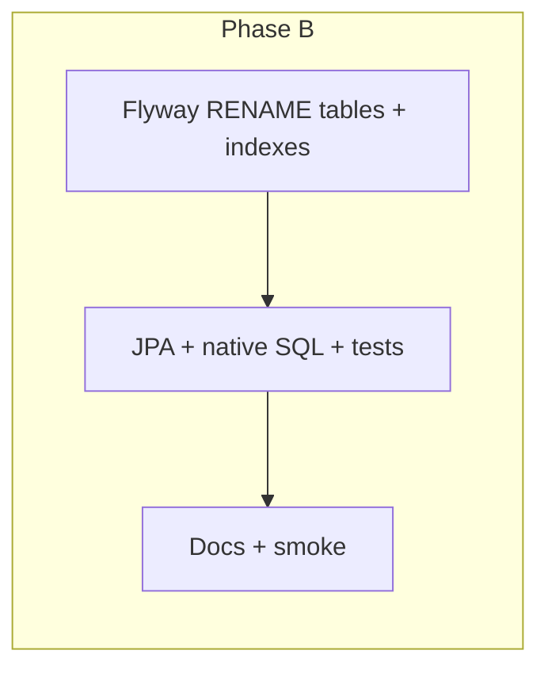

# Target schema gap closure — design

**Date:** 2026-05-07  
**Status:** Approved — **single program: Phase A (semantic) + Phase B (§6 singular renames)**  
**Approval:** Product choice **A** (2026-05-07) — include singular renames in the same overall program as semantic gap closure; execute **in order** (semantic before renames) to reduce risk.  
**Parent:** [`../plans/2026-05-07-optimized-er-diagram-plan.md`](../plans/2026-05-07-optimized-er-diagram-plan.md)  
**Scope:** Close documented gaps between the **current** `audio-library-automation-bot` PostgreSQL schema + JPA and the plan’s **§2 target** / **§5 phase completion** / **§6 naming**.

---

## 1. Problem statement

The phased migrations delivered the **intent** of the ER plan (bibliographic core, acquisition via `book`/`book_source`, stage tables, distribution split, `job_queue`, legacy drops). Remaining differences fall into:

| Gap | Plan reference | Risk if ignored |
|-----|----------------|-----------------|
| `cycles` still holds denormalized `title` / `author`; `book_id` nullable | §5 Phase 1 tail | Drift from `book`; ambiguous source of truth |
| No `cycle_number`; no `UNIQUE (book_id, cycle_number)` | §2.5 `cycle` | Ordering / “Part N” semantics live only in identifiers or strings |
| Table names plural (`cycles`, `audio_parts`, …) vs singular target | §1 Fate, §6 | Naming inconsistency; docs vs code confusion |
| `torrent_tasks` not renamed to `torrent_task` | §1, §2.4 | Same |
| `sp_fail_stale_jobs` exists; no app scheduler | §7 Q6 | Stuck `IN_PROGRESS` rows unless ops run SQL manually |
| `library_audiobooks` denormalized strings | §7 Q1 | Duplicate titles/authors vs `book` |
| Uploaders / strict `platform_metadata` | §7 Q3–Q4 | Runtime validation gaps (follow-up to DDL) |

---

## 2. Decision record

### Considered approaches

| Id | Summary |
|----|--------|
| **A** | Semantic only (no singular renames) |
| **B** | Full parity in one blast: semantics + §6 names together |
| **C** | Staged programs: ship semantic first, **later** ship renames as a separate program |

### Chosen approach

**Single program with two internal phases** (delivers **B**’s end state without mixing risky steps in one migration file):

| Phase | Name | Content |
|-------|------|---------|
| **A** | Semantic alignment | `cycle_number`, `book_id` enforcement, drop denormalized `title`/`author`, scheduler for `sp_fail_stale_jobs`, tests |
| **B** | §6 singular renames | Renames below + global JPA/`@Table` + native SQL/IT grep |

**Rationale:** Renaming hub tables (`cycles` → `cycle`) invalidates every raw string and document reference at once. Doing **A** first ensures data rules (`book_id`, `cycle_number`) are correct before a large mechanical rename. Both phases ship under **one approved program** (may be one PR or two back-to-back PRs **without** other features in between).

---

## 3. Phase A — Semantic alignment

### 3.1 `cycles` and `book`

** Preconditions (verify before NOT NULL / drops):**

1. Every row that must remain production-valid has a resolvable `book_id`, or a deterministic backfill from `book` (reuse / extend `sp_backfill_book_from_cycles` or a new `sp_backfill_cycles_book_id` scoped to rules fixed in the implementation plan).
2. API and jobs that create `cycles` always set `book_id` (Java changes where cycles are created without a book).

**DDL direction (new Flyway only; do not edit applied migrations):**

1. Add `cycle_number INT NOT NULL DEFAULT 1` with `CHECK (cycle_number >= 1)` (or backfill-per-row before NOT NULL if safer).
2. Backfill `cycle_number` per `book_id` partition: e.g. `ROW_NUMBER() OVER (PARTITION BY book_id ORDER BY id)` where `book_id IS NOT NULL`; cycles without `book_id` temporarily use `cycle_number = 1` until linked (implementation plan must define deadline or rejection policy for orphans).
3. Add unique enforcement: partial `UNIQUE (book_id, cycle_number)` where `book_id IS NOT NULL` during transition; after `book_id` is NOT NULL everywhere, use a single **unique constraint** on `(book_id, cycle_number)` per §2.5.
4. After verification: `ALTER ... ALTER COLUMN book_id SET NOT NULL` (or archive/delete orphan cycles per policy).
5. Drop `cycles.title` and `cycles.author` after consumers read `book.title` / `book_person`; update JPA `CycleEntity` and DTOs/controllers.
6. **Description column:** Either `RENAME COLUMN cycle_description TO description` to match §2.5, or keep `cycle_description` and record a one-line **deviation** in the implementation plan (avoid double renames).

**PostgreSQL note:** If Phase B renames `cycles` → `cycle`, `cycle` may need quoted identifiers in hand-written SQL (`"cycle"`). JPA table name `cycle` is fine; document for DBAs.

### 3.2 Stale job cleanup

- Spring `@Scheduled` (or `@ConditionalOnProperty` when DB/procedure unavailable) calling `CALL sp_fail_stale_jobs(:minutes)` with `minutes` from config (default 60).
- Document in local runbook: profiles, interval, failure behavior (log and continue).

### 3.3 `library_audiobooks` (optional within Phase A)

- **Minimum:** No DDL; document denormalized strings as tech debt (§7 Q1).
- **Stretch:** Add migration to drop redundant columns once API/UI reads via `book_id`/`cycle_id` joins — only if scoped in implementation plan.

### 3.4 Tests

- Extend `FlywayCycleSchemaIT` (or add IT) for new constraints/columns.
- Scheduler covered by unit test or profile-gated integration test as appropriate.

---

## 4. Phase B — §6 singular table renames

**When:** After Phase A is merged, tests green on staging, and operators are ready for one migration window (Phase B may immediately follow Phase A in the same release train).

### 4.1 Tables to rename (plan §1 / §6)

| Current name | Target name |
|--------------|-------------|
| `cycles` | `cycle` |
| `audio_parts` | `audio_part` |
| `video_parts` | `video_part` |
| `torrent_tasks` | `torrent_task` |
| `library_audiobooks` | `library_audiobook` |

**Already singular (no rename):** `book`, `book_source`, `source`, `book_chapter`, `audio_stage`, `video_stage`, `image_asset`, `image_chunk`, `ai_content`, `platform`, `distribution`, `distribution_result`, `job_queue`, etc.

### 4.2 Flyway

- One migration file **or** a small ordered set (e.g. rename hub `cycles` first, then parts tables — PostgreSQL updates FK metadata on `ALTER TABLE ... RENAME TO`).
- Follow with **index/constraint renames** where names embed the old table string (`ix_cycles_*` → `ix_cycle_*`, etc.) for operator clarity (optional but recommended in same Phase B band).

### 4.3 Application

- Update every JPA `@Table(name = "...")` and any **native query** / `JdbcTemplate` / test SQL string.
- Grep repo for: `cycles`, `audio_parts`, `video_parts`, `torrent_tasks`, `library_audiobooks` (word boundaries / qualified names) and fix.

### 4.4 External / docs

- Update `CLAUDE.md`, runbooks, and any scripts referencing old table names.
- **Frontend / other services:** search for raw table names (unlikely) and API field renames only if REST contracts change (they should not if JSON stays stable).

### 4.5 Rollback

- Prefer **forward-fix**; true rollback = restore DB snapshot or apply inverse `RENAME` script kept alongside Phase B migration (rare in production).

---

## 5. Flyway version band (informative)

Next new scripts ship **after** `V202605072460`. Implementation plan should allocate contiguous versions (e.g. `V202605072461__...` through `V2026050724xx__...`) for Phase A, then Phase B — exact filenames belong in the implementation plan.

---

## 6. Out of scope (explicit)

- Firebase / admin UI rewrites except where broken by removed `cycles.title`/`author`.
- Twitch/Patreon enablement (§7 Q5).
- Strict DB CHECK on `distribution_result.platform_metadata` unless explicitly added later.

---

## 7. Success criteria

1. **§5 Phase 1 tail:** `book_id` NOT NULL on `cycle` hub rows (post-rename); `title`/`author` columns gone from hub for production schema.
2. **§2.5 (functional):** `cycle_number` + uniqueness per `book` satisfied for production data.
3. **§7 Q6:** Scheduled `sp_fail_stale_jobs` in agreed runtime profiles.
4. **§6:** Effective physical table names are **`cycle`**, **`audio_part`**, **`video_part`**, **`torrent_task`**, **`library_audiobook`** (with quoting rules documented for `cycle`).
5. **CI:** `./mvnw test` and `FlywayCycleSchemaIT` pass on embedded PostgreSQL.

---

## 8. Next steps

1. Use **writing-plans** to author the implementation plan: ordered Flyway files, backfill SQL, Java file checklist, `FlywayCycleSchemaIT` expectations, staging checklist.
2. Implement Phase A → verify → implement Phase B → verify.
3. Commit spec + plan; operational note for migration window before Phase B.

---

## 9. Spec self-review

- **Scope:** Program includes both phases; order fixed (A then B).  
- **Reserved words:** `cycle` called out for SQL quoting.  
- **Placeholders:** Orphan `book_id` policy and optional `library_audiobooks` column drop deferred to implementation plan.  
- **Contradictions:** None with parent plan §6 when Phase B completes.
