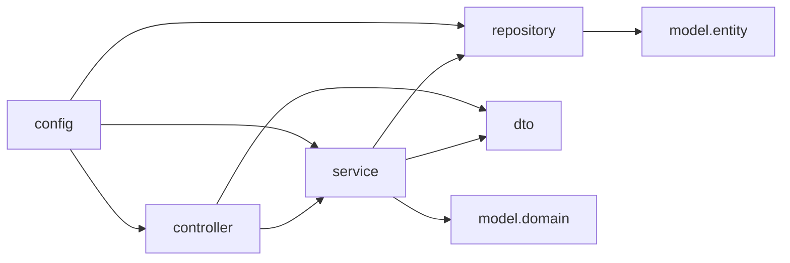

# Spring Boot layered restructure (big-bang) — design spec

**Date:** 2026-05-09  
**Status:** Approved — implementation plan: [`docs/superpowers/plans/2026-05-09-springboot-layered-restructure-implementation-plan.md`](../plans/2026-05-09-springboot-layered-restructure-implementation-plan.md)  
**Scope:** `audio-library-automation-bot` only

---

## 1. Goal

Restructure the backend into a consistent layered architecture that improves feature delivery speed, removes obsolete structure aggressively, and standardizes package/path conventions for Spring Boot + Java development.

## 2. Constraints and decisions

- **Migration style:** Big-bang rewrite in one major branch/PR.
- **Architecture style:** Layered with canonical roots:
  - `controller`
  - `service`
  - `repository`
  - `model` (`entity`, `domain`)
  - `dto` (`request`, `response`, `message`, `event`, `internal`)
  - `config`
- **Cleanup mode:** Aggressive (delete anything not aligned with target architecture unless explicitly needed).
- **Primary scaling objective:** Faster feature delivery by reducing coupling and navigation friction.
- **Job row semantics (cross-doc, non-normative detail):** Each `JobType` ties to **one primary owner FK** on the row that job acts on (e.g. Plan A audio spine → `audio_part_id`; other job families → `distribution_id` or cycle-scoped keys per ER / pipeline plans).

## 3. Current-state issues observed

1. Package structure is mixed by old domain-first and ad hoc paths (`pipeline/*`, `jobs/*`, `search/*`, `telegram/*`, etc.) without a single naming contract.
2. Several files live in folders that do not match declared package names, causing cognitive overhead and risky refactors.
3. Legacy naming artifacts remain (`poster.youtube`, `image`, `text`, misspelled classes like `OpenAiCotroller` and `ImageDescriptionTextExtractorSercvice`).
4. DTO/entity/domain boundaries are blurred across feature folders, making onboarding and change impact analysis slower.

## 4. Target package blueprint

Base package remains:

`kg.automation.rest.automatation`

Target structure:

```text
kg.automation.rest.automatation
├── config
│   └── messaging          # RabbitMQ / AMQP infrastructure wiring only (see §4.2)
├── controller
│   ├── pipeline
│   ├── library
│   ├── job
│   ├── torrent
│   ├── ai
│   └── distribution
├── service
│   ├── pipeline
│   ├── library
│   ├── job
│   ├── torrent
│   ├── ai
│   ├── integration
│   └── distribution
├── repository
│   ├── pipeline
│   ├── library
│   ├── job
│   └── distribution
├── model
│   ├── entity
│   │   ├── pipeline
│   │   ├── library
│   │   ├── job
│   │   └── distribution
│   └── domain
│       ├── pipeline
│       ├── job
│       └── distribution
├── dto
│   ├── request          # HTTP ingress only (REST/OpenAPI contracts)
│   │   ├── pipeline
│   │   ├── library
│   │   └── distribution
│   ├── response         # HTTP egress only
│   │   ├── pipeline
│   │   ├── library
│   │   └── distribution
│   ├── message          # Async / runtime wire: queues, RPC-style payloads, orchestration hand-offs — not REST semantics
│   │   ├── job
│   │   └── pipeline
│   ├── event            # Event-shaped payloads (notifications, immutable past-tense) when distinct from commands — optional if you collapse into message
│   │   └── job
│   └── internal         # Non-REST, non-messaging POCOs (in-process helpers, FFmpeg option bags, import rows) — not queue/job/orchestration wire types
├── mapper
├── exception
└── util
```

### 4.1 Layer ownership rules

- `controller`: HTTP concerns only (validation entry, status codes, request/response DTO binding). **Allowed dependencies:** **`dto.request`**, **`dto.response`**, **`service`**, **`model.domain`**, and other non-entity **`model`…** types as needed; **forbidden in public REST surface:** **`model.entity`** — do not declare **`@Entity`** types (or other persistence row types) in **public** controller method signatures (parameters or return types). Pragmatic CI often enforces **`controller` → no dependency on `..model.entity..`** package (see **`§10` L4**).
- `service`: orchestration, transactions, business rules; no HTTP classes.
- `repository`: persistence interfaces and custom query implementations.
- `model.entity`: JPA entities only (suffix `Entity` reserved for persistence types in this package).
- `model.domain`: business enums/value objects not tied to JPA schema. **`JobType`**, **`JobStatus`**, and **`PipelineRunStatus`** are **job execution** vocabulary (historically the **`jobs.*` / job-queue slice**); they **do not** come from **`pipeline.domain`**—canonical package **`model.domain.job`** (queue/orchestrator/runner terms; not `dto.*`, not `config.messaging`). **Entity leak prevention** is enforced by **ArchUnit** (**`L4`** in **`Task A1`**, **`L3`** in **`Task A2`**, **`§10`**) **and** by the implementation plan **`Task J`** ripgrep checks on controllers—the mechanisms are **complementary**. **JPA entities must never be used as REST (or other external) API contracts:** do not return `ProcessingJobEntity`, `PipelineRunEntity`, `AudioPartEntity`, `AudioStageEntity`, or any `@Entity` from controllers, and do not bind request bodies to entities—this codebase already mixes **operational DB state** with **pipeline concepts**, which is exactly where accidental API leakage starts; keep persistence types inside `service` + `repository` and map to `dto.request` / `dto.response` / `dto.message` at boundaries.
- `dto.request` / `dto.response`: shapes for **HTTP** only—**do not** suffix them `Entity` or mirror JPA entities one-for-one under these packages.
- `dto.message`: queue bodies, dispatched job payloads, orchestration payloads that cross async/run-time boundaries (**not** “request/response” in the REST sense).
- `dto.event`: serialized **event** notifications when you want semantics separate from commands (omit or merge under `dto.message` if YAGNI).
- `dto.internal`: in-process or non-wire helper types that are neither REST nor messaging contracts.
- `config`: bean wiring/profiles/conditional loading.

### 4.2 Backend mechanisms (non–“ordinary feature service” placements)

Layer-first layout must still name **cross-cutting runtime mechanisms** so they are not dumped into generic `service`, `util`, or unexplained `config`. The rules below are **normative**.

| Mechanism | Current homes (representative) | Target package(s) | Rationale |
|-----------|-------------------------------|-------------------|-----------|
| **External HTTP / RPC clients** to microservices (`SilenceServiceClient`, `WhisperServiceClient`, download helpers under `gateway`, etc.) | `gateway.*` | `service.integration.*` | Outbound adapters to systems we do not own; not domain pipeline logic. Keep **only** thin I/O + error mapping here; orchestration stays in feature services. |
| **Pipeline job runners and execution** (`*JobRunner`, `PipelineJobExecutor`, stale-job cleanup, job-related listeners that invoke runners) | `jobs.service.*`, `jobs.runtime.*`, `jobs.listener.*` | `service.job.*` (`service.job.runtime`, `service.job.listener` as needed) | First-class backend execution path; same layer as other services, dedicated subpackages so it cannot be mistaken for CRUD helpers. |
| **Pipeline orchestration** (phase advancement, coordinating domain services — `PipelineOrchestrator`) | `pipeline.orchestrator.*` | `service.pipeline.orchestrator` (**or** `service.pipeline` if flattened; prefer **subpackage `orchestrator`** for discoverability) | Business orchestration for the audiobook pipeline, **not** infrastructure. Do **not** place under `integration` or `config`. |
| **RabbitMQ / AMQP** | Historically `infra.rabbit.*` (wiring), plus publish/consume scattered in job services | **Split:** (1) **`config.messaging`**: Spring AMQP beans — connection, `ConnectionFactory`, `RabbitTemplate` customization, declarables (exchanges, queues, bindings), exchange/route **constants** that are pure wiring — **must not** contain **`@RabbitListener`** methods or listener `@Component` classes (**hard rule**; enforce with ArchUnit **LM** in **`§10`**). (2) **`service.job.messaging`** **or** `service.job.listener`: `@RabbitListener` components and inbound dispatch **to** `ProcessingJobService` / `PipelineJobExecutor`. **Do not** leave a root `infra.rabbit` (or typo “infrarabbit”) orphan; fold into `config.messaging` + `service.job`. (3) **Serialized job/queue payloads** (e.g. `PipelineJobMessage`): **`dto.message.job`** — not `dto.request`/`dto.response`. **Orchestration wire types** crossing messaging or worker boundaries: **`dto.message.pipeline`**. Routing-key enums/constants that are purely transport identifiers stay **`config.messaging`**. Prefer **`dto.event.*`** only for immutable notification payloads when distinguishable from command messages; otherwise **`dto.message`** is enough. |

**Dependency sketch (listeners and orchestrator):**

```mermaid
flowchart TB
  subgraph cfg [config.messaging]
    RabbitCfg[Rabbit infra beans exchanges queues]
  end
  subgraph job_svc [service.job]
    Listener[@RabbitListener dispatch]
    Exec[PipelineJobExecutor]
    Runners[*JobRunner]
  end
  subgraph pipe_svc [service.pipeline.orchestrator]
    Orch[PipelineOrchestrator]
  end
  Listener --> Exec
  Exec --> Runners
  Orch --> job_svc
  cfg --> Listener
```

- **Plan A** (and related pipeline plans) treating Rabbit as **the** dispatch path implies: `config.messaging` is a **named, stable** package for reviewers and ArchUnit—not an afterthought lumped under `config` root without distinction.

### 4.3 Anti-patterns (do not regress)

- Do not move `SilenceServiceClient` / `WhisperServiceClient` under `service.pipeline` merely because the pipeline calls them—they remain **`service.integration`**.
- Do not move `PipelineOrchestrator` under `integration` because it schedules async work—it remains **`service.pipeline`**.
- Do not bury `@RabbitListener` beans under `config` or inside **`config.messaging`**—**`config.messaging` is for beans, constants, and topology only**; consumption/dispatch lives in **`service.job`** (**ArchUnit LM**).
- Do not park queue/orchestration payloads under **`dto.request`/`dto.response`** or fudge them as **`dto.internal`** when they are messaging contracts—use **`dto.message`** (and **`dto.event`** when semantics warrant).
- Do not expose **`@Entity`** types on REST controllers or as public API equivalents to DTOs (see **`model.entity`** rule in §4.1)—**verify** with **ArchUnit `L4`/`L3`** **plus** **`Task J`** rg (**§7**), not one in isolation.

### 4.4 Layer dependency direction

See §4.2 for Rabbit/orchestrator edges; graph below is the global layer contract.



Forbidden:
- `repository -> controller`
- `entity -> controller/dto`
- `controller -> repository` (must go via `service`)

## 5. Move/delete matrix

### 5.1 Move (required)

- Align **§4.2 mechanisms** during the same migration: `gateway.*` → `service.integration.*`; job runners/runtime/listeners → `service.job.*`; `PipelineOrchestrator` → `service.pipeline.orchestrator`; **`infra.rabbit.*` (and similar) → `config.messaging`** for topology/beans plus **`service.job`** for listeners/dispatch — **never** orphaned under `infra` after restructure ends.
- Move every existing `*.web.*` and `*.controller.*` package into `controller/<feature>` (acquisition scraping such as **`BookParserController`** / baza-knig → **`controller.pipeline`** exclusively—decided for this restructure to avoid parallel `controller.search` ambiguity during the big bang).
- Move `*.service.*` into `service/<feature>`.
- Move repository packages into `repository/<feature>`.
- Move JPA entities from `*.domain` (where they are entity classes) to `model/entity/<feature>`.
- Keep non-entity enums/value objects under `model/domain/<feature>`; **`JobType`**, **`JobStatus`**, **`PipelineRunStatus`** (**job slice**, not **`pipeline.domain`**) → **`model.domain.job`** (canonical).
- Move portable types into **`dto/request`**, **`dto/response`**, **`dto/message`**, **`dto/event`**, or **`dto/internal`** per §4.1 (not a single bucket).

### 5.2 Rename while moving

- Fix class naming typos during move:
  - `OpenAiCotroller` -> `OpenAiController`
  - `ImageDescriptionTextExtractorSercvice` -> `ImageDescriptionTextExtractorService`
- Align package-to-folder identity so every file path exactly matches package declaration.

### 5.3 Delete aggressively

Delete classes/files when any condition is true:
- Superseded by moved class with identical responsibility.
- Unreferenced from Spring wiring and non-test runtime paths.
- Legacy wrappers/adapters that only delegate to the new layer without adding behavior.
- Duplicate DTO/entity definitions for same contract/table.

Keep temporarily only if:
- Needed by active runtime profile behavior that has no migrated equivalent yet.
- Needed to keep tests compiling in the same big-bang branch until final cleanup step.

## 6. Big-bang execution sequence (single branch)

1. **Create inventory table** for all Java classes:
   - old path
   - new path
   - action (`MOVE`, `MOVE+RENAME`, `DELETE`, `KEEP`)
2. **Plan A hot-path package map (before any broad refactor)**

   Produce a **narrow artifact** for [Plan A / Rabbit-driven pipeline](./2026-05-08-pipeline-orchestrator-rabbitmq.md) — spine classes only—they are proven active wiring, not hypothetical. Mandatory rows (**extend** only when Plan A formally adds cousins):

   | Spine role | Type name | Notes |
   |------------|-----------|-------|
   | Rabbit ingress (listener) | `PipelineJobsRabbitListener` | **Plan A canonical name.** If absent in-repo until a Plan A MR lands, still create the row (**target package**) and flip status to landed when merged. |
   | Job executor | `PipelineJobExecutor` | Same architectural role if referred colloquially as “audio job executor.” |
   | Audio runners | `AudioNoiseRemoveJobRunner`, `AudioTrimJobRunner`, `AudioCompressJobRunner`, `AudioDurationJobRunner`, `ConcatenateProcessingJobRunner` | Queue-backed audio backbone. |
   | Orchestrator | `PipelineOrchestrator` | Phase gates; **`service.pipeline.orchestrator`**, not infra. |
   | Persistence | `ProcessingJobRepository`, `PipelineRunRepository`, `AudioPartRepository`, `AudioStageRepository` | Hot-path repos for job/audio stage state (includes `audio_stage`). |
   | Filesystem layout helper | `CycleFileLayout` | Shared path derivation on spine. |
   | Outbound microservice clients | `SilenceServiceClient`, `WhisperServiceClient` | Target **`service.integration`**. |

   In the **same artifact**, list **migration lockstep dependents** so one diagram shows the whole vertical slice. For **PA-2**, treat as **one moving unit** (same lockstep group **G1-MQ**): **`@RabbitListener`** ingress, **`dto.message.*`** job payloads, **publish path** (`ProcessingJobService` and any publisher wiring), **and** **`config.messaging`** (AMQP beans, **exchange/queue topology**, **routing/constants**)—do **not** land partial spine PRs that update only one of these while the others still reference old packages.

   **Deliverable example:** [`docs/superpowers/plans/artifacts/2026-05-09-plan-a-spine-package-map.md`](../plans/artifacts/2026-05-09-plan-a-spine-package-map.md) with columns **class**, **spine lockstep group**, **must move together**, **filesystem path**, **current package**, **target package** (group columns required for listener / executor / orchestrator / message / config classes).

3. **Checkpoint CP-Arch (merge gate before spine execution PRs)**

   **`Task A1`** (introduce **`LayeredDependencyRulesTest`** with **L1 + L2** as the CP-Arch minimum, plus **L4** + **LM** in the **same A1 milestone** — **no `L3` entity residency** until **`Task A2`**): MUST be **merged to the shared branch before** `PA-2` lands, **or** delivered in the **same mergeable PR/stack** as the first `PA-2` spine moves. **Do not** land `PA-2` on `main` without **A1** CI protection—forbidden dependencies would go undetected during the highest-churn slice.

4. **Migrate Plan A spine as first protected slice**

   Move spine + lockstep dependents in **contiguous commits** (**model.entities used by spine → repos → dto.message/config.messaging integrations touched → spine services**) before refactoring unrelated controllers or library-only areas. **Within PA-2**, keep **listener + serialized payloads + publisher + `config.messaging` topology/constants** on the **same merge boundary** (group **G1-MQ** in the spine map)—splitting them causes broken imports and mismatched exchange/queue names. After each milestone: `./mvnw test -Dtest=PipelineOrchestrator*,*JobRunner*,ProcessingJobServiceTest` (extend with open integration modules as needed)—**green spine before touching the periphery.** Honor **lockstep groups** from the **`§6` step 2** artifact (**G1-MQ**, **G2-EXEC**, …).

5. **Refactor remainder of model layer** (entities/domains outside spine or stragglers).
6. **Refactor remainder of repositories**.
7. **Refactor remainder of services**.
8. **Refactor controllers + DTOs + mappers**.
9. **Remove obsolete files**.
10. **Run full compile/tests/smoke checks**.
11. **Run package guards** (**ArchUnit** — **`§10`** is the normative definition).

## 7. Verification gates

Mandatory before declaring migration done:

- `./mvnw -DskipTests compile`
- `./mvnw test`
- Boot app in core mode and run smoke checks on critical endpoints:
  - pipeline cycle endpoints
  - library audiobook endpoints
  - upload/distribution confirmation paths
- No file remains with path/package mismatch.
- No direct `controller -> repository` dependency.
- REST surface uses **`dto.request` / `dto.response` only**; queue/orchestration wire types live under **`dto.message`** (or **`dto.event`**); **no `@Entity`** in controller method signatures (parameters or return types). **Entity leak prevention:** **ArchUnit `L4`** (**`Task A1`**) + **`L3`** (**`Task A2`**) **and** **`Task J`** controller ripgrep (implementation plan)—use **both** CI and spot-checks.
- **Plan A spine tests** referenced in **`§6` step 4** pass whenever that slice is migrated.
- **Checkpoint CP-Arch (`§6` step 3):** **`Task A1`** merged **before or with** **`PA-2`** (implementation plan)—honored before declaring migration done on shared branches.
- **`Task J` rg** (same patterns as implementation plan **`Task J` Step 3**): ripgrep `controller` paths for **`model.entity`** in **`public`** signatures / imports (**zero hits** desired post-rewrite)—**pairs with** ArchUnit **`L4`/`L3`**; neither replaces the other.
- **`./mvnw test`** includes and passes **`src/test/java/.../architecture/*`** (**ArchUnit** rules in **`§10`**).

## 8. Risk controls for big-bang approach

- Freeze non-critical feature changes during migration window.
- Use temporary branch protection requiring green tests.
- Add focused integration tests around pipeline orchestration and distribution persistence before deleting legacy classes.
- Keep a rollback branch/tag at pre-restructure commit.

## 9. Definition of done

- All backend classes follow canonical layered package contract.
- **Plan A spine package map artifact** (**`§6` step 2**) filled with **lockstep group** + **must move together** columns; **CP-Arch** (**`§6` step 3**) satisfied; spine slice (**`§6` step 4**) migrated before incidental areas.
- **ArchUnit enforcement** (**`§10`**) merged: **`Task A1`** (**L1, L2, L4, LM**) before/with **`PA-2`**; **`Task A2`** (**L3**) after **`model.entity` migration**.
- **`dto.request` / `dto.response` / `dto.message` / `dto.event` / `dto.internal`** are used per §4.1 (no misuse of HTTP DTO packages for queue payloads).
- **`@Entity`** types are not public REST contracts (§4.1); enforcement is **ArchUnit + `Task J`** (see **§7**).
- Old package trees removed unless explicitly justified in code review notes.
- Naming typos and legacy package names corrected.
- Build/test/smoke checks green.
- Team can locate any business change by layer and feature in under 2 minutes.

## 10. Package guard enforcement (**mechanism: ArchUnit**)

**Purpose:** **`§6` step 11** (“package guards”) is **executable**, not aspiration—violations fail **`./mvnw test`** so structure cannot silently drift post-rewrite.

| Mechanism | Detail |
|-----------|--------|
| **Library** | `com.tngtech.archunit:archunit-junit5` — **already declared** on `audio-library-automation-bot` `pom.xml`. |
| **Test location** | `src/test/java/kg/automation/rest/automatation/architecture/` — **`LayeredDependencyRulesTest`** (and extend here or split by concern). Annotate **`@AnalyzeClasses(packagesOf = AutomatationApplication.class, importOptions = ImportOption.DoNotIncludeTests.class)`** so only production code is checked. |

**Rule batches (implementation plan `Task A1` / `Task A2`):**

| Rule | When | ArchUnit formulation (conceptual) | Forbidden pattern |
|------|------|-----------------------------------|-------------------|
| **L1** | **A1** (CP-Arch) | `noClasses(..controller..)` must not dependOn `..repository..` | `controller → repository` |
| **L2** | **A1** (CP-Arch) | `noClasses(..repository..)` must not dependOn `..controller..` | repository → controller |
| **L4** | **A1** (same milestone as L1/L2) | `noClasses(..controller..)` must not dependOn `..model.entity..` | exposing / coupling controllers to JPA entity packages (proxy for “no entity in public REST signatures”; pair with **`Task J`** rg) |
| **LM** | **A1** | Methods **`@RabbitListener`** must be declared in classes **`resideOutsideOfPackages("..config.messaging..")`** | `@RabbitListener` inside **`config.messaging`** |
| **L3** | **A2** (after **all** entities live under `model.entity`) | Classes **`@Entity`** must **`resideInAnyPackage(..model.entity..)`** | entities outside `model.entity` |
| **L-configMessaging-service** (**optional**) | Later | `noClasses(..config.messaging..).should().dependOnClassesThat().resideInAnyPackage(..service..)` only if zero false positives | config messaging → service (strict) |

**Optional later:** `Architectures.layeredArchitecture()` with named layers assigning `pkg.controllers(..controller..)`, `pkg.services(..service..)`, `pkg.persistence(..repository..)` — add when package graph is stable enough that layer definitions rarely churn.

## 11. Implementation plan handoff

After this design is approved, create an implementation plan that includes:
- class-by-class migration batches
- Plan A spine map + **CP-Arch** + spine-first migration slice (**`§6` steps 2–4**)
- delete list with evidence (reference count / wiring status)
- daily verification checklist
- rollback and stabilization steps

## 12. Self-review log

| Check | Result |
|---|---|
| Placeholders | None left intentionally |
| Internal consistency | Architecture, delete policy, big-bang steps, spine-first slice, **`§10` ArchUnit** align |
| Scope | Restricted to `audio-library-automation-bot` only |
| Ambiguity | §4.1 DTO split + **`JobType`/`JobStatus`/`PipelineRunStatus` (job slice, not `pipeline.domain`) → `model.domain.job`** + entity-leak checks (**ArchUnit `L4`/`L3` + `Task J`**); **`config.messaging` no `@RabbitListener`** (**§4.2**/LM); PA-2 **G1-MQ** lockstep; **`§10` A1/A2**; spine map **`§6` step 2**; **CP-Arch (`§6` step 3)** + migrate step **4**; **`BookParserController` → `controller.pipeline`** frozen |

